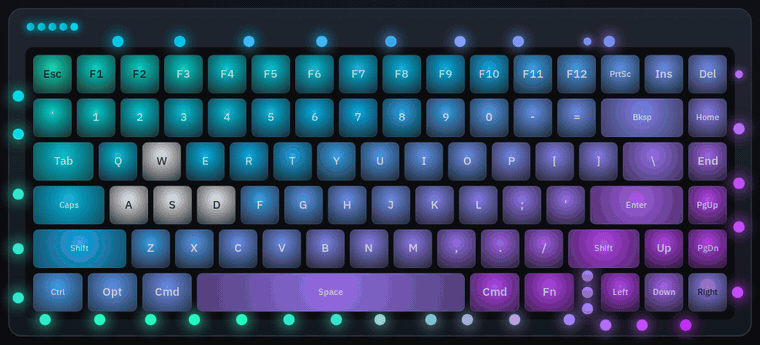
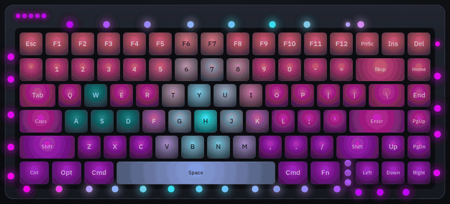
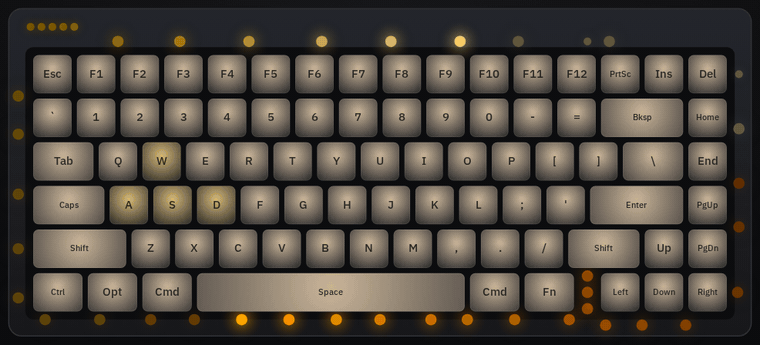
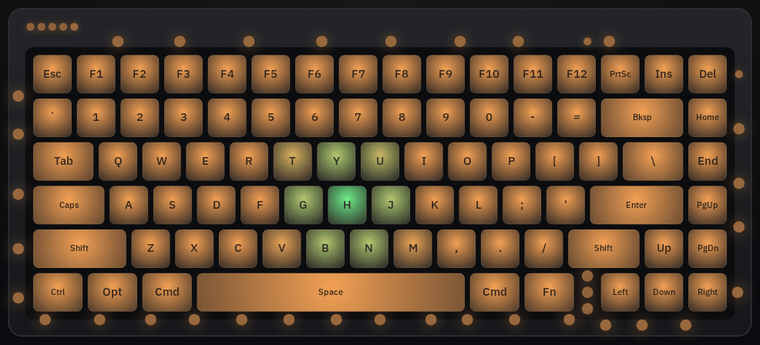

# Halo Composer

**Per-LED lighting for the NuPhy Halo75 V2.** Halo Composer is a replacement keyboard firmware, and **Halo Studio** is the browser editor that goes with it. Together they let you:

- color **every LED individually**: the 83 key LEDs and all 42 "halo" LEDs around the base;
- apply **effects that keep your colors** (breathe, wave, candle, comet, ripple, ...) instead of replacing them;
- split the board into **up to 8 zones**, each with its own effect, speed and brightness range: for example, keys that flash on every press while the halo breathes slowly between 30% and 100%;
- use **multi-color gradients**, keypress reactions, starter scenes, and a live preview that uses the same lighting math as the keyboard.

<p align="center">
  
</p>

> [!WARNING]
> **This is a brand-new project.** It runs well on the developer's Halo75 V2 (ANSI), but it hasn't been tested much beyond that. You can always flash NuPhy's official firmware back (the [install guide](docs/FLASHING.md) links it).

## Get started

1. **Download** `nuphy_halo75v2_ansi_composer.bin` from the latest release on the [Releases page](https://github.com/DRebd/halo-composer/releases). If you use VIA, take `halo75v2_composer_via3.json` as well.
2. **Flash it** by following the [install guide](docs/FLASHING.md), step by step. No programming needed; allow about half an hour the first time.
3. **Design your lighting** in **Halo Studio** at **https://drebd.github.io/halo-composer/** (desktop Chrome or Edge), then read the [user guide](docs/USER_GUIDE.md) for the editor and the keyboard shortcuts.

## Halo Studio

<p align="center">
  
</p>

| Keypress reactions | Comets orbiting the halo |
|---|---|
|  |  |
| **The factory look:** 2700K keys, a mint flash and short ripple on each press | **Effects gallery:** every effect with a live preview |
|  |  |
| **Paint and select** any LED, or use one-click groups | **Halo setup:** place each halo LED on the drawing |
|  |  |

## Documentation

| I want to... | Go to |
|---|---|
| Install the firmware (or go back to NuPhy's) | [docs/FLASHING.md](docs/FLASHING.md) |
| Learn the editor and the keyboard shortcuts | [docs/USER_GUIDE.md](docs/USER_GUIDE.md) |
| See what ryodeushii's firmware and Halo Composer each add, on one page | [docs/WHATS_DIFFERENT.md](docs/WHATS_DIFFERENT.md) |
| Understand how it works (firmware, USB protocol, scene format) | [docs/HOW_IT_WORKS.md](docs/HOW_IT_WORKS.md) |
| See what's planned, the known limitations, and why this exists | [docs/ROADMAP_AND_HISTORY.md](docs/ROADMAP_AND_HISTORY.md) |
| Build it, test it, or host Halo Studio yourself | [docs/DEVELOPING.md](docs/DEVELOPING.md) |

## Plain-English glossary

| Term | Meaning |
|---|---|
| **Firmware** | The small program that runs *inside* the keyboard. It reads the keys and drives the lights. |
| **Flashing** | Replacing the keyboard's firmware with a new file (`.bin`). It's reversible: you can flash NuPhy's original back. |
| **QMK** | The open-source keyboard firmware the Halo75 V2 runs. |
| **VIA** | A website (usevia.app) that remaps keys on QMK keyboards. It still works with this firmware. |
| **ryodeushii's firmware** | A community-maintained, improved version of NuPhy's QMK firmware. Halo Composer is built on top of it. |
| **Halo** | The light strip around the base, plus the small status bar and badge LEDs: 45 LED positions, 42 of them fitted. |
| **Zone** | A group of LEDs that share one effect, speed and brightness range. You choose which LEDs go in which zone. |
| **Scene** | Everything about a look: per-LED colors, zones, gradients and the halo layout. The keyboard stores one saved scene; Studio can keep as many as you like. |
| **EEPROM** | The keyboard's small permanent memory. "Save to keyboard" writes the scene there so it survives unplugging. |
| **WebHID** | The browser feature (Chrome/Edge) that lets a web page talk to a USB device after you approve it in a pop-up. |
| **DFU mode** | A special mode for receiving new firmware. On this keyboard you enter it by holding **Esc** while plugging in the cable. |

## How the pieces fit

```
Halo Studio (web page, Chrome/Edge) --USB cable, WebHID--> keyboard firmware
   editor + live preview                                     Halo Composer lighting engine
   (same lighting math as the firmware)                      + ryodeushii's firmware (typing, wireless, sleep)
                                                             + VIA still works for key remapping
```

The editor talks to the keyboard only over the **USB cable in wired mode**; the wireless radio carries keystrokes only. The lighting runs on the keyboard itself, so a saved scene keeps running in Bluetooth and 2.4 GHz modes.

## What's in this repository

| Folder | Contents |
|---|---|
| `firmware/keymap/` | The Composer keymap: lighting engine (`composer/hc_engine.c`), USB protocol (`composer/hc_qmk.c`), key layout |
| `firmware/patches/` | Small hooks into ryodeushii's code: halo drawing, LED power, and the Caps Lock indicator color |
| `firmware/base.env` | The exact ryodeushii version and build container used (pinned for repeatable builds) |
| `studio/` | Halo Studio source. `build_studio.py` bundles it into one HTML file |
| `tools/` | `halo_kb.py` (keyboard backup, status and self-test from the command line), geometry and VIA-definition generators |
| `tests/` | Engine parity test (C vs JavaScript), protocol tests against a simulated keyboard, browser end-to-end test |
| `scripts/` | One-command build, test and README-media capture on Windows (uses Docker) |
| `docs/` | The guides above, plus `media/` for the README images |

Every update to the project on GitHub is built and tested automatically: the firmware must compile, Halo Studio's preview must produce exactly the same LED values as the firmware's engine, and the editor is driven end to end against a simulated keyboard. Those checks catch software mistakes; they don't replace trying it on real keyboards. Each automatic build is labeled *UNTESTED-on-hardware* on the [Actions tab](https://github.com/DRebd/halo-composer/actions); files that have been run on a real keyboard are published on the [Releases page](https://github.com/DRebd/halo-composer/releases).

## Credits and license

### [ryodeushii](https://github.com/ryodeushii/qmk-firmware)

**Halo Composer is built directly on ryodeushii's firmware for NuPhy keyboards,** which gave the Halo75 V2 working wireless, deep sleep, adjustable debounce, proper VIA menus and much more. I'm very grateful for that work: without it, this project wouldn't exist.

Also built on:

- [QMK Firmware](https://github.com/qmk/qmk_firmware) (GPL-2.0-or-later).
- NuPhy's published source ([nuphy-src/qmk_firmware](https://github.com/nuphy-src/qmk_firmware)).

Licensed under the GNU GPL v2 or later (see [LICENSE.md](LICENSE.md)), the same as the firmware it extends. Not affiliated with NuPhy.

Vibecoded with Claude Code. Use this software at your own risk.
