# Halo Composer

**Per-LED lighting for the NuPhy Halo75 V2.** Halo Composer is a replacement keyboard firmware with its own lighting engine, and **Halo Studio** is the browser editor that goes with it. A Composer scene combines all of this at the same time:

- **a color for every LED**: the 83 key LEDs and all 42 "halo" LEDs around the base;
- **up to 8 zones**, each running its own effect (17 of them, from breathe and candle to comet and ripple) at its own speed and brightness range. Effects animate your colors, or a gradient or rainbow, instead of replacing them, and moving ones can run back and forth;
- **keypress reactions** on top: flash, glow, ripple, or an echo on the halo.

For example: warm white keys that flash and ripple when pressed, WASD pulsing in its own color, and a halo breathing slowly between 30% and 100%. You design it live in Halo Studio, whose preview uses the same lighting math as the keyboard, or start from one of 11 starter scenes. The keyboard then runs it on its own.

<p align="center">
  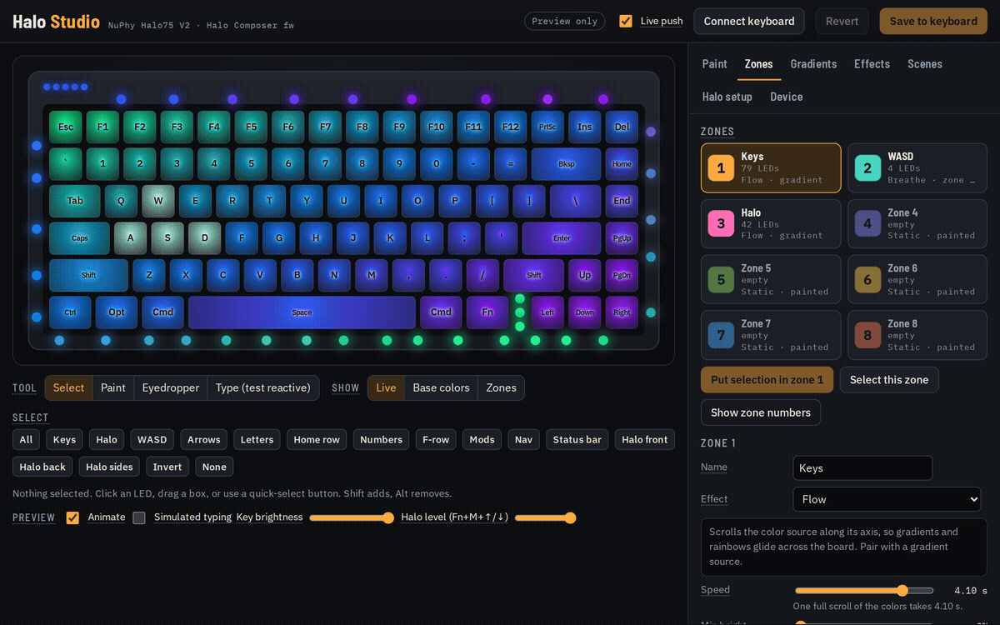
  <!-- Still alternative: 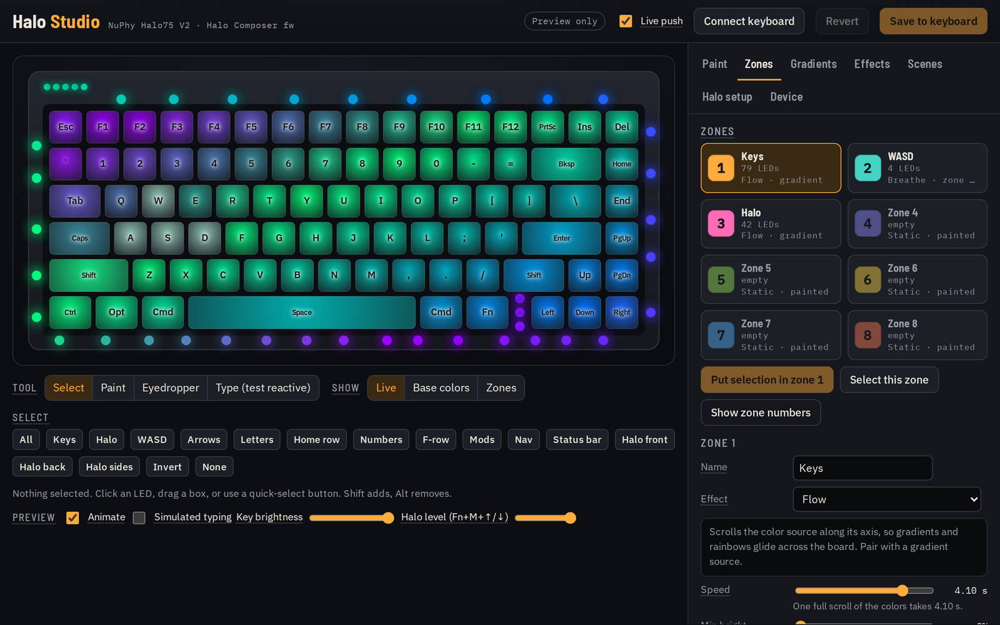 -->
</p>

> [!WARNING]
> **This is a brand-new project.** It runs well on the developer's Halo75 V2 (ANSI), but it hasn't been tested much beyond that. You can always flash NuPhy's official firmware back (the [install guide](docs/FLASHING.md) links it).
>
> The lighting goes far beyond what the stock firmware can do, but Halo Studio's controls, and the way the LED settings interact, still need a lot of simplifying. That's the [top roadmap item](docs/ROADMAP_AND_HISTORY.md#simplify-studio).

## Get started

1. **Download** `nuphy_halo75v2_ansi_composer.bin` from the latest release on the [Releases page](https://github.com/DRebd/halo-composer/releases). If you use VIA, take `halo75v2_composer_via3.json` as well.
2. **Flash it** by following the [install guide](docs/FLASHING.md), step by step. No programming needed; allow about half an hour the first time.
3. **Design your lighting** in **Halo Studio** at **https://drebd.github.io/halo-composer/** (desktop Chrome or Edge), then read the [user guide](docs/USER_GUIDE.md) for the editor and the keyboard shortcuts.

## Halo Studio

<p align="center">
  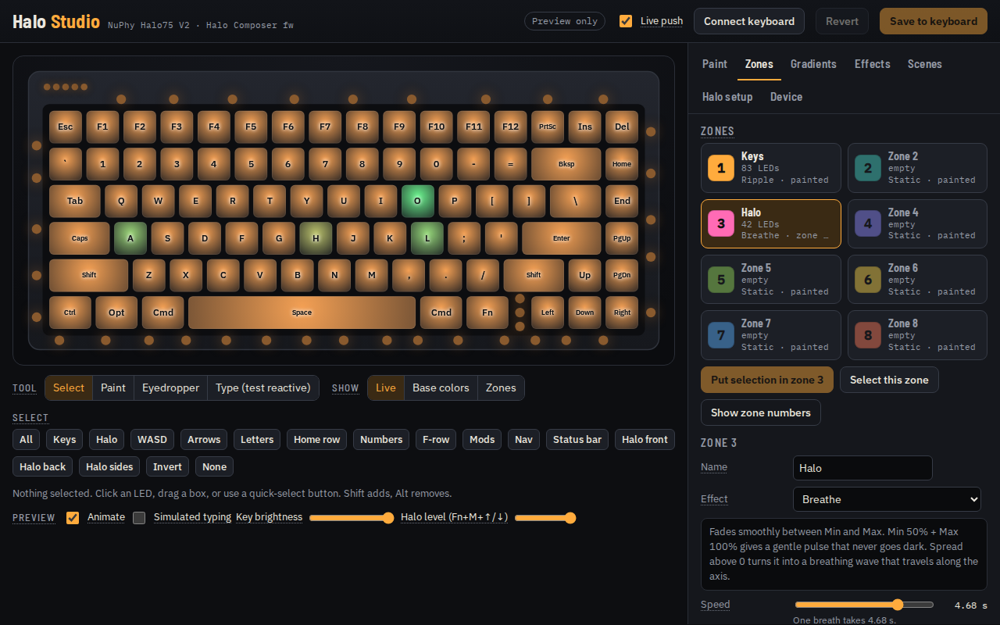
</p>

| Keypress reactions: glows follow your typing | Comets orbiting the halo |
|---|---|
| 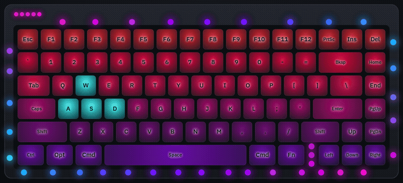<!-- Still: 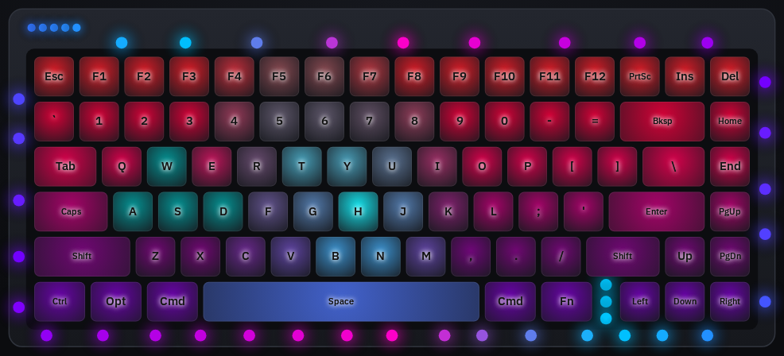 --> | 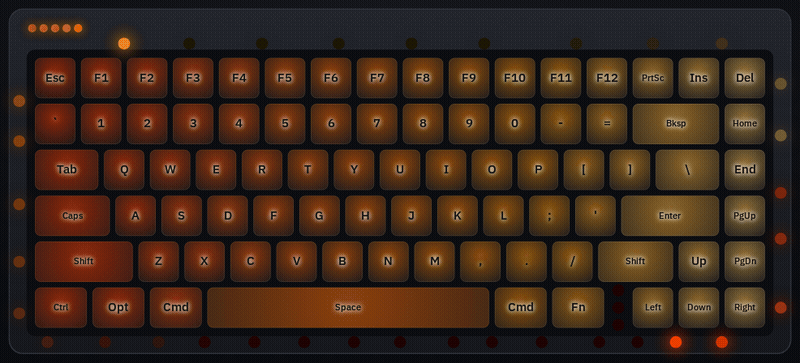<!-- Still: 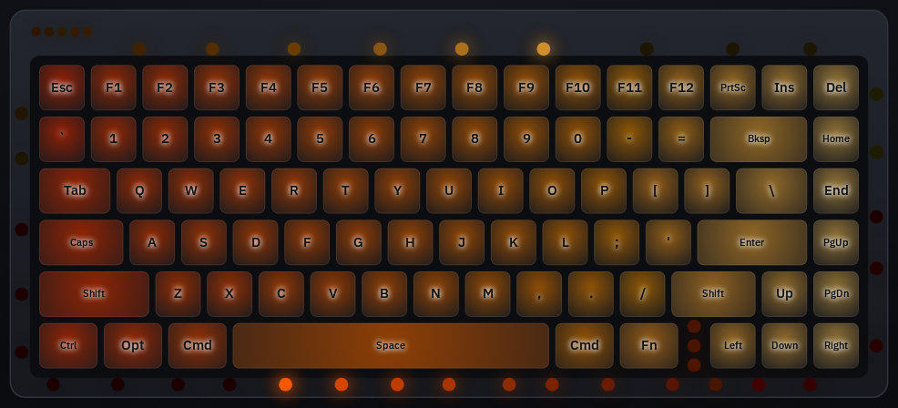 --> |
| **The factory look:** 2700K keys, a mint flash and short ripple on each press, a breathing halo | **Back and forth:** a comet sweeps across the board and back |
| 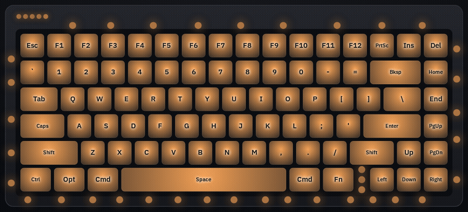<!-- Still: 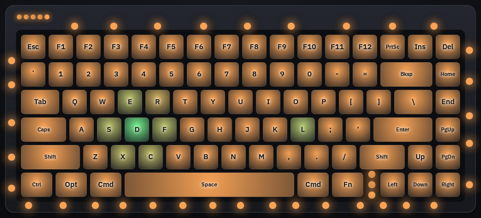 --> | 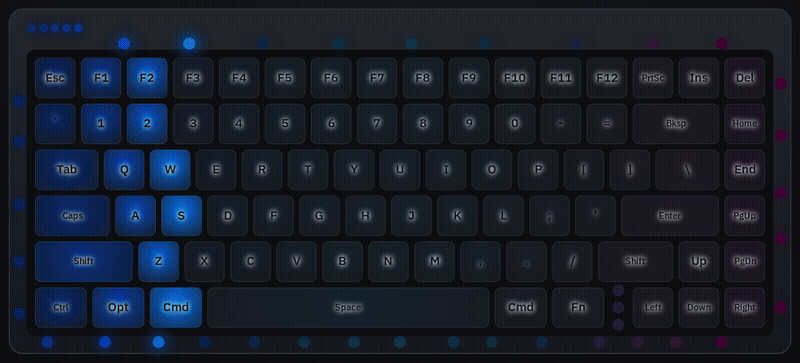<!-- Still: 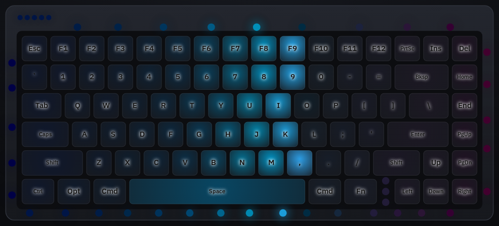 --> |
| **Gradients:** up to 6 color stops each | **Effects gallery:** every effect with a live preview |
| 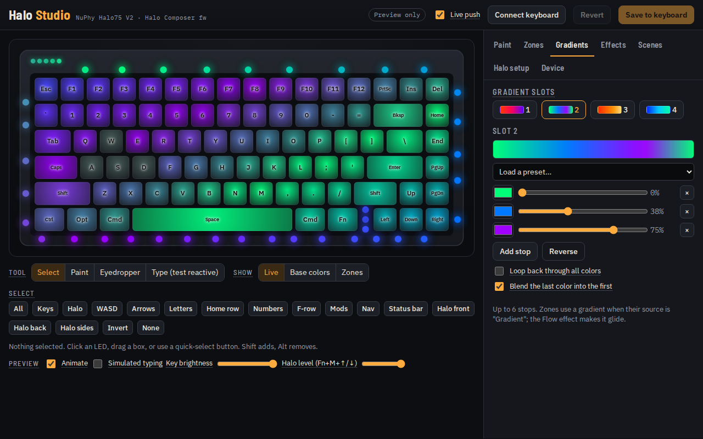 | 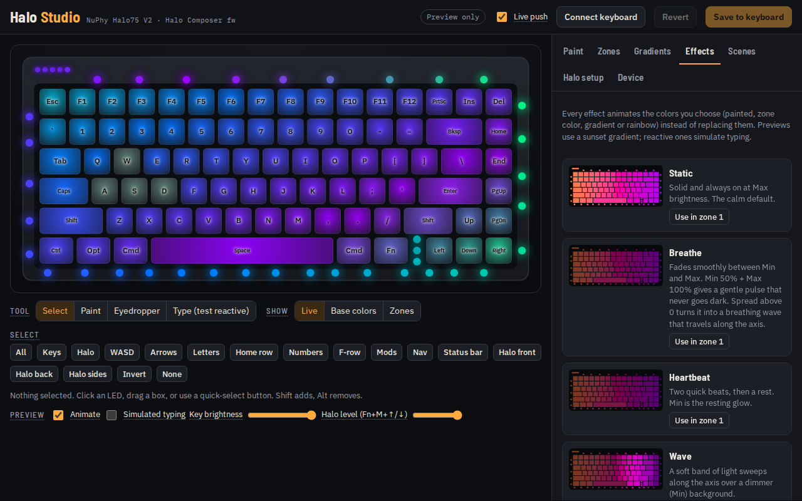 |
| **Paint and select** any LED, or use one-click groups | **Halo setup:** place each halo LED on the drawing |
| 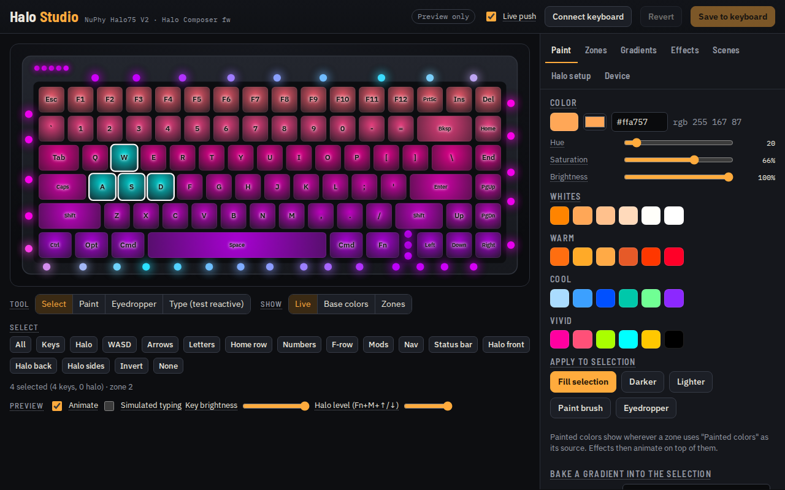 | 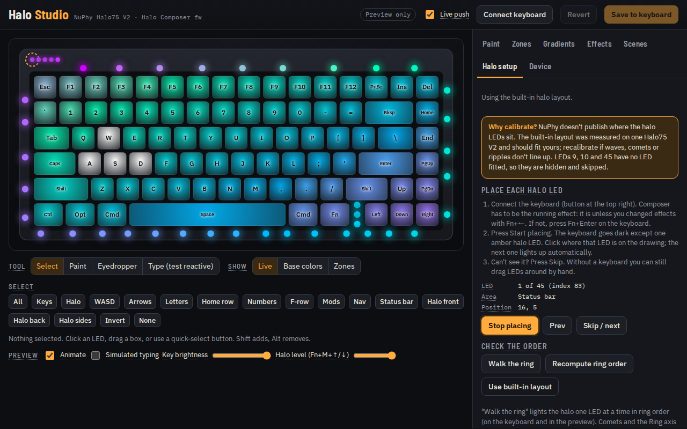 |

## Documentation

| I want to... | Go to |
|---|---|
| Install the firmware (or go back to NuPhy's) | [docs/FLASHING.md](docs/FLASHING.md) |
| Learn the editor and the keyboard shortcuts | [docs/USER_GUIDE.md](docs/USER_GUIDE.md) |
| See what ryodeushii's firmware and Halo Composer each add, on one page | [docs/WHATS_DIFFERENT.md](docs/WHATS_DIFFERENT.md) |
| Understand how it works (firmware, USB protocol, scene format) | [docs/HOW_IT_WORKS.md](docs/HOW_IT_WORKS.md) |
| See what's planned, the known limitations, and why this exists | [docs/ROADMAP_AND_HISTORY.md](docs/ROADMAP_AND_HISTORY.md) |
| Build it, test it, or host Halo Studio yourself | [docs/DEVELOPING.md](docs/DEVELOPING.md) |

## Plain-English glossary

| Term | Meaning |
|---|---|
| **Firmware** | The small program that runs *inside* the keyboard. It reads the keys and drives the lights. |
| **Flashing** | Replacing the keyboard's firmware with a new file (`.bin`). It's reversible: you can flash NuPhy's original back. |
| **QMK** | The open-source keyboard firmware the Halo75 V2 runs. |
| **VIA** | A website (usevia.app) that remaps keys on QMK keyboards. It still works with this firmware. |
| **ryodeushii's firmware** | A community-maintained, improved version of NuPhy's QMK firmware. Halo Composer is built on top of it. |
| **Halo** | The light strip around the edge of the base, plus the 5-LED status bar and a short 3-LED strip between the Fn and ← keys: 45 LED positions, 42 of them fitted. |
| **Zone** | A group of LEDs that share one effect, speed, brightness range and keypress reaction. You choose which LEDs go in which zone. |
| **Scene** | Everything about a look: per-LED colors, zones, gradients and the halo layout. The keyboard stores one saved scene; Studio can keep as many as you like. |
| **EEPROM** | The keyboard's small permanent memory. "Save to keyboard" writes the scene there so it survives unplugging. |
| **WebHID** | The browser feature (Chrome/Edge) that lets a web page talk to a USB device after you approve it in a pop-up. |
| **DFU mode** | A special mode for receiving new firmware. On this keyboard you enter it by holding **Esc** while plugging in the cable. |

## How the pieces fit

```
Halo Studio (web page, Chrome/Edge) --USB cable, WebHID--> keyboard firmware
   editor + live preview                                     Halo Composer lighting engine
   (same lighting math as the firmware)                      + ryodeushii's firmware (typing, wireless, sleep)
                                                             + VIA still works for key remapping
```

The editor talks to the keyboard only over the **USB cable in wired mode**; the wireless radio carries keystrokes only. The lighting runs on the keyboard itself, so a saved scene keeps running in Bluetooth and 2.4 GHz modes.

## What's in this repository

| Folder | Contents |
|---|---|
| `firmware/keymap/` | The Composer keymap: lighting engine (`composer/hc_engine.c`), USB protocol (`composer/hc_qmk.c`), key layout |
| `firmware/patches/` | Small hooks into ryodeushii's code: halo drawing, LED power, and the Caps Lock indicator color |
| `firmware/base.env` | The exact ryodeushii version and build container used (pinned for repeatable builds) |
| `studio/` | Halo Studio source. `build_studio.py` bundles it into one HTML file |
| `tools/` | `halo_kb.py` (keyboard backup, status and self-test from the command line), geometry and VIA-definition generators |
| `tests/` | Engine parity test (C vs JavaScript), protocol tests against a simulated keyboard, browser end-to-end test |
| `scripts/` | One-command build, test and README-media capture on Windows (uses Docker) |
| `docs/` | The guides above, plus `media/` for the README images |

Every update to the project on GitHub is built and tested automatically: the firmware must compile, Halo Studio's preview must produce exactly the same LED values as the firmware's engine, and the editor is driven end to end against a simulated keyboard. Those checks catch software mistakes; they don't replace trying it on real keyboards. Each automatic build is labeled *UNTESTED-on-hardware* on the [Actions tab](https://github.com/DRebd/halo-composer/actions); files that have been run on a real keyboard are published on the [Releases page](https://github.com/DRebd/halo-composer/releases).

## Future improvements

- **Simplify Studio**, the top priority: smart defaults and single controls that set several related settings at once, with every advanced option kept.
- **Several scenes on the keyboard**, switched with Cmd+Fn+1…8 without opening Studio.
- **A battery gauge across the function row**: Esc to F12 lit as a charge bar.
- **A halo that follows the screen or the music**, streamed from the computer over USB.

The full list, with rough costs and the known limitations: [docs/ROADMAP_AND_HISTORY.md](docs/ROADMAP_AND_HISTORY.md).

## Credits and license

### [ryodeushii](https://github.com/ryodeushii/qmk-firmware)

**Halo Composer is built directly on ryodeushii's firmware for NuPhy keyboards,** which gave the Halo75 V2 working wireless, deep sleep, adjustable debounce, proper VIA menus and much more. I'm very grateful for that work: without it, this project wouldn't exist.

Also built on:

- [QMK Firmware](https://github.com/qmk/qmk_firmware) (GPL-2.0-or-later).
- NuPhy's published source ([nuphy-src/qmk_firmware](https://github.com/nuphy-src/qmk_firmware)).

Licensed under the GNU GPL v2 or later (see [LICENSE.md](LICENSE.md)), the same as the firmware it extends. Not affiliated with NuPhy.

Vibecoded with Claude Code. Use this software at your own risk.
