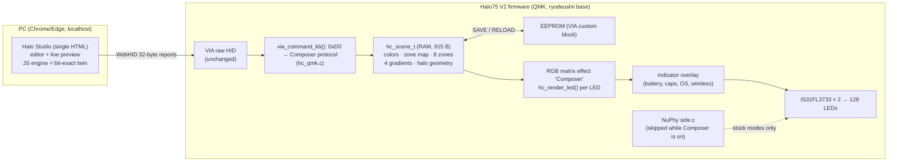

# Halo Composer: per-LED lighting firmware + Halo Studio for the NuPhy Halo75 V2

Written 2026-09-23. It is meant to be handed to Claude Code, running on David's PC with the keyboard plugged in, to build, flash and test on real hardware.

| | |
|---|---|
| **What this is** | A new lighting engine for the Halo75 V2's QMK firmware, plus a browser GUI to drive it. It is a fork of the ryodeushii community firmware. Every LED is individually colorable, including all 45 halo/status/badge LEDs. Effects animate those colors instead of replacing them. Up to 8 zones each get their own effect, speed and brightness floor/ceiling. There are 4 multi-stop gradients, keypress overlays, and a raw-HID protocol. The GUI is **Halo Studio**, a single HTML file using WebHID, with a live animated preview driven by a bit-exact JavaScript copy of the firmware engine. |
| **Built and verified here (no keyboard)** | The firmware compiles cleanly for `nuphy/halo75v2/ansi:composer`: 87,264-byte `.bin`, 0 warnings. The C engine and JS engine agree byte for byte across 80 fuzzed scenes × 40 frames × 128 LEDs plus unit vectors. Halo Studio passes 7/7 end-to-end checks against the **real firmware protocol code** compiled as a fake keyboard (160 HID packets): connect, live push, paint, save to EEPROM, revert, and render parity. |
| **NOT verified** | Anything on the physical keyboard. That covers the flash itself, the real positions of the halo LEDs (currently **inferred**, and there is a calibration wizard for this), frame rate on the 48 MHz Cortex-M0, battery and indicator behaviour, sleep/wake, and wireless modes. Section 10 is the bring-up plan. |
| **Base** | `github.com/ryodeushii/qmk-firmware`, branch `nuphy-keyboards`, commit `9847cb81729fa6540ffed1a583b9acdaaa20607b` (2026-07-24). |

---

## 0. Quick start for Claude Code

```bash
# 1. Get the base firmware and extract this document's files into it
git clone --recurse-submodules -b nuphy-keyboards https://github.com/ryodeushii/qmk-firmware.git halo-composer
cd halo-composer && git checkout 9847cb81729fa6540ffed1a583b9acdaaa20607b
python3 extract_files.py /path/to/HALO_COMPOSER.md .   # script in section 13
git apply keyboards/nuphy/halo75v2/ansi/keymaps/composer/patches/nuphy-shared.diff
chmod +x keyboards/nuphy/halo75v2/ansi/keymaps/composer/tools/run_tests.sh
python3 keyboards/nuphy/halo75v2/ansi/keymaps/composer/tools/make_via_json.py   # VIA JSON with the Composer entry

# 2. Host tests (no keyboard needed): engine parity, fake keyboard, GUI end-to-end
keyboards/nuphy/halo75v2/ansi/keymaps/composer/tools/run_tests.sh

# 3. Build firmware  ->  nuphy_halo75v2_ansi_composer.bin
make nuphy/halo75v2/ansi:composer        # or: qmk compile -kb nuphy/halo75v2/ansi -km composer

# 4. Build + serve the GUI (WebHID needs Chrome/Edge and a secure origin such as localhost)
python3 keyboards/nuphy/halo75v2/ansi/keymaps/composer/studio/build_studio.py
cd keyboards/nuphy/halo75v2/ansi/keymaps/composer/studio && python3 -m http.server 8080
#   open http://localhost:8080/halo-studio.html
```

Before flashing, read section 10, especially the keymap backup. Entering the bootloader by holding **Esc** also **wipes EEPROM**, so keymaps and macros are reset.

On Windows, the easiest toolchain is QMK MSYS (https://msys.qmk.fm), or WSL for building plus QMK Toolbox on Windows for flashing. Flashing on Windows uses QMK Toolbox (https://github.com/qmk/qmk_toolbox/releases): unplug, set the switch to wired, hold Esc, plug in, then Flash. If a flash goes wrong, hold the small button under the Caps Lock keycap while plugging in.

---

## 1. Why NuPhy's "QMK/VIA" feels hollow (short version)

It isn't fake. The Halo75 V2 does run QMK, NuPhy publishes GPL source, and VIA really does remap keys. What's missing is everything that makes QMK/VIA great elsewhere:

- **No upstream QMK and no VIA auto-detection.** There are no NuPhy boards in `qmk/qmk_firmware`. NuPhy's Air75 V2 pull request (#22751) has been open since Dec 2023, labeled `needs-core-wireless`, and a QMK reviewer called it unmergeable because it adds its own lighting systems and duplicates QMK code. The board is not in `the-via/keyboards`, so you must load a JSON file by hand. That's the "draft definition" and warning you saw. Sources: https://github.com/qmk/qmk_firmware/pull/22751, https://github.com/the-via/keyboards, https://nuphy.com/pages/via-usage-guide-for-nuphy-keyboards
- **The halo is outside QMK's lighting system.** `side.c` renders the 45 halo/status LEDs in its own loop with 8 preset colors. It is not in the RGB matrix and not in NuPhy's VIA JSON, so VIA can't touch it. (Verified from source.)
- **Source dumps, not development.** The `halo75_v2` folder has 6 commits, messages like "Fix bugs", last touched 2025-03-25. Source pushes roughly follow binary releases (2.1.5 shipped 4 Mar 2025, source 25 Mar). Firmware 2.1.5 on David's board has two custom keycodes on R and T in the halo layer that are **not in the published source**, so the published code is not exactly what ships (observed in VIA). Community maintainers say the same: "we are not sure if NuPhy published all of their code". Sources: https://github.com/nuphy-src/qmk_firmware/commits/nuphy-keyboards, https://github.com/zhogov/nuphy-state-of-qmk-firmware
- **Closed wireless.** The BT/2.4G radio is a separate chip with separate closed firmware (QMK, RF and dongle are updated separately). VIA is wired-only. Source: https://nuphy.com/pages/qmk-firmwares
- **The community had to fix the basics.** ryodeushii's firmware exists to fix things like RF/BLE reliability, sleep, and debounce. Source: https://github.com/ryodeushii/qmk-firmware/releases
- **Direction of travel.** In Oct 2025 NuPhy moved new Halo V2 production to its own closed "NuPhyIO" firmware. Source: https://www.notebookcheck.net/NuPhy-updates-Halo-V2-wireless-mechanical-keyboards-for-up-to-4X-battery-life-improvements-and-there-s-an-option-with-a-num-pad.1135958.0.html
- **Fairness note.** Part of the gap is VIA itself. VIA has **no per-key RGB editor for any keyboard**; see the open request https://github.com/the-via/app/issues/257. Per-key color on QMK boards always comes from vendor forks (Keychron Launcher), Vial/OpenRGB/SignalRGB protocols, or custom firmware like this one.

---

## 2. Research: what best-in-class lighting looks like, and what we took from it

| Product | Standout lighting features | Taken into this design |
|---|---|---|
| Razer Chroma Studio | Layer stack, selector/pen/paint-bucket tools, Quick Selections, multi-stop gradient "color stoppers", ambient screen awareness | Paint/select tools, quick selections, multi-stop gradients; screen ambience is on the roadmap |
| Corsair iCUE | Stacked lighting layers, quick zones, Murals (screen/audio/image to lighting) | Zones plus overlay layer; host streaming on the roadmap |
| Logitech G HUB | Freestyle per-key painting, screen sampler, audio visualizer | Per-LED painting; roadmap |
| SteelSeries GameSense | Event-driven value meters on key zones (health/ammo bars) | Roadmap: meter effect driven over HID |
| Wootility | Browser-based, live on-screen preview, effect layers, copy/paste between layers | Browser GUI with a live preview that uses the *same math* as the firmware |
| Keychron Launcher + Keychron QMK fork | WebHID, per-key HSV stored in EEPROM, "Mixed RGB" = 2 regions × up to 5 sequenced effects; RAM until an explicit SAVE | Same RAM-until-SAVE model; we go further: 8 zones, effects that modulate per-LED color, halo included |
| ASUS Aura Creator | Timeline of effect "bricks", layers, per-brick speed/angle | Roadmap: playlists/crossfades |
| Mountain Base Camp | Several effects overlaid per key; each perimeter LED individually settable | Halo LEDs are first-class LEDs here |
| Glorious CORE (counter-example) | Side lights/badge can't take per-key effects | Exactly the limitation we remove |

Prior art on the QMK protocol side (all fetched from source by a research pass):

- **Keychron:** command `0xA8` + sub-commands for per-key color get/set (≤9 LEDs/packet) and regions. Scene is 598 B for 128 LEDs. https://github.com/Keychron/qmk_firmware/tree/2025q3/keyboards/keychron/common/rgb
- **VialRGB:** rides inside VIA commands 0x07–0x09 (value IDs 0x40–0x44), direct HSV fast-set of ≤9 LEDs per packet, RAM only.
- **SignalRGB:** commands `0x21–0x28`, streaming only, and does not coexist happily with VIA. ryodeushii already ships an `srgb` keymap for the Halo75 V2 that treats the halo as plain LEDs.
- **OpenRGB-QMK:** 64-byte packets and command IDs that collide with VIA's.
- **Our choice:** command byte **`0xD0`**, which is free across VIA/Vial/Keychron/SignalRGB. It coexists with VIA, since everything that isn't `0xD0` falls through to VIA unchanged.

---

## 3. Hardware facts and budgets

| Item | Value | Source |
|---|---|---|
| MCU | STM32F072 (Cortex-M0, 48 MHz, **no FPU, no hardware divide**), 128 KB flash, 16 KB RAM | ryodeushii tree |
| LED drivers | 2 × IS31FL3733 (I2C 0x50/0x53, 1 MHz), 64 RGB LEDs each, 8-bit PWM | `config.h` |
| LEDs | 0–82 per-key, **83–127 "halo"** (45) | `side.c`, `keyboard.json` |
| Halo sub-groups (NuPhy code) | 83–87 = 5-LED **status bar** (caps/battery/OS/wireless indicators); 88–127 = 40 "ambient" LEDs | `side.c` |
| Physical halo layout | **INFERRED, unverified.** NuPhy's power-on sweep order plus its "auxiliary light group" bitmasks suggest: front edge 19 LEDs (125,126,127,92–88,93–103, right→left), left side 104–110, back 111–117, badge 118–119, right side 120–124, status bar top-left. The GUI calibration wizard fixes whatever is wrong and stores the real positions in the keyboard. | derived from `side.c` + original NuPhy `side.c` group masks |
| Stock quirk | With key brightness at 0, NuPhy's `led_power_handle()` cuts power to **both** drivers, so the halo dies too. Patched here with a weak hook. | `common/config/config.c` |
| RAM | Stock `via` build leaves **2,616 B** free heap. Composer build leaves **1,496 B** (scene 915 B + state 192 B). Engine worst stack frame 120 B. | linker map, `-fstack-usage` |
| Flash | `via` build 78.3 KB → `composer` build 87.3 KB (of 128 KB, minus the emulated-EEPROM pages) | `arm-none-eabi-size` |
| EEPROM | Emulated, 4 KB logical. 8 layers × 6 × 17 × 2 = 1,632 B keymaps. The scene adds 915 B in VIA's custom-config block, so **VIA's macro buffer shrinks from ~2.4 KB to ~1.5 KB**. | QMK nvm code; VIA readout 2,411 B on stock |
| Frame rate | QMK RGB matrix here: flush limit 25 ms (~40 fps), 4 LEDs per task call | `keyboard.json` |
| Raw HID | 32-byte reports, **USB only** (the RF protocol carries only keyboard/mouse/consumer/system reports) | `rf_protocol.h` |

---

## 4. Architecture



**Per-frame pipeline for each LED** (`hc_render_led`, integer-only):

1. **Zone lookup.** `zone_of[led] & 7` selects one of 8 zones. Bit 7 means "ignore keypress overlays".
2. **Base color from the zone's source.**
   - *Painted* (per-LED RGB from the GUI).
   - *Zone color*.
   - *Gradient*: a 1–6 stop gradient sampled along `src_axis` × `src_scale`, optionally scrolling.
   - *Rainbow*: hue from position.
3. **Effect modulates that color.** Most effects only change brightness between the zone's `v_min` and `v_max`, so a painted palette survives every effect. Hue effects rotate each LED's own hue. Sparkle, raindrops, ripple and heatmap blend toward an accent color.
4. **Keypress overlay** (per zone): flash, glow, ripple, or **halo echo**. Echo lights the halo LEDs nearest the pressed key.
5. **Master brightness.** Keys use QMK's global value (Fn+↑/↓). The halo uses NuPhy's halo level (**Fn+M+↑/↓ keeps working**; 6 steps 0–100%), or can optionally follow the keys. Optional gamma 2.2.
6. **Indicators** (NuPhy's battery/caps/OS/wireless) are drawn on top from the RGB-matrix indicator callback, so they never flicker against the effect.

**Why this shape:**

- Effects-as-modulators is what makes "apply standard effects while keeping my per-LED colors" possible.
- Zones give per-key effects with different speeds (e.g. WASD breathing fast, halo breathing slow between 50% and 100%) without a RAM-heavy layer stack. 16 KB of RAM leaves ~1.5 KB after this design.
- Every animation is a **pure function of (scene, time, key hits)**. Random effects use hashed per-LED slots instead of stored state. That is what lets the browser preview be bit-exact, and it keeps RAM use tiny. The only stored state is 8 recent key hits and a 128-byte heat map.

**Integration points** (all other ryodeushii code untouched):

- New keymap `keyboards/nuphy/halo75v2/ansi/keymaps/composer/`. It has the same layers as `default`, plus a 128-LED `g_led_config` in QMK's standard 224×64 space. Halo LEDs have flag `NONE`, so stock effects keep leaving them to NuPhy's halo engine.
- `side.c` (+26 lines under `#ifdef HALO_COMPOSER_ENABLE`): skips NuPhy's halo rendering while Composer is active, and exposes `side_composer_overlay()` and `side_power_show_active()`.
- `common/config/config.c` (+7 lines): weak `nuphy_leds_need_power()`. The stock default returns false, so there is no behaviour change for other keymaps.
- The Composer is effect #43 in the RGB-matrix list, after NuPhy's `game_mode` and `position_mode`. Reach it with Fn+← (cycles effects), the last entry in VIA's Effect dropdown when using `halo75v2_composer_via3.json`, or Halo Studio's "Turn Composer on".

---

## 5. Scene data model (`hc_scene_t`, 915 bytes, little-endian, packed)

| Offset | Size | Field |
|---|---|---|
| 0 | 1 | `magic` = 0xC7 |
| 1 | 1 | `version` = 1 |
| 2 | 1 | `flags`: bit0 gamma 2.2, bit1 halo follows key brightness |
| 3 | 1 | reserved |
| 4 | 384 | `color[128][3]`: painted RGB per LED |
| 388 | 128 | `zone_of[128]`: bits0-2 zone, bit7 = ignore keypress overlays |
| 516 | 160 | `zones[8]` × 20 B (below) |
| 676 | 104 | `grad[4]` × 26 B: `count, flags(bit0 wrap), stop[6]{pos,r,g,b}` (stops sorted by pos) |
| 780 | 90 | `halo_xy[45][2]`: calibrated positions, QMK 224×64 space |
| 870 | 45 | `halo_ring[45]`: perimeter coordinate 0–255 (drives the Ring axis) |

Zone (20 B):

| Byte | Field | Meaning |
|---|---|---|
| 0 | effect | see section 6 |
| 1 | speed | 0–255; one cycle ≈ `262144/(speed+16)` ms (16.4 s @0, 1.8 s @128, 0.97 s @255) |
| 2 | v_min | brightness floor 0–255 |
| 3 | v_max | brightness ceiling 0–255 |
| 4 | axis | effect axis: 0 X, 1 Y, 2 radial, 3 angle, 4 spiral, 5 diagonal, 6 ring, 7 none |
| 5 | spread | phase spread across the axis (16 = one full cycle) |
| 6 | p1 | effect parameter 1 |
| 7 | p2 | effect parameter 2 |
| 8 | flags | bit0 reverse, bit1 also scroll the color source, bit2 mirror axis |
| 9 | source | 0 painted, 1 zone color, 2 gradient, 3 rainbow |
| 10 | src_axis | axis for gradient/rainbow |
| 11 | src_scale | 16 = spans the axis once |
| 12 | gradient | slot 0–3 |
| 13 | reactive | low nibble: 0 none, 1 flash, 2 glow, 3 ripple, 4 halo echo · high nibble: fade speed 0–15 |
| 14–16 | color | zone color (source=1) / accent color (sparkle, raindrops, ripple, heatmap; black = LED's own color) |
| 17–19 | rx_color | overlay color (black = white) |

**Default scene** (factory and "Warm Desk"): keys (255,200,140) static; WASD (255,170,70) at 78%; halo amber (255,100,16) breathing 50–100% with a ~4.7 s cycle.

---

## 6. Effects reference

| # | Effect | What it does | p1 | p2 |
|---|---|---|---|---|
| 0 | Static | Solid at Max | – | – |
| 1 | Breathe | Sine between Min and Max. Spread > 0 makes a breathing wave along the axis. | – | – |
| 2 | Heartbeat | Two beats then rest | – | – |
| 3 | Wave | Soft bright band sweeps along the axis over the Min background | band width | – |
| 4 | White wave | Band washes colors toward white | band width | whiteness |
| 5 | Hue drift | Each LED's hue swings ± around its own hue | swing | – |
| 6 | Color cycle | Rotates hue, keeping sat/val. With spread: rainbow sweep, pinwheel (angle), rings (radial), spiral | – | – |
| 7 | Flow | Scrolls the gradient/rainbow source along its axis | – | – |
| 8 | Sparkle | Random LEDs flash to the accent color, base at Min | density | – |
| 9 | Candle | Smooth independent flicker per LED, Min..Max | – | – |
| 10 | Raindrops | Random LEDs fade to accent and back (hue shift if no accent) | density | hue shift |
| 11 | Comet | Heads with fading tails along the axis (Ring = orbit the halo) | tail length | count 1–8 |
| 12 | Strobe | Hard blink Max/Min | duty | – |
| 13 | Reactive fade | Min until pressed; pressed key → Max, fades (speed = fade length 0.15–3.2 s) | – | – |
| 14 | Ripple | Rings of accent color expand from each keypress, into the halo | ring width | – |
| 15 | Heatmap | Keys tint toward accent with use; cool down over ~10 s | – | – |
| 16 | Off | Dark | – | – |

This covers QMK's standard effect set as modulators:

- Breathing, Band Sat/Val → Breathe, White wave, Wave.
- Cycle All / Left-Right / Up-Down / Out-In / Pinwheel / Spiral → Color cycle and Flow with an axis.
- Hue Breathing/Pendulum/Wave → Hue drift.
- Raindrops, Jellybean → Raindrops, Sparkle.
- Reactive family → Reactive fade and the overlays.
- Splash family → Ripple.
- Typing heatmap → Heatmap.

The stock QMK effects are still present too. Composer is just one more mode.

---

## 7. Raw HID protocol (`0xD0`)

Request `[0xD0, sub, args…]` → response `[0xD0, sub, status, payload…]`, where status 0 = OK, 1 = bad argument, 2 = unknown. All SETs are **RAM only** until `SAVE`. Packets are 32 bytes.

| Sub | Name | Args → Response |
|---|---|---|
| 0x01 | GET_INFO | → ver, led_count, key_leds, halo_leds, zones, gradients, stops, fx_count, active, scene_size(lo,hi), scene_flags, magic, mode, prev_mode |
| 0x02 | SET_ACTIVE | on (switches RGB mode to Composer / back to the previous mode) |
| 0x03 / 0x04 | SET/GET_COLORS | start, n≤9, rgb×n |
| 0x05 / 0x06 | SET/GET_ZONE_MAP | start, n≤27 (get ≤28), bytes |
| 0x07 / 0x08 | SET/GET_ZONE | zone, 20 bytes |
| 0x09 / 0x0A | SET/GET_GRADIENT | slot, 26 bytes |
| 0x0B / 0x0C | SET/GET_HALO_GEOM | start, n≤9, (x,y,ring)×n |
| 0x0D / 0x0E | SET/GET_SCENE_FLAGS | flags |
| 0x10 | SAVE | scene → EEPROM |
| 0x11 | RELOAD | EEPROM → RAM (defaults if invalid) |
| 0x12 | DEFAULTS | factory scene into RAM |
| 0x13 | IDENTIFY | led, r, g, b, ms(lo,hi): only that LED lit (calibration); led=0xFF cancels |
| 0x14 | SIM_KEY | led: inject a key hit (preview reactive effects on the hardware) |
| 0x15 | GET_STATS | → frames(u32), key master, halo master, halo level, power-on-sweep active |

A full scene push is about 45 packets. Halo Studio sends only dirty ranges, debounced by 60 ms.

---

## 8. Halo Studio (GUI)

A single self-contained HTML file with no build step to run it. `build_studio.py` only inlines the sources. It uses Chrome/Edge WebHID from `http://localhost`.

- **Stage.** Animated keyboard with halo, driven by the JS twin of the firmware engine at 60 fps.
  - Tools: select (click, box-drag, Shift add, Alt remove, Ctrl toggle), paint brush, eyedropper, and "Type" (click keys or type to fire reactive effects, which are also mirrored to the keyboard).
  - Views: live, base colors, zone numbers.
  - Quick selections: All, Keys, Halo, WASD, Arrows, Letters, Home row, Numbers, F-row, Mods, Nav, Status bar, Badge, Halo front/back/sides, Invert, None.
  - Preview sliders emulate Fn+↑/↓ and Fn+M+↑/↓. There is also a simulated-typing toggle.
- **Paint.** HSV sliders, hex, and swatch presets (Kelvin whites 1900–6500 K, warm, cool, vivid). Fill, darker/lighter, bake a gradient across the selection along any axis, and per-LED "ignore keypress overlays".
- **Zones.** 8 named zones, assign the selection, and select a zone. Settings per zone:
  - effect, with a description of each;
  - speed, shown in seconds per cycle;
  - min/max brightness, effect axis, spread, reverse, mirror, and scroll-colors;
  - color source, gradient slot, color axis and scale;
  - zone/accent color, and keypress overlay with fade and color.
- **Gradients.** 4 slots, up to 6 stops, drag positions, loop/wrap, reverse, and 12 presets: Sunset, Aurora, Ember, Ocean, Warm glow, Fire, Vaporwave, Candy, Forest, Ice, Spectrum, Mono amber.
- **Effects.** Gallery with a description and a live animated mini-preview for every effect, plus "Use in zone N".
- **Scenes.** 11 starter scenes: Warm Desk, Ember Comet, Aurora Drift, Synthwave, Candlelight, Typing Ripples, Focus, Stealth, Rainbow Classic, Heatmap, Ocean Tide. Also a local library (localStorage) and export/import `.halo.json` files. The editor auto-saves locally, and before connecting it snapshots the editor into the library.
- **Halo setup.**
  - A calibration wizard: the keyboard lights one halo LED, you click where it is, and it advances.
  - "Walk the ring", which lights LEDs in ring order.
  - Recompute the ring order from positions, and reset to defaults.
- **Device.** Connection info, Composer on/off, read/push/factory scene, gamma and halo-follows-keys options, a keyboard fps measurement, and an HID log.
- **Header.** Live push toggle, Save to keyboard (EEPROM), and Revert.

**Operating rule:** close VIA (and any other tab using the keyboard) before connecting. Two apps sharing the raw-HID interface produce exactly the "Receiving incorrect response" desync seen earlier in VIA.

---

## 9. Verification performed (sandbox, no hardware)

| Check | Result |
|---|---|
| `make nuphy/halo75v2/ansi:composer` (arm-none-eabi-gcc 13.2.1) | OK, 0 warnings, `.bin` 87,264 B |
| `make nuphy/halo75v2/ansi:via` with the shared patches applied | OK (patches are no-ops for other keymaps) |
| Engine compiled on host with `-Wall -Wextra -Wconversion` | clean |
| **C ↔ JS parity** (`tools/run_tests.sh` step 1): 80 fuzzed scenes (all effects, sources, axes, overlays, flags, gradients 0–6 stops, off-grid halo positions, uint32 timer wrap) × 40 frames × 128 LEDs, plus sin8/hsv/atan2/isqrt vectors | **byte-identical** |
| **GUI ↔ real protocol code** (step 4): Playwright drives the real page. A fake WebHID device forwards reports to `hc_qmk.c` + `hc_engine.c` compiled natively. | **7/7 PASS**: connect read-back, activate, scene live-push, paint + zone edit, SAVE → EEPROM identical, Revert, firmware-glue frame == GUI frame (160 packets) |
| Semantic spot checks | default halo breathes exactly 128→255 (50–100%); every effect produces motion; Off is dark |
| GUI at 1440 px and 400 px | no page errors, no horizontal scroll |

**Not measured:** real render cost on the M0.

- Rough estimate: 300–600 cycles/LED for static/breathe and up to ~5k cycles/LED with ripple overlays and 8 recent hits. That is ≤ ~13 ms/frame worst case, spread over 32 task slices.
- Measure it with Device → "Measure keyboard frame rate" (GET_STATS). Also measure typing latency while hammering keys under the Ripple overlay.

---

## 10. Hardware bring-up plan (for Claude Code + David)

Keep NuPhy's official v2.1.5 `.bin` (https://nuphy.com/pages/qmk-firmwares) and ryodeushii's plain `via` build on disk as rollbacks.

1. **Back up.** In VIA → *Save + Load* → **Save** the current layout JSON. Note any macros; they will be cleared, and the macro buffer drops to ~1.5 KB. Holding Esc to enter the bootloader **erases EEPROM** (QMK bootmagic), so everything resets to defaults after flashing.
2. **Flash.** Wired mode, QMK Toolbox, hold Esc while plugging in, Flash `nuphy_halo75v2_ansi_composer.bin`. Pass: the keyboard types normally.
3. **Stock-mode regression.** Pass criteria:
   - Fn+← cycles stock effects.
   - The Fn+M halo controls still work and the halo does not flicker (stock modes must look identical to ryodeushii's `via` build).
   - VIA loads with `halo75v2_composer_via3.json` (Design tab) and remaps keys.
   - Close VIA afterwards.
4. **Composer on.** Select "Composer (Halo Studio)" (last effect) in VIA, or press Fn+← repeatedly. Expect warm white keys, deeper-toned WASD, and an amber halo breathing 50–100%. Try the brightness keys:
   - Fn+↑/↓ changes the keys.
   - Fn+M+↑/↓ changes the halo (6 steps).
   - Key brightness at 0 with the halo still lit (tests the power patch).
5. **Indicators on top of Composer.** Caps Lock (status bar), Fn+\ battery display, the Win/Mac switch, and the link indicators (Fn+1..4 in wireless). Pass: they show without flicker and disappear cleanly. Watch the charging animation especially: `bat_led_show()` now runs at frame rate instead of housekeeping rate.
6. **Boot sweep.** Unplug and replug. NuPhy's power-on halo sweep should play, then Composer takes over without a glitch.
7. **Halo Studio.** Serve on localhost, Connect, then Halo setup → Start placing:
   - Click all 45 LEDs where they really are. Skip any hidden ones.
   - Then use Walk the ring.
   - Save to keyboard. Record the real layout and feed it back into `tools/gen_geometry.py` so the defaults become correct.
8. **Performance.** Device → Measure frame rate. Target ≥ 25 fps with the "Typing Ripples" scene while typing fast. Typing must never lag. If it does, lower `led_process_limit` work (e.g. use fewer hit slots in overlays) or cache `hc_axis_value` per LED.
9. **Persistence.** Save, unplug, replug. The scene must persist, and so must VIA keymaps and macros.
10. **Wireless and sleep.** Switch to 2.4G and BT. Lighting runs, and the GUI correctly can't connect (USB only). Sleep and wake should restore lighting. Check battery drain against stock over a day with the halo on.
11. **Rollback test** (optional). Flash the `via` build via Esc (EEPROM wiped) and confirm the stock look returns.

---

## 11. Known risks and open questions

- **Halo geometry is inferred.** Until calibrated, spatial effects on the halo may look shuffled. Palette effects (static/breathe/candle) are unaffected.
- **Unreleased base.** ryodeushii's July 2026 HEAD has no public release since 1.1.4 (Sep 2024). The engine and keymap are portable to NuPhy's own source, but the `side.c`/`config.c` hooks differ there.
- **RAM headroom** is 1.5 KB. Don't grow `hc_scene_t` casually. Any layout change must bump `HC_SCENE_VERSION` and `SCENE_BYTES` in the JS, and the size `_Static_assert` will enforce this.
- **Indicator cadence change** (see step 5) and power-on handoff (step 6) are the two integration spots most likely to need a tweak on real hardware.
- **VIA + Studio at the same time** will desync. That is by design of raw HID, not a firmware bug.
- The two unexplained custom keycodes on David's stock 2.1.5 (R/T in the halo layer) don't exist in either source, so they will not exist after flashing.

---

## 12. Roadmap: more ideas that fit this MCU

| Idea | Why | Feasibility on STM32F072 |
|---|---|---|
| **White balance per group** (keys vs halo RGB gains) | Halo diffusers tint differently from keycaps; makes "warm white" match everywhere | Trivial: 6 bytes + 3 multiplies |
| **Multiple stored scenes + Fn+M+1..4** | Switch looks without the GUI | EEPROM-bound: each extra scene costs 915 B of macro space. Alternatives: cap layers at 6 (frees 408 B), or store palette-indexed scenes (~300 B) |
| **Layer-aware lighting** | Hold Fn and the bound keys glow and the rest dim; per-layer zone overrides | Cheap: read `layer_state` in the overlay |
| **WPM-reactive** | Typing speed drives hue or brightness | QMK `WPM_ENABLE`; cheap |
| **Value meters (GameSense-style)** | CPU/volume/download bar on the number row or halo, fed by a tiny host script | New effect + 1-byte HID command |
| **Notifications** | Flash a zone N times on a build finish, message, etc. | Tiny HID command; USB only |
| **Screen ambience on the halo** | Halo matches screen edges | Host-side: Studio `getDisplayMedia` → 45 LEDs = 5 packets/frame, ~30–60 fps wired. Needs a RAM-light "stream zone" so it doesn't overwrite painted colors |
| **Audio visualizer** | Halo/keys dance to music | Host-side Web Audio → same stream path |
| **Playlists with crossfades** | Aura Creator / Keychron Mixed-RGB style sequences | Small: timer + two scene slots in RAM would exceed budget; crossfade between zone configs instead |
| **Time-of-day warmth** | Whites shift warmer at night | No RTC: Studio or a tray script pushes updates |
| **Two-layer compositing with blend modes** | Chroma/iCUE-style stacking | ~512 B RAM more; only after freeing RAM (e.g. drop the typing-heatmap framebuffer, 102 B, and reduce hit slots) |
| **IS31FL3733 hardware auto-breath** | Idle glow at near-zero CPU during light sleep | Driver work; QMK doesn't expose ABM |
| **Port to Air75 V2 / Halo96 V2 / Gem80** | Same common code base | New geometry file + board `side.c` hooks |

---

## 13. Applying this document

All files follow as `<!-- FILE: path -->` + a four-backtick fence, with paths relative to the QMK repo root. Save this as `extract_files.py` and run `python3 extract_files.py HALO_COMPOSER.md <qmk-root>`:

```python
#!/usr/bin/env python3
import re, sys, pathlib
doc = pathlib.Path(sys.argv[1]).read_text(encoding="utf-8")
root = pathlib.Path(sys.argv[2] if len(sys.argv) > 2 else ".")
pat = re.compile(r"^<!-- FILE: ([^\n]+?) -->\n````[\w+-]*\n(.*?)\n````$", re.S | re.M)
n = 0
for path, body in pat.findall(doc):
    p = root / path
    p.parent.mkdir(parents=True, exist_ok=True)
    p.write_text(body + "\n", encoding="utf-8")
    n += 1
    print("wrote", p)
print(n, "files")
```

Then do the rest of section 0 step 1: apply the shared patch, make `run_tests.sh` executable, and generate the VIA JSON. The same change is in the sandbox as two commits on branch `halo-composer` (`9331b4a`, `b3d5a01`). Committing and pushing to a fork on David's GitHub is a good first step for Claude Code.

---

## 14. Source files

### `keyboards/nuphy/halo75v2/ansi/keymaps/composer/patches/nuphy-shared.diff`

Shared-code patch: `side.c` + `common/config/config.c` (apply with `git apply`)
<!-- FILE: keyboards/nuphy/halo75v2/ansi/keymaps/composer/patches/nuphy-shared.diff -->
````diff
diff --git a/keyboards/nuphy/common/config/config.c b/keyboards/nuphy/common/config/config.c
index 3c53a3e..9cb640e 100644
--- a/keyboards/nuphy/common/config/config.c
+++ b/keyboards/nuphy/common/config/config.c
@@ -215,6 +215,12 @@ void user_set_rgb_color(int index, uint8_t red, uint8_t green, uint8_t blue) {
  * @note Turn off LEDs if not used to save some power. This is ported
  *       from older Nuphy leaks.
  */
+// Boards/keymaps can keep the LED drivers powered even when the key brightness
+// is 0 (e.g. Halo Composer lighting only the halo). Default: stock behaviour.
+__attribute__((weak)) bool nuphy_leds_need_power(void) {
+    return false;
+}
+
 void led_power_handle(void) {
     static uint32_t interval = 0;
 
@@ -224,7 +230,7 @@ void led_power_handle(void) {
     interval = timer_read32();
 
     if (rgb_led_last_act > 100) { // 10ms intervals
-        if (rgb_matrix_is_enabled() && rgb_matrix_get_val() != 0) {
+        if (rgb_matrix_is_enabled() && (rgb_matrix_get_val() != 0 || nuphy_leds_need_power())) {
             pwr_rgb_led_on();
         } else { // brightness is 0 or RGB off.
             pwr_rgb_led_off();
diff --git a/keyboards/nuphy/halo75v2/ansi/side.c b/keyboards/nuphy/halo75v2/ansi/side.c
index dba8ca4..7e7daff 100644
--- a/keyboards/nuphy/halo75v2/ansi/side.c
+++ b/keyboards/nuphy/halo75v2/ansi/side.c
@@ -24,6 +24,10 @@ along with this program.  If not, see <http://www.gnu.org/licenses/>.
 #include "side.h"
 #include "timer.h"
 
+#ifdef HALO_COMPOSER_ENABLE
+bool hc_is_active(void);
+#endif
+
 #define SIDE_INDEX 83
 
 #define SIDE_LED_COUNT 5
@@ -770,6 +774,14 @@ void side_led_show(void) {
         return;
     }
 
+#ifdef HALO_COMPOSER_ENABLE
+    // Composer renders the halo itself and draws the indicators via
+    // side_composer_overlay() from the RGB matrix indicator callback.
+    if (hc_is_active()) {
+        return;
+    }
+#endif
+
 #if !NUPHY_SIDE_LIGHTING_ENABLED && !NUPHY_AMBIENT_LIGHTING_ENABLED
     return;
 #endif
@@ -785,3 +797,17 @@ void side_led_show(void) {
 
     halo_side_indicators_show();
 }
+
+#ifdef HALO_COMPOSER_ENABLE
+bool side_power_show_active(void) {
+    return f_power_show;
+}
+
+// Battery / caps / OS / wireless indicators drawn on top of the Composer frame.
+void side_composer_overlay(void) {
+#    if (WORK_MODE == THREE_MODE)
+    bat_led_show();
+#    endif
+    halo_side_indicators_show();
+}
+#endif
````

### `keyboards/nuphy/halo75v2/ansi/keymaps/composer/rules.mk`

Keymap build rules
<!-- FILE: keyboards/nuphy/halo75v2/ansi/keymaps/composer/rules.mk -->
````make
# Halo Composer keymap for NuPhy Halo75 V2 (ANSI)
VIA_ENABLE = yes
RGB_MATRIX_CUSTOM_USER = yes
SRC += composer/hc_engine.c composer/hc_board_geometry.c composer/hc_qmk.c
````

### `keyboards/nuphy/halo75v2/ansi/keymaps/composer/config.h`

Keymap config: EEPROM size, coordinate center
<!-- FILE: keyboards/nuphy/halo75v2/ansi/keymaps/composer/config.h -->
````c
// Halo Composer keymap config
// SPDX-License-Identifier: GPL-2.0-or-later
#pragma once

#define HALO_COMPOSER_ENABLE

// Scene (915 bytes) lives right after NuPhy's 23-byte keyboard_config in VIA's
// custom-config EEPROM block. This shrinks the VIA macro buffer (~2.4 KB -> ~1.5 KB).
#undef VIA_EEPROM_CUSTOM_CONFIG_SIZE
#define VIA_EEPROM_CUSTOM_CONFIG_SIZE (NUPHY_VIA_EEPROM_CUSTOM_CONFIG_SIZE + 915)

// Composer uses QMK's standard 224x64 coordinate space (keyboard.json uses 0..151)
#undef RGB_MATRIX_CENTER
#define RGB_MATRIX_CENTER {112, 32}

// Remember more simultaneous keypresses for ripples/glows
#undef LED_HITS_TO_REMEMBER
#define LED_HITS_TO_REMEMBER 8
````

### `keyboards/nuphy/halo75v2/ansi/keymaps/composer/keymap.c`

Keymap: default layers + 128-LED `g_led_config` + hooks
<!-- FILE: keyboards/nuphy/halo75v2/ansi/keymaps/composer/keymap.c -->
````c
// Halo Composer keymap for NuPhy Halo75 V2 (ANSI)
// SPDX-License-Identifier: GPL-2.0-or-later
//
// Same layers as the default keymap; adds a 128-LED g_led_config (keys + halo)
// and hooks the Composer engine into QMK.

#include "../default/keymap.c"
#include "composer/hc_qmk.h"

// clang-format off
led_config_t g_led_config = {
    {
        {0, 1, 2, 3, 4, 5, 6, 7, 8, 9, 10, 11, 12, 13, 15, 14, NO_LED},
        {16, 17, 18, 19, 20, 21, 22, 23, 24, 25, 26, 27, 28, 29, NO_LED, 30, NO_LED},
        {31, 32, 33, 34, 35, 36, 37, 38, 39, 40, 41, 42, 43, 44, NO_LED, 45, NO_LED},
        {46, 47, 48, 49, 50, 51, 52, 53, 54, 55, 56, 57, NO_LED, 58, NO_LED, 59, NO_LED},
        {60, NO_LED, 61, 62, 63, 64, 65, 66, 67, 68, 69, 70, NO_LED, 71, 72, 73, NO_LED},
        {74, 75, 76, NO_LED, NO_LED, NO_LED, 77, NO_LED, NO_LED, 78, 79, NO_LED, NO_LED, 80, 81, 82, NO_LED},
    },
    {
        // generated by tools/gen_geometry.py (keys 0..82, halo 83..127)
        {22, 16}, {34, 16}, {46, 16}, {58, 16}, {70, 16}, {82, 16}, {94, 16}, {106, 16}, {118, 16}, {130, 16}, {142, 16}, {154, 16}, {166, 16}, {178, 16}, {202, 16}, {190, 16}, {22, 24}, {34, 24}, {46, 24}, {58, 24}, {70, 24}, {82, 24}, {94, 24}, {106, 24}, {118, 24}, {130, 24}, {142, 24}, {154, 24}, {166, 24}, {184, 24}, {202, 24}, {25, 32}, {40, 32}, {52, 32}, {64, 32}, {76, 32}, {88, 32}, {100, 32}, {112, 32}, {124, 32}, {136, 32}, {148, 32}, {160, 32}, {172, 32}, {187, 32}, {202, 32}, {26, 40}, {43, 40}, {55, 40}, {67, 40}, {79, 40}, {91, 40}, {103, 40}, {115, 40}, {127, 40}, {139, 40}, {151, 40}, {163, 40}, {182, 40}, {202, 40}, {30, 48}, {49, 48}, {61, 48}, {73, 48}, {85, 48}, {97, 48}, {109, 48}, {121, 48}, {133, 48}, {145, 48}, {157, 48}, {174, 48}, {190, 48}, {202, 48}, {24, 56}, {38, 56}, {54, 56}, {98, 56}, {144, 56}, {158, 56}, {178, 56}, {190, 56}, {202, 56}, {14, 5}, {20, 5}, {26, 5}, {32, 5}, {38, 5}, {135, 62}, {146, 62}, {157, 62}, {169, 62}, {180, 62}, {123, 62}, {112, 62}, {101, 62}, {89, 62}, {78, 62}, {67, 62}, {55, 62}, {44, 62}, {33, 62}, {21, 62}, {10, 62}, {2, 56}, {2, 48}, {2, 40}, {2, 32}, {2, 24}, {2, 16}, {2, 8}, {60, 2}, {79, 2}, {97, 2}, {116, 2}, {135, 2}, {153, 2}, {172, 2}, {194, 5}, {206, 5}, {222, 8}, {222, 20}, {222, 32}, {222, 44}, {222, 56}, {214, 62}, {203, 62}, {191, 62}
    },
    {
        // keys = KEYLIGHT; halo = NONE so stock QMK effects leave it to NuPhy's halo engine.
        // The Composer effect ignores flags and drives all 128 LEDs.
        [0 ... 82]   = LED_FLAG_KEYLIGHT,
        [83 ... 127] = LED_FLAG_NONE,
    },
};
// clang-format on

void keyboard_post_init_user(void) {
    hc_init();
}

bool process_record_user(uint16_t keycode, keyrecord_t *record) {
    hc_process_key(record->event.key.row, record->event.key.col, record->event.pressed);
    return true;
}

bool rgb_matrix_indicators_user(void) {
    hc_indicators();
    return true;
}
````

### `keyboards/nuphy/halo75v2/ansi/keymaps/composer/rgb_matrix_user.inc`

RGB matrix effects: NuPhy game/position modes + Composer
<!-- FILE: keyboards/nuphy/halo75v2/ansi/keymaps/composer/rgb_matrix_user.inc -->
````c
// Halo Composer: NuPhy's two custom effects + the Composer effect
RGB_MATRIX_EFFECT(game_mode)
RGB_MATRIX_EFFECT(position_mode)
RGB_MATRIX_EFFECT(composer)

#ifdef RGB_MATRIX_CUSTOM_EFFECT_IMPLS

extern rgb_config_t rgb_matrix_config;
bool                hc_rgb_effect(effect_params_t *params);

static bool game_mode(effect_params_t *params) {
    RGB_MATRIX_USE_LIMITS(led_min, led_max);
    for (uint8_t i = led_min; i < led_max; i++) {
        if (i < 83) rgb_matrix_set_color(i, 0x00, 0x00, 0x00);
    }
    rgb_t rgb = hsv_to_rgb(rgb_matrix_config.hsv);
    static const uint8_t lit[] = {0, 33, 47, 48, 49, 72, 80, 81, 82}; // Esc, W A S D, arrows
    for (uint8_t k = 0; k < sizeof(lit); k++) rgb_matrix_set_color(lit[k], rgb.r, rgb.g, rgb.b);
    return rgb_matrix_check_finished_leds(led_max);
}

static bool position_mode(effect_params_t *params) {
    RGB_MATRIX_USE_LIMITS(led_min, led_max);
    for (uint8_t i = led_min; i < led_max; i++) {
        if (i < 83) rgb_matrix_set_color(i, 0x00, 0x00, 0x00);
    }
    rgb_t rgb = hsv_to_rgb(rgb_matrix_config.hsv);
    rgb_matrix_set_color(50, rgb.r, rgb.g, rgb.b); // F
    rgb_matrix_set_color(53, rgb.r, rgb.g, rgb.b); // J
    rgb_matrix_set_color(72, rgb.r, rgb.g, rgb.b); // Up
    return rgb_matrix_check_finished_leds(led_max);
}

static bool composer(effect_params_t *params) {
    return hc_rgb_effect(params);
}

#endif // RGB_MATRIX_CUSTOM_EFFECT_IMPLS
````

### `keyboards/nuphy/halo75v2/ansi/keymaps/composer/composer/hc_engine.h`

Engine API and scene structs
<!-- FILE: keyboards/nuphy/halo75v2/ansi/keymaps/composer/composer/hc_engine.h -->
````c
// Halo Composer - per-LED lighting engine for NuPhy Halo75 V2 (and similar boards)
// Copyright 2026 Halo Composer contributors
// SPDX-License-Identifier: GPL-2.0-or-later
//
// This file is deliberately free of QMK dependencies so it can be compiled
// on a PC for unit tests and mirrored 1:1 by the JavaScript preview engine
// (halo-studio.html -> class HcEngine). Every integer operation here has an
// exact JS twin; if you change the math here, change it there too and rerun
// the parity test (tools/parity_test.sh).

#pragma once

#include <stdbool.h>
#include <stdint.h>

#ifndef HC_KEY_LEDS
#    define HC_KEY_LEDS 83 // per-key LEDs (index 0..82)
#endif
#ifndef HC_HALO_LEDS
#    define HC_HALO_LEDS 45 // status bar (5) + halo underglow (40), index 83..127
#endif
#define HC_LED_COUNT (HC_KEY_LEDS + HC_HALO_LEDS)

#define HC_ZONES 8
#define HC_GRADIENTS 4
#define HC_GRAD_STOPS 6
#define HC_MAX_HITS 8

#define HC_MAGIC 0xC7
#define HC_SCENE_VERSION 1

// Coordinate space: QMK convention, x 0..224, y 0..64, center (112, 32).
#define HC_CENTER_X 112
#define HC_CENTER_Y 32

#if defined(_MSC_VER)
#    define HC_PACKED
#else
#    define HC_PACKED __attribute__((packed))
#endif

// ---------------------------------------------------------------- enums ---
typedef enum {
    HC_FX_STATIC = 0,   // solid, brightness = v_max
    HC_FX_BREATHE,      // sine brightness v_min..v_max (spread>0 = breathing wave)
    HC_FX_PULSE,        // heartbeat double-beat
    HC_FX_WAVE,         // narrow bright band sweeping along the axis
    HC_FX_SATWAVE,      // whitening band sweeping along the axis
    HC_FX_HUE_DRIFT,    // hue swings +/- p1 around each LED's own hue
    HC_FX_COLOR_CYCLE,  // hue rotates through the full wheel (keeps sat/val)
    HC_FX_FLOW,         // scrolls the colour source (gradient/rainbow) along the axis
    HC_FX_SPARKLE,      // random LEDs flash to the accent colour
    HC_FX_CANDLE,       // smooth random flicker per LED
    HC_FX_RAINDROPS,    // random LEDs fade to the accent colour and back
    HC_FX_COMET,        // p2 comets with tail p1 travel along the axis (use RING for halo)
    HC_FX_STROBE,       // on/off, duty = p1
    HC_FX_REACT_FADE,   // dark (v_min) until pressed, key glows then fades
    HC_FX_RIPPLE,       // rings expand from each keypress
    HC_FX_HEATMAP,      // keys tint toward accent the more they are used
    HC_FX_OFF,          // LEDs in this zone are black
    HC_FX_COUNT
} hc_effect_t;

typedef enum {
    HC_SRC_MAP = 0,   // per-LED colour painted in the GUI
    HC_SRC_ZONE,      // the zone's colour
    HC_SRC_GRADIENT,  // multi-stop gradient sampled along src_axis
    HC_SRC_RAINBOW,   // hue from position along src_axis
    HC_SRC_COUNT
} hc_source_t;

typedef enum {
    HC_AXIS_X = 0, // left -> right
    HC_AXIS_Y,     // back -> front
    HC_AXIS_RADIAL,// centre -> outwards
    HC_AXIS_ANGLE, // around the centre (pinwheel)
    HC_AXIS_SPIRAL,// angle + radius
    HC_AXIS_DIAG,  // top-left -> bottom-right
    HC_AXIS_RING,  // halo perimeter order (keys fall back to angle)
    HC_AXIS_NONE,  // everything in phase
    HC_AXIS_COUNT
} hc_axis_t;

typedef enum {
    HC_RX_NONE = 0,
    HC_RX_FLASH,  // pressed key flashes the reactive colour then fades
    HC_RX_GLOW,   // soft glow around the pressed key
    HC_RX_RIPPLE, // ring expanding from the pressed key (reaches the halo too)
    HC_RX_ECHO,   // halo LEDs nearest (by angle) to the pressed key light up
    HC_RX_COUNT
} hc_reactive_t;

// zone.flags
#define HC_ZF_REVERSE 0x01    // run the effect the other way along its axis
#define HC_ZF_SRC_SCROLL 0x02 // also scroll the colour source (any effect)
#define HC_ZF_MIRROR 0x04     // mirror the axis around its middle (ping-pong shapes)

// scene.flags
#define HC_SF_GAMMA 0x01          // perceptual gamma 2.2 on output
#define HC_SF_HALO_FOLLOWS_KEYS 0x02 // halo uses the key brightness (Fn+Up/Down) instead of Fn+M+Up/Down

// scene.zone_of[i] flags
#define HC_LF_ZONE_MASK 0x07
#define HC_LF_NO_REACT 0x80 // this LED ignores reactive overlays

// ---------------------------------------------------------------- structs -
typedef struct HC_PACKED {
    uint8_t effect;    // hc_effect_t
    uint8_t speed;     // 0..255 (cycle ~16 s at 0, ~1 s at 255)
    uint8_t v_min;     // brightness floor 0..255
    uint8_t v_max;     // brightness ceiling 0..255
    uint8_t axis;      // hc_axis_t used by the effect
    uint8_t spread;    // effect phase spread across the axis, 16 = one full cycle
    uint8_t p1;        // effect specific (see docs)
    uint8_t p2;        // effect specific (see docs)
    uint8_t flags;     // HC_ZF_*
    uint8_t source;    // hc_source_t
    uint8_t src_axis;  // hc_axis_t used to map the colour source
    uint8_t src_scale; // 16 = gradient/rainbow spans the axis once
    uint8_t gradient;  // gradient slot 0..HC_GRADIENTS-1
    uint8_t reactive;  // low nibble hc_reactive_t, high nibble reactive speed 0..15
    uint8_t color[3];  // zone colour (HC_SRC_ZONE) and accent colour (sparkle etc.)
    uint8_t rx_color[3]; // reactive colour (black = white)
} hc_zone_t; // 20 bytes

typedef struct HC_PACKED {
    uint8_t pos; // 0..255, stops must be sorted ascending
    uint8_t r, g, b;
} hc_stop_t;

typedef struct HC_PACKED {
    uint8_t   count; // 1..HC_GRAD_STOPS
    uint8_t   flags; // bit0 = wrap (last stop blends back into first)
    hc_stop_t stop[HC_GRAD_STOPS];
} hc_gradient_t; // 26 bytes

typedef struct HC_PACKED {
    uint8_t       magic;
    uint8_t       version;
    uint8_t       flags;    // HC_SF_*
    uint8_t       reserved;
    uint8_t       color[HC_LED_COUNT][3]; // per-LED painted colour
    uint8_t       zone_of[HC_LED_COUNT];  // zone index + HC_LF_* flags
    hc_zone_t     zones[HC_ZONES];
    hc_gradient_t grad[HC_GRADIENTS];
    uint8_t       halo_xy[HC_HALO_LEDS][2]; // calibrated halo positions
    uint8_t       halo_ring[HC_HALO_LEDS];  // perimeter coordinate 0..255 per halo LED
} hc_scene_t;

typedef struct HC_PACKED {
    uint8_t  led;
    uint8_t  x, y;
    uint32_t t; // ms timestamp of the press
} hc_hit_t;

typedef struct {
    hc_hit_t hits[HC_MAX_HITS];
    uint8_t  hit_head;
    uint8_t  heat[HC_LED_COUNT];
    uint32_t heat_t;
} hc_state_t;

// Board description supplied by the board/keymap (flash constants).
extern const uint8_t hc_key_xy[HC_KEY_LEDS][2];
extern const uint8_t hc_default_halo_xy[HC_HALO_LEDS][2];
extern const uint8_t hc_default_halo_ring[HC_HALO_LEDS];

// ------------------------------------------------------------------ API ---
void hc_scene_defaults(hc_scene_t *s);
bool hc_scene_valid(const hc_scene_t *s);
void hc_state_init(hc_state_t *st);

void hc_led_xy(const hc_scene_t *s, uint8_t led, uint8_t *x, uint8_t *y);
void hc_key_hit(hc_state_t *st, const hc_scene_t *s, uint8_t led, uint32_t t);
void hc_frame_begin(hc_state_t *st, const hc_scene_t *s, uint32_t t);
// Renders one LED (before master brightness / gamma). out = r,g,b
void hc_render_led(const hc_scene_t *s, const hc_state_t *st, uint8_t led, uint32_t t, uint8_t out[3]);
// Applies master brightness and optional gamma
void hc_finish(const hc_scene_t *s, uint8_t master, uint8_t c[3]);

// helpers exposed for tests / protocol
uint8_t  hc_scale8(uint8_t i, uint8_t s);
uint8_t  hc_sin8(uint8_t theta);
uint8_t  hc_lerp8(uint8_t a, uint8_t b, uint8_t f);
uint32_t hc_hash32(uint32_t x);
uint16_t hc_phase16(uint32_t t, uint8_t speed);
uint8_t  hc_atan2_8(int16_t dy, int16_t dx);
uint16_t hc_isqrt32(uint32_t n);
void     hc_rgb2hsv(const uint8_t rgb[3], uint8_t hsv[3]);
void     hc_hsv2rgb(const uint8_t hsv[3], uint8_t rgb[3]);
void     hc_grad_sample(const hc_gradient_t *g, uint8_t pos, uint8_t out[3]);
uint8_t  hc_axis_value(const hc_scene_t *s, uint8_t led, uint8_t axis);
````

### `keyboards/nuphy/halo75v2/ansi/keymaps/composer/composer/hc_engine.c`

Engine (pure integer math, mirrored by hc_engine.js)
<!-- FILE: keyboards/nuphy/halo75v2/ansi/keymaps/composer/composer/hc_engine.c -->
````c
// Halo Composer - per-LED lighting engine
// Copyright 2026 Halo Composer contributors
// SPDX-License-Identifier: GPL-2.0-or-later
//
// Pure integer math, no floats (Cortex-M0 has no FPU), no QMK headers.
// Mirrored exactly by HcEngine in halo-studio.html. Keep them in sync.

#include "hc_engine.h"
#include <string.h>

// ------------------------------------------------------------- helpers ---
uint8_t hc_scale8(uint8_t i, uint8_t s) {
    return (uint8_t)(((uint16_t)i * (1u + (uint16_t)s)) >> 8);
}

static uint8_t qadd8(uint8_t a, uint8_t b) {
    uint16_t r = (uint16_t)a + b;
    return r > 255 ? 255 : (uint8_t)r;
}

static uint8_t qsub8(uint8_t a, uint8_t b) {
    return a > b ? (uint8_t)(a - b) : 0;
}

uint8_t hc_lerp8(uint8_t a, uint8_t b, uint8_t f) {
    if (b >= a) return (uint8_t)(a + hc_scale8((uint8_t)(b - a), f));
    return (uint8_t)(a - hc_scale8((uint8_t)(a - b), f));
}

// FastLED sin8_C: 0..255 in -> 1..255 out, sin8(64) = 255
static const uint8_t b_m16_interleave[8] = {0, 49, 49, 41, 90, 27, 117, 10};

uint8_t hc_sin8(uint8_t theta) {
    uint8_t offset = theta;
    if (theta & 0x40) offset = (uint8_t)(255 - offset);
    offset &= 0x3F;
    uint8_t secoffset = offset & 0x0F;
    if (theta & 0x40) secoffset++;
    uint8_t section = offset >> 4;
    uint8_t b       = b_m16_interleave[section * 2];
    uint8_t m16     = b_m16_interleave[section * 2 + 1];
    uint8_t mx      = (uint8_t)((m16 * secoffset) >> 4);
    int     y       = mx + b;
    if (theta & 0x80) y = -y;
    return (uint8_t)(y + 128);
}

static uint8_t tri8(uint8_t u) {
    return u < 128 ? (uint8_t)(u * 2) : (uint8_t)((255 - u) * 2);
}

uint32_t hc_hash32(uint32_t x) {
    x ^= x >> 16;
    x *= 0x7feb352dU;
    x ^= x >> 15;
    x *= 0x846ca68bU;
    x ^= x >> 16;
    return x;
}

// 16-bit phase: wraps every 65536*4/(speed+16) ms -> 16.4 s @0, 0.97 s @255
uint16_t hc_phase16(uint32_t t, uint8_t speed) {
    return (uint16_t)(((uint64_t)t * (uint32_t)(speed + 16u)) >> 2);
}

// same clock without the 16-bit wrap (wraps at 2^32), for per-LED random slots
static uint32_t phase32(uint32_t t, uint8_t speed) {
    return (uint32_t)(((uint64_t)t * (uint32_t)(speed + 16u)) >> 2);
}

// 0..255 angle, 0 = +x (right), increasing clockwise on screen (y grows downward)
uint8_t hc_atan2_8(int16_t dy, int16_t dx) {
    if (dx == 0 && dy == 0) return 0;
    uint16_t ax = (uint16_t)(dx < 0 ? -dx : dx);
    uint16_t ay = (uint16_t)(dy < 0 ? -dy : dy);
    uint8_t  a;
    if (ax >= ay) {
        a = (uint8_t)(((uint32_t)ay * 32u) / ax);
    } else {
        a = (uint8_t)(64u - ((uint32_t)ax * 32u) / ay);
    }
    if (dx < 0) a = (uint8_t)(128 - a);
    if (dy < 0) a = (uint8_t)(256 - a);
    return a;
}

uint16_t hc_isqrt32(uint32_t n) {
    uint32_t res = 0;
    uint32_t bit = 1UL << 30;
    while (bit > n) bit >>= 2;
    while (bit) {
        if (n >= res + bit) {
            n -= res + bit;
            res = (res >> 1) + bit;
        } else {
            res >>= 1;
        }
        bit >>= 2;
    }
    return (uint16_t)res;
}

void hc_hsv2rgb(const uint8_t hsv[3], uint8_t rgb[3]) {
    uint8_t h = hsv[0], s = hsv[1], v = hsv[2];
    if (s == 0) {
        rgb[0] = rgb[1] = rgb[2] = v;
        return;
    }
    uint8_t region = h / 43;
    uint8_t rem    = (uint8_t)((h - region * 43) * 6);
    uint8_t p      = (uint8_t)((v * (255 - s)) >> 8);
    uint8_t q      = (uint8_t)((v * (255 - ((s * rem) >> 8))) >> 8);
    uint8_t t      = (uint8_t)((v * (255 - ((s * (255 - rem)) >> 8))) >> 8);
    switch (region) {
        case 0: rgb[0] = v; rgb[1] = t; rgb[2] = p; break;
        case 1: rgb[0] = q; rgb[1] = v; rgb[2] = p; break;
        case 2: rgb[0] = p; rgb[1] = v; rgb[2] = t; break;
        case 3: rgb[0] = p; rgb[1] = q; rgb[2] = v; break;
        case 4: rgb[0] = t; rgb[1] = p; rgb[2] = v; break;
        default: rgb[0] = v; rgb[1] = p; rgb[2] = q; break;
    }
}

void hc_rgb2hsv(const uint8_t c[3], uint8_t hsv[3]) {
    int r = c[0], g = c[1], b = c[2];
    int mx = r > g ? (r > b ? r : b) : (g > b ? g : b);
    int mn = r < g ? (r < b ? r : b) : (g < b ? g : b);
    hsv[2] = (uint8_t)mx;
    if (mx == 0) {
        hsv[0] = 0;
        hsv[1] = 0;
        return;
    }
    int d  = mx - mn;
    hsv[1] = (uint8_t)((255 * d) / mx);
    if (d == 0) {
        hsv[0] = 0;
        return;
    }
    int h;
    if (mx == r) {
        h = (43 * (g - b)) / d;
    } else if (mx == g) {
        h = 85 + (43 * (b - r)) / d;
    } else {
        h = 171 + (43 * (r - g)) / d;
    }
    hsv[0] = (uint8_t)(h & 0xFF);
}

static void hue_shift(uint8_t c[3], uint8_t off) {
    if (off == 0) return;
    uint8_t hsv[3];
    hc_rgb2hsv(c, hsv);
    hsv[0] = (uint8_t)(hsv[0] + off);
    hc_hsv2rgb(hsv, c);
}

static void scale_rgb(uint8_t c[3], uint8_t v) {
    c[0] = hc_scale8(c[0], v);
    c[1] = hc_scale8(c[1], v);
    c[2] = hc_scale8(c[2], v);
}

static void lerp_rgb(uint8_t a[3], const uint8_t b[3], uint8_t f) {
    a[0] = hc_lerp8(a[0], b[0], f);
    a[1] = hc_lerp8(a[1], b[1], f);
    a[2] = hc_lerp8(a[2], b[2], f);
}

static void copy_rgb(uint8_t d[3], const uint8_t s[3]) {
    d[0] = s[0];
    d[1] = s[1];
    d[2] = s[2];
}

static bool is_black(const uint8_t c[3]) {
    return (c[0] | c[1] | c[2]) == 0;
}

void hc_grad_sample(const hc_gradient_t *g, uint8_t pos, uint8_t out[3]) {
    uint8_t n = g->count;
    if (n > HC_GRAD_STOPS) n = HC_GRAD_STOPS;
    if (n == 0) {
        out[0] = out[1] = out[2] = 0;
        return;
    }
    const hc_stop_t *st = g->stop;
    if (n == 1) {
        out[0] = st[0].r; out[1] = st[0].g; out[2] = st[0].b;
        return;
    }
    bool    wrap = (g->flags & 1) != 0;
    uint8_t i    = 0;
    while (i < n && st[i].pos <= pos) i++;
    const hc_stop_t *a;
    const hc_stop_t *b;
    uint16_t         span, off;
    if (i == 0) {
        if (!wrap) {
            out[0] = st[0].r; out[1] = st[0].g; out[2] = st[0].b;
            return;
        }
        a    = &st[n - 1];
        b    = &st[0];
        span = (uint16_t)(256 - a->pos + b->pos);
        off  = (uint16_t)(256 - a->pos + pos);
    } else if (i == n) {
        if (!wrap) {
            out[0] = st[n - 1].r; out[1] = st[n - 1].g; out[2] = st[n - 1].b;
            return;
        }
        a    = &st[n - 1];
        b    = &st[0];
        span = (uint16_t)(256 - a->pos + b->pos);
        off  = (uint16_t)(pos - a->pos);
    } else {
        a    = &st[i - 1];
        b    = &st[i];
        span = (uint16_t)(b->pos - a->pos);
        off  = (uint16_t)(pos - a->pos);
    }
    uint8_t f = span ? (uint8_t)(((uint32_t)off * 255u) / span) : 0;
    out[0]    = hc_lerp8(a->r, b->r, f);
    out[1]    = hc_lerp8(a->g, b->g, f);
    out[2]    = hc_lerp8(a->b, b->b, f);
}

// --------------------------------------------------------------- geometry -
void hc_led_xy(const hc_scene_t *s, uint8_t led, uint8_t *x, uint8_t *y) {
    if (led < HC_KEY_LEDS) {
        *x = hc_key_xy[led][0];
        *y = hc_key_xy[led][1];
    } else {
        uint8_t h = (uint8_t)(led - HC_KEY_LEDS);
        *x        = s->halo_xy[h][0];
        *y        = s->halo_xy[h][1];
    }
}

uint8_t hc_axis_value(const hc_scene_t *s, uint8_t led, uint8_t axis) {
    uint8_t x, y;
    hc_led_xy(s, led, &x, &y);
    int16_t dx = (int16_t)x - HC_CENTER_X;
    int16_t dy = (int16_t)y - HC_CENTER_Y;
    switch (axis) {
        case HC_AXIS_X: {
            uint16_t v = (uint16_t)(((uint16_t)x * 255u) / 224u);
            return v > 255 ? 255 : (uint8_t)v;
        }
        case HC_AXIS_Y: {
            uint16_t v = (uint16_t)y * 4u;
            return v > 255 ? 255 : (uint8_t)v;
        }
        case HC_AXIS_RADIAL: {
            uint16_t d = (uint16_t)(hc_isqrt32((uint32_t)(dx * dx + dy * dy)) * 2u);
            return d > 255 ? 255 : (uint8_t)d;
        }
        case HC_AXIS_ANGLE:
            return hc_atan2_8(dy, dx);
        case HC_AXIS_SPIRAL: {
            uint16_t d = (uint16_t)(hc_isqrt32((uint32_t)(dx * dx + dy * dy)) * 2u);
            if (d > 255) d = 255;
            return (uint8_t)(hc_atan2_8(dy, dx) + d);
        }
        case HC_AXIS_DIAG: {
            uint16_t vx = (uint16_t)(((uint16_t)x * 255u) / 224u);
            uint16_t vy = (uint16_t)y * 4u;
            if (vx > 255) vx = 255;
            if (vy > 255) vy = 255;
            return (uint8_t)((vx + vy) / 2u);
        }
        case HC_AXIS_RING:
            if (led >= HC_KEY_LEDS) return s->halo_ring[led - HC_KEY_LEDS];
            return hc_atan2_8(dy, dx);
        case HC_AXIS_NONE:
        default:
            return 0;
    }
}

static uint8_t zone_axis(const hc_scene_t *s, const hc_zone_t *z, uint8_t led, uint8_t axis) {
    uint8_t a = hc_axis_value(s, led, axis);
    if (z->flags & HC_ZF_MIRROR) a = tri8(a);
    return a;
}

// ------------------------------------------------------------ lifecycle ---
void hc_state_init(hc_state_t *st) {
    memset(st, 0, sizeof(*st));
    for (uint8_t i = 0; i < HC_MAX_HITS; i++) st->hits[i].led = 0xFF;
}

void hc_key_hit(hc_state_t *st, const hc_scene_t *s, uint8_t led, uint32_t t) {
    if (led >= HC_LED_COUNT) return;
    hc_hit_t *h  = &st->hits[st->hit_head];
    st->hit_head = (uint8_t)((st->hit_head + 1) % HC_MAX_HITS);
    h->led       = led;
    hc_led_xy(s, led, &h->x, &h->y);
    h->t          = t;
    st->heat[led] = qadd8(st->heat[led], 40);
}

void hc_frame_begin(hc_state_t *st, const hc_scene_t *s, uint32_t t) {
    (void)s;
    uint32_t steps = (uint32_t)(t - st->heat_t) / 40u;
    if (steps == 0) return;
    st->heat_t += steps * 40u;
    uint8_t dec = steps > 255 ? 255 : (uint8_t)steps;
    for (uint8_t i = 0; i < HC_LED_COUNT; i++) st->heat[i] = qsub8(st->heat[i], dec);
}

// ------------------------------------------------------------- effects ---
// accent colour: zone colour, or the LED's base colour when the zone colour is black
static void accent_of(const hc_zone_t *z, const uint8_t base[3], uint8_t out[3]) {
    if (is_black(z->color)) {
        copy_rgb(out, base);
    } else {
        copy_rgb(out, z->color);
    }
}

// random "slot" helper for sparkle/raindrops: returns envelope position 0..255
// inside the LED's current slot and whether this slot fires (density p)
static bool rand_slot(uint32_t ph32, uint8_t led, uint8_t shift, uint8_t density, uint8_t *pos) {
    uint32_t o    = hc_hash32((uint32_t)led + 0x9E37u) & 0xFFFFu;
    uint32_t tt   = ph32 + o;
    uint32_t slot = tt >> shift;
    *pos          = (uint8_t)((tt >> (shift - 8)) & 0xFFu);
    uint32_t h    = hc_hash32(slot ^ ((uint32_t)led << 24) ^ 0xA5A5u);
    return (h & 0xFFu) < density;
}

static uint8_t band8(uint8_t theta, uint8_t p1) {
    uint16_t w = (uint16_t)((p1 >> 1) + 1); // 1..128
    uint16_t d = theta < 128 ? theta : (uint16_t)(256 - theta);
    if (d >= w) return 0;
    return hc_sin8((uint8_t)(64u + (d * 128u) / w));
}

static uint16_t dist_to(uint8_t x0, uint8_t y0, uint8_t x1, uint8_t y1) {
    int32_t dx = (int32_t)x1 - x0;
    int32_t dy = (int32_t)y1 - y0;
    return hc_isqrt32((uint32_t)(dx * dx + dy * dy));
}

void hc_render_led(const hc_scene_t *s, const hc_state_t *st, uint8_t led, uint32_t t, uint8_t out[3]) {
    const uint8_t   zl = s->zone_of[led];
    const hc_zone_t *z = &s->zones[zl & HC_LF_ZONE_MASK];
    out[0] = out[1] = out[2] = 0;
    if (z->effect == HC_FX_OFF || z->effect >= HC_FX_COUNT) return;

    const uint16_t ph16 = hc_phase16(t, z->speed);
    const uint8_t  ph8  = (uint8_t)(ph16 >> 8);
    const bool     rev  = (z->flags & HC_ZF_REVERSE) != 0;
    const uint8_t  lo   = z->v_min < z->v_max ? z->v_min : z->v_max;
    const uint8_t  hi   = z->v_min < z->v_max ? z->v_max : z->v_min;
    const uint8_t  rng  = (uint8_t)(hi - lo);

    // ---- base colour
    uint8_t c[3];
    uint8_t scroll = (z->effect == HC_FX_FLOW || (z->flags & HC_ZF_SRC_SCROLL)) ? ph8 : 0;
    if (rev) scroll = (uint8_t)(0 - scroll);
    switch (z->source) {
        case HC_SRC_ZONE:
            copy_rgb(c, z->color);
            break;
        case HC_SRC_GRADIENT: {
            uint8_t p = (uint8_t)(((uint16_t)zone_axis(s, z, led, z->src_axis) * z->src_scale) >> 4);
            hc_grad_sample(&s->grad[z->gradient % HC_GRADIENTS], (uint8_t)(p - scroll), c);
            break;
        }
        case HC_SRC_RAINBOW: {
            uint8_t p      = (uint8_t)(((uint16_t)zone_axis(s, z, led, z->src_axis) * z->src_scale) >> 4);
            uint8_t hsv[3] = {(uint8_t)(p - scroll), 255, 255};
            hc_hsv2rgb(hsv, c);
            break;
        }
        case HC_SRC_MAP:
        default:
            copy_rgb(c, s->color[led]);
            break;
    }

    // ---- effect
    const uint8_t a     = zone_axis(s, z, led, z->axis);
    const uint8_t sp    = (uint8_t)(((uint16_t)a * z->spread) >> 4);
    const uint8_t theta = rev ? (uint8_t)(ph8 + sp) : (uint8_t)(ph8 - sp);
    uint8_t       acc[3];

    switch (z->effect) {
        case HC_FX_STATIC:
        case HC_FX_FLOW:
            scale_rgb(c, hi);
            break;

        case HC_FX_BREATHE:
            scale_rgb(c, (uint8_t)(lo + hc_scale8(hc_sin8(theta), rng)));
            break;

        case HC_FX_PULSE: {
            uint8_t e;
            if (theta < 32) {
                e = tri8((uint8_t)(theta * 8));
            } else if (theta >= 48 && theta < 80) {
                e = hc_scale8(tri8((uint8_t)((theta - 48) * 8)), 170);
            } else {
                e = 0;
            }
            scale_rgb(c, (uint8_t)(lo + hc_scale8(e, rng)));
            break;
        }

        case HC_FX_WAVE:
            scale_rgb(c, (uint8_t)(lo + hc_scale8(band8(theta, z->p1), rng)));
            break;

        case HC_FX_SATWAVE: {
            static const uint8_t white[3] = {255, 255, 255};
            lerp_rgb(c, white, hc_scale8(band8(theta, z->p1), z->p2));
            scale_rgb(c, hi);
            break;
        }

        case HC_FX_HUE_DRIFT: {
            int off = (((int)hc_sin8(theta) - 128) * (int)z->p1) / 128;
            hue_shift(c, (uint8_t)(off & 0xFF));
            scale_rgb(c, hi);
            break;
        }

        case HC_FX_COLOR_CYCLE:
            hue_shift(c, theta);
            scale_rgb(c, hi);
            break;

        case HC_FX_SPARKLE: {
            uint8_t pos;
            bool    fire = rand_slot(phase32(t, z->speed), led, 11, z->p1, &pos);
            accent_of(z, c, acc);
            scale_rgb(c, lo);
            if (fire) {
                uint8_t e = (uint8_t)(255 - pos);
                e         = hc_scale8(e, e);
                scale_rgb(acc, hi);
                lerp_rgb(c, acc, e);
            }
            break;
        }

        case HC_FX_RAINDROPS: {
            uint8_t pos;
            bool    fire = rand_slot(phase32(t, z->speed), led, 12, z->p1, &pos);
            accent_of(z, c, acc);
            if (is_black(z->color)) hue_shift(acc, z->p2);
            scale_rgb(c, hi);
            if (fire) {
                scale_rgb(acc, hi);
                lerp_rgb(c, acc, tri8(pos));
            }
            break;
        }

        case HC_FX_CANDLE: {
            uint32_t o  = hc_hash32((uint32_t)led + 0x9E37u) & 0xFFFFu;
            uint32_t tt = phase32(t, z->speed) + o;
            uint32_t k  = tt >> 10;
            uint8_t  f  = (uint8_t)((tt >> 2) & 0xFFu);
            uint8_t  n0 = (uint8_t)(hc_hash32(k ^ ((uint32_t)led << 24)) & 0xFFu);
            uint8_t  n1 = (uint8_t)(hc_hash32((k + 1u) ^ ((uint32_t)led << 24)) & 0xFFu);
            scale_rgb(c, (uint8_t)(lo + hc_scale8(hc_lerp8(n0, n1, f), rng)));
            break;
        }

        case HC_FX_COMET: {
            uint8_t  n    = z->p2 == 0 ? 1 : (z->p2 > 8 ? 8 : z->p2);
            uint16_t seg  = (uint16_t)(256u / n);
            uint8_t  tail = z->p1 == 0 ? 1 : z->p1;
            uint8_t  head = rev ? (uint8_t)(0 - ph8) : ph8;
            uint8_t  d    = rev ? (uint8_t)(a - head) : (uint8_t)(head - a);
            uint16_t dm   = (uint16_t)(d % seg);
            uint8_t  e    = 0;
            if (dm < tail) {
                e = (uint8_t)(255u - (dm * 255u) / tail);
                e = hc_scale8(e, e);
            }
            scale_rgb(c, (uint8_t)(lo + hc_scale8(e, rng)));
            break;
        }

        case HC_FX_STROBE:
            scale_rgb(c, theta < z->p1 ? hi : lo);
            break;

        case HC_FX_REACT_FADE: {
            uint32_t dur = 150u + (uint32_t)(255 - z->speed) * 12u;
            uint8_t  e   = 0;
            for (uint8_t i = 0; i < HC_MAX_HITS; i++) {
                const hc_hit_t *h = &st->hits[i];
                if (h->led != led) continue;
                uint32_t age = t - h->t;
                if (age >= dur) continue;
                uint8_t f = (uint8_t)(255u - (age * 255u) / dur);
                if (f > e) e = f;
            }
            scale_rgb(c, (uint8_t)(lo + hc_scale8(e, rng)));
            break;
        }

        case HC_FX_RIPPLE: {
            const uint32_t life = 1500u;
            uint8_t        x, y;
            hc_led_xy(s, led, &x, &y);
            uint16_t w = (uint16_t)(z->p1 / 8u + 2u);
            uint8_t  e = 0;
            for (uint8_t i = 0; i < HC_MAX_HITS; i++) {
                const hc_hit_t *h = &st->hits[i];
                if (h->led == 0xFF) continue;
                uint32_t age = t - h->t;
                if (age >= life) continue;
                uint32_t r    = (age * (16u + z->speed / 2u)) / 256u;
                uint16_t dist = dist_to(h->x, h->y, x, y);
                uint32_t dd   = dist > r ? dist - r : r - dist;
                if (dd >= w) continue;
                uint8_t ring = (uint8_t)(((w - dd) * 255u) / w);
                uint8_t f    = hc_scale8(ring, (uint8_t)(255u - (age * 255u) / life));
                if (f > e) e = f;
            }
            accent_of(z, c, acc);
            scale_rgb(c, lo);
            scale_rgb(acc, hi);
            lerp_rgb(c, acc, e);
            break;
        }

        case HC_FX_HEATMAP:
            accent_of(z, c, acc);
            scale_rgb(c, lo);
            scale_rgb(acc, hi);
            lerp_rgb(c, acc, st->heat[led]);
            break;

        default:
            break;
    }

    // ---- reactive overlay
    uint8_t kind = z->reactive & 0x0F;
    if (kind != HC_RX_NONE && kind < HC_RX_COUNT && !(zl & HC_LF_NO_REACT)) {
        uint32_t dur = 200u + (uint32_t)(15u - (z->reactive >> 4)) * 120u;
        uint8_t  e   = 0;
        uint8_t  x, y;
        hc_led_xy(s, led, &x, &y);
        for (uint8_t i = 0; i < HC_MAX_HITS; i++) {
            const hc_hit_t *h = &st->hits[i];
            if (h->led == 0xFF) continue;
            uint32_t age = t - h->t;
            if (age >= dur) continue;
            uint8_t fade = (uint8_t)(255u - (age * 255u) / dur);
            uint8_t f    = 0;
            switch (kind) {
                case HC_RX_FLASH:
                    if (h->led == led) f = fade;
                    break;
                case HC_RX_GLOW: {
                    uint16_t dist = dist_to(h->x, h->y, x, y);
                    if (dist < 28) f = hc_scale8(fade, (uint8_t)(255u - (dist * 255u) / 28u));
                    break;
                }
                case HC_RX_RIPPLE: {
                    uint32_t r    = (age * 3u) / 10u;
                    uint16_t dist = dist_to(h->x, h->y, x, y);
                    uint32_t dd   = dist > r ? dist - r : r - dist;
                    if (dd < 10) f = hc_scale8(fade, (uint8_t)((10u - dd) * 25u));
                    break;
                }
                case HC_RX_ECHO:
                    if (led >= HC_KEY_LEDS) {
                        uint8_t ah = hc_atan2_8((int16_t)y - HC_CENTER_Y, (int16_t)x - HC_CENTER_X);
                        uint8_t ak = hc_atan2_8((int16_t)h->y - HC_CENTER_Y, (int16_t)h->x - HC_CENTER_X);
                        uint8_t d  = (uint8_t)(ah - ak);
                        if (d > 128) d = (uint8_t)(256 - d);
                        if (d < 20) f = hc_scale8(fade, (uint8_t)(255u - d * 12u));
                    }
                    break;
                default:
                    break;
            }
            if (f > e) e = f;
        }
        if (e) {
            uint8_t rc[3];
            if (is_black(z->rx_color)) {
                rc[0] = rc[1] = rc[2] = 255;
            } else {
                copy_rgb(rc, z->rx_color);
            }
            lerp_rgb(c, rc, e);
        }
    }

    copy_rgb(out, c);
}

static const uint8_t gamma22[256] = {
    0,0,0,0,0,0,0,0,0,0,0,0,0,0,0,1,1,1,1,1,1,1,1,1,1,2,2,2,2,2,2,2,3,3,3,3,3,4,4,4,4,5,5,5,5,6,6,6,6,7,7,7,8,8,8,9,9,9,10,10,11,11,11,12,12,13,13,13,14,14,15,15,16,16,17,17,18,18,19,19,20,20,21,22,22,23,23,24,25,25,26,26,27,28,28,29,30,30,31,32,33,33,34,35,35,36,37,38,39,39,40,41,42,43,43,44,45,46,47,48,49,49,50,51,52,53,54,55,56,57,58,59,60,61,62,63,64,65,66,67,68,69,70,71,73,74,75,76,77,78,79,81,82,83,84,85,87,88,89,90,91,93,94,95,97,98,99,100,102,103,105,106,107,109,110,111,113,114,116,117,119,120,121,123,124,126,127,129,130,132,133,135,137,138,140,141,143,145,146,148,149,151,153,154,156,158,159,161,163,165,166,168,170,172,173,175,177,179,181,182,184,186,188,190,192,194,196,197,199,201,203,205,207,209,211,213,215,217,219,221,223,225,227,229,231,234,236,238,240,242,244,246,248,251,253,255,
};

void hc_finish(const hc_scene_t *s, uint8_t master, uint8_t c[3]) {
    scale_rgb(c, master);
    if (s->flags & HC_SF_GAMMA) {
        c[0] = gamma22[c[0]];
        c[1] = gamma22[c[1]];
        c[2] = gamma22[c[2]];
    }
}

// --------------------------------------------------------------- defaults -
static void set_zone(hc_zone_t *z, uint8_t effect, uint8_t source, uint8_t speed, uint8_t lo, uint8_t hi) {
    memset(z, 0, sizeof(*z));
    z->effect    = effect;
    z->source    = source;
    z->speed     = speed;
    z->v_min     = lo;
    z->v_max     = hi;
    z->axis      = HC_AXIS_X;
    z->spread    = 16;
    z->src_axis  = HC_AXIS_X;
    z->src_scale = 16;
    z->p1        = 96;
    z->p2        = 1;
}

static void set_grad(hc_gradient_t *g, uint8_t flags, uint8_t n, const uint8_t (*st)[4]) {
    memset(g, 0, sizeof(*g));
    g->count = n;
    g->flags = flags;
    for (uint8_t i = 0; i < n; i++) {
        g->stop[i].pos = st[i][0];
        g->stop[i].r   = st[i][1];
        g->stop[i].g   = st[i][2];
        g->stop[i].b   = st[i][3];
    }
}

void hc_scene_defaults(hc_scene_t *s) {
    memset(s, 0, sizeof(*s));
    s->magic   = HC_MAGIC;
    s->version = HC_SCENE_VERSION;

    // Default look: warm white keys, WASD a slightly deeper warm tone,
    // amber halo breathing between 50% and 100%.
    for (uint8_t i = 0; i < HC_LED_COUNT; i++) {
        s->color[i][0] = 255;
        s->color[i][1] = 200;
        s->color[i][2] = 140;
        s->zone_of[i]  = i < HC_KEY_LEDS ? 0 : 2;
    }
    static const uint8_t wasd[4] = {33, 47, 48, 49};
    for (uint8_t i = 0; i < 4; i++) {
        s->color[wasd[i]][0] = 255;
        s->color[wasd[i]][1] = 170;
        s->color[wasd[i]][2] = 70;
        s->zone_of[wasd[i]]  = 1;
    }
    for (uint8_t i = HC_KEY_LEDS; i < HC_LED_COUNT; i++) {
        s->color[i][0] = 255;
        s->color[i][1] = 100;
        s->color[i][2] = 16;
    }

    set_zone(&s->zones[0], HC_FX_STATIC, HC_SRC_MAP, 128, 0, 255);
    set_zone(&s->zones[1], HC_FX_STATIC, HC_SRC_MAP, 128, 0, 200);
    set_zone(&s->zones[2], HC_FX_BREATHE, HC_SRC_ZONE, 40, 128, 255);
    s->zones[2].axis     = HC_AXIS_NONE;
    s->zones[2].spread   = 0;
    s->zones[2].color[0] = 255;
    s->zones[2].color[1] = 100;
    s->zones[2].color[2] = 16;
    for (uint8_t i = 3; i < HC_ZONES; i++) set_zone(&s->zones[i], HC_FX_STATIC, HC_SRC_MAP, 128, 0, 255);

    static const uint8_t sunset[3][4] = {{0, 255, 60, 0}, {128, 255, 0, 90}, {255, 90, 0, 255}};
    static const uint8_t aurora[3][4] = {{0, 0, 255, 120}, {96, 0, 120, 255}, {192, 160, 0, 255}};
    static const uint8_t ember[3][4]  = {{0, 255, 40, 0}, {160, 255, 140, 0}, {255, 255, 220, 120}};
    static const uint8_t ocean[3][4]  = {{0, 0, 40, 255}, {128, 0, 200, 255}, {255, 0, 255, 160}};
    set_grad(&s->grad[0], 0, 3, sunset);
    set_grad(&s->grad[1], 1, 3, aurora);
    set_grad(&s->grad[2], 0, 3, ember);
    set_grad(&s->grad[3], 1, 3, ocean);

    memcpy(s->halo_xy, hc_default_halo_xy, sizeof(s->halo_xy));
    memcpy(s->halo_ring, hc_default_halo_ring, sizeof(s->halo_ring));
}

bool hc_scene_valid(const hc_scene_t *s) {
    if (s->magic != HC_MAGIC || s->version != HC_SCENE_VERSION) return false;
    for (uint8_t i = 0; i < HC_ZONES; i++) {
        if (s->zones[i].effect >= HC_FX_COUNT) return false;
        if (s->zones[i].source >= HC_SRC_COUNT) return false;
        if (s->zones[i].axis >= HC_AXIS_COUNT || s->zones[i].src_axis >= HC_AXIS_COUNT) return false;
    }
    for (uint8_t i = 0; i < HC_GRADIENTS; i++) {
        if (s->grad[i].count > HC_GRAD_STOPS) return false;
    }
    return true;
}
````

### `keyboards/nuphy/halo75v2/ansi/keymaps/composer/composer/hc_protocol.h`

Raw HID protocol constants
<!-- FILE: keyboards/nuphy/halo75v2/ansi/keymaps/composer/composer/hc_protocol.h -->
````c
// Halo Composer raw-HID protocol (rides on VIA's raw HID interface, 32-byte reports)
// SPDX-License-Identifier: GPL-2.0-or-later
//
// Request : [0]=HC_HID_CMD [1]=sub-command [2..31]=arguments
// Response: [0]=HC_HID_CMD [1]=sub-command [2]=status  [3..31]=payload
//
// 0xD0 does not collide with VIA (0x01-0x15, 0xFE, 0xFF), SignalRGB (0x21-0x28),
// Keychron (0xA0-0xAB) or OpenRGB-QMK (0x01-0x09 are already VIA's anyway).
// All SET_* commands change RAM only; nothing touches EEPROM until HC_SAVE.

#pragma once

#define HC_HID_CMD 0xD0
#define HC_PROTOCOL_VERSION 1

enum hc_status {
    HC_OK        = 0,
    HC_E_ARG     = 1, // argument out of range
    HC_E_UNKNOWN = 2, // unknown sub-command
};

enum hc_subcmd {
    HC_GET_INFO        = 0x01, // -> ver, led_count, key_leds, halo_leds, zones, gradients, stops, fx_count, active, scene_size(lo,hi), scene_flags, magic, mode, prev_mode
    HC_SET_ACTIVE      = 0x02, // [on]         switch RGB mode to/from "Composer"
    HC_SET_COLORS      = 0x03, // [start, n<=9, r,g,b * n]
    HC_GET_COLORS      = 0x04, // [start, n<=9] -> r,g,b * n
    HC_SET_ZONE_MAP    = 0x05, // [start, n<=27, byte * n]   (zone index | HC_LF_* flags)
    HC_GET_ZONE_MAP    = 0x06, // [start, n<=28] -> byte * n
    HC_SET_ZONE        = 0x07, // [zone, 20 bytes hc_zone_t]
    HC_GET_ZONE        = 0x08, // [zone] -> 20 bytes
    HC_SET_GRADIENT    = 0x09, // [slot, 26 bytes hc_gradient_t]
    HC_GET_GRADIENT    = 0x0A, // [slot] -> 26 bytes
    HC_SET_HALO_GEOM   = 0x0B, // [start, n<=9, x,y,ring * n]  (start/n index halo LEDs 0..44)
    HC_GET_HALO_GEOM   = 0x0C, // [start, n<=9] -> x,y,ring * n
    HC_SET_SCENE_FLAGS = 0x0D, // [flags]
    HC_GET_SCENE_FLAGS = 0x0E, // -> flags
    HC_SAVE            = 0x10, // write RAM scene to EEPROM
    HC_RELOAD          = 0x11, // reload scene from EEPROM (defaults if invalid)
    HC_DEFAULTS        = 0x12, // load factory scene into RAM (not saved)
    HC_IDENTIFY        = 0x13, // [led, r, g, b, ms_lo, ms_hi]  light ONE led, others off (calibration); led=0xFF cancels
    HC_SIM_KEY         = 0x14, // [led]  inject a key hit (preview reactive effects from the GUI)
    HC_GET_STATS       = 0x15, // -> frames(u32 LE), rgb_val, halo_master, side_level, power_show
};
````

### `keyboards/nuphy/halo75v2/ansi/keymaps/composer/composer/hc_qmk.h`

QMK glue API
<!-- FILE: keyboards/nuphy/halo75v2/ansi/keymaps/composer/composer/hc_qmk.h -->
````c
// Halo Composer - QMK glue API
// SPDX-License-Identifier: GPL-2.0-or-later
#pragma once

#include <stdbool.h>
#include <stdint.h>
#include "rgb_matrix.h"

void hc_init(void);
bool hc_is_active(void);
bool hc_rgb_effect(effect_params_t *params);
void hc_process_key(uint8_t row, uint8_t col, bool pressed);
void hc_indicators(void);

// provided by side.c (patched) when HALO_COMPOSER_ENABLE is defined
bool side_power_show_active(void);
void side_composer_overlay(void);
````

### `keyboards/nuphy/halo75v2/ansi/keymaps/composer/composer/hc_qmk.c`

QMK glue: effect, keypress hook, indicators, raw HID handler, EEPROM
<!-- FILE: keyboards/nuphy/halo75v2/ansi/keymaps/composer/composer/hc_qmk.c -->
````c
// Halo Composer - QMK glue for NuPhy Halo75 V2 (ryodeushii common code base)
// SPDX-License-Identifier: GPL-2.0-or-later

#include <string.h>
#include "quantum.h"
#include "rgb_matrix.h"
#include "raw_hid.h"
#include "via.h"
#include "common/config.h"
#include "hc_engine.h"
#include "hc_protocol.h"
#include "hc_qmk.h"

#define HC_EEPROM_OFFSET NUPHY_VIA_EEPROM_CUSTOM_CONFIG_SIZE

_Static_assert(sizeof(hc_scene_t) == 915, "hc_scene_t layout changed - bump HC_SCENE_VERSION and update the GUI");
_Static_assert(VIA_EEPROM_CUSTOM_CONFIG_SIZE >= HC_EEPROM_OFFSET + sizeof(hc_scene_t), "VIA_EEPROM_CUSTOM_CONFIG_SIZE too small for the composer scene");
_Static_assert(RGB_MATRIX_LED_COUNT == HC_LED_COUNT, "composer expects 128 LEDs (83 keys + 45 halo)");

static hc_scene_t hc_scene;
static hc_state_t hc_state;
static bool       hc_inited    = false;
static uint8_t    hc_prev_mode = RGB_MATRIX_SOLID_COLOR;
static uint32_t   hc_frames    = 0;

static struct {
    uint8_t  led;
    uint8_t  rgb[3];
    uint32_t until;
} hc_ident = {.led = 0xFF};

// Fn+M+Up/Down still controls the halo: NuPhy's 0..5 level becomes a linear master.
static const uint8_t hc_halo_levels[6] = {0, 48, 96, 144, 200, 255};

static uint8_t halo_master(void) {
    if (hc_scene.flags & HC_SF_HALO_FOLLOWS_KEYS) return rgb_matrix_get_val();
    uint8_t lvl = keyboard_config.lights.side_brightness;
    return hc_halo_levels[lvl > 5 ? 5 : lvl];
}

static void hc_load(void) {
    via_read_custom_config(&hc_scene, HC_EEPROM_OFFSET, sizeof(hc_scene));
    if (!hc_scene_valid(&hc_scene)) {
        hc_scene_defaults(&hc_scene);
        via_update_custom_config(&hc_scene, HC_EEPROM_OFFSET, sizeof(hc_scene));
    }
}

void hc_init(void) {
    if (hc_inited) return;
    hc_state_init(&hc_state);
    hc_load();
    hc_inited = true;
}

bool hc_is_active(void) {
    return rgb_matrix_is_enabled() && rgb_matrix_get_mode() == RGB_MATRIX_CUSTOM_composer;
}

// Keeps the LED drivers powered when keys are at brightness 0 but the halo is lit
// (NuPhy's led_power_handle() otherwise cuts both IS31FL3733 drivers).
bool nuphy_leds_need_power(void) {
    return hc_is_active() && halo_master() > 0;
}

bool hc_rgb_effect(effect_params_t *params) {
    RGB_MATRIX_USE_LIMITS(led_min, led_max);
    if (!hc_inited) hc_init();

    const uint32_t t = g_rgb_timer;
    if (params->iter == 0) {
        hc_frame_begin(&hc_state, &hc_scene, t);
        hc_frames++;
    }
    const uint8_t mk         = rgb_matrix_get_val();
    const uint8_t mh         = halo_master();
    const bool    ident      = hc_ident.led != 0xFF && (int32_t)(hc_ident.until - t) > 0;
    const bool    power_show = side_power_show_active();

    for (uint8_t i = led_min; i < led_max && i < HC_LED_COUNT; i++) {
        if (i >= HC_KEY_LEDS && power_show) continue; // NuPhy boot sweep owns the halo
        uint8_t c[3] = {0, 0, 0};
        if (ident) {
            if (i == hc_ident.led) memcpy(c, hc_ident.rgb, 3);
        } else {
            hc_render_led(&hc_scene, &hc_state, i, t, c);
            hc_finish(&hc_scene, i < HC_KEY_LEDS ? mk : mh, c);
        }
        rgb_matrix_set_color(i, c[0], c[1], c[2]);
    }
    return rgb_matrix_check_finished_leds(led_max);
}

void hc_process_key(uint8_t row, uint8_t col, bool pressed) {
    if (!pressed || !hc_inited || !hc_is_active()) return;
    if (row >= MATRIX_ROWS || col >= MATRIX_COLS) return;
    uint8_t led = g_led_config.matrix_co[row][col];
    if (led == NO_LED) return;
    hc_key_hit(&hc_state, &hc_scene, led, g_rgb_timer);
}

void hc_indicators(void) {
    if (hc_is_active()) side_composer_overlay();
}

// ---------------------------------------------------------------- raw HID -
static void set_active(bool on) {
    uint8_t mode = rgb_matrix_get_mode();
    if (on) {
        if (mode != RGB_MATRIX_CUSTOM_composer) hc_prev_mode = mode;
        if (!rgb_matrix_is_enabled()) rgb_matrix_enable();
        rgb_matrix_mode(RGB_MATRIX_CUSTOM_composer);
    } else if (mode == RGB_MATRIX_CUSTOM_composer) {
        rgb_matrix_mode(hc_prev_mode == RGB_MATRIX_CUSTOM_composer ? RGB_MATRIX_SOLID_COLOR : hc_prev_mode);
    }
}

static void hc_handle_hid(uint8_t *data) {
    uint8_t a[29];
    memcpy(a, &data[2], sizeof(a)); // arguments, before we overwrite data[2] with the status
    uint8_t *status = &data[2];
    uint8_t *out    = &data[3];
    memset(&data[2], 0, 30);
    *status = HC_OK;

    switch (data[1]) {
        case HC_GET_INFO:
            out[0]  = HC_PROTOCOL_VERSION;
            out[1]  = HC_LED_COUNT;
            out[2]  = HC_KEY_LEDS;
            out[3]  = HC_HALO_LEDS;
            out[4]  = HC_ZONES;
            out[5]  = HC_GRADIENTS;
            out[6]  = HC_GRAD_STOPS;
            out[7]  = HC_FX_COUNT;
            out[8]  = hc_is_active();
            out[9]  = (uint8_t)(sizeof(hc_scene_t) & 0xFF);
            out[10] = (uint8_t)(sizeof(hc_scene_t) >> 8);
            out[11] = hc_scene.flags;
            out[12] = HC_MAGIC;
            out[13] = rgb_matrix_get_mode();
            out[14] = hc_prev_mode;
            break;

        case HC_SET_ACTIVE:
            set_active(a[0] != 0);
            break;

        case HC_SET_COLORS: {
            uint8_t start = a[0], n = a[1];
            if (n > 9 || start >= HC_LED_COUNT || start + n > HC_LED_COUNT) { *status = HC_E_ARG; break; }
            memcpy(hc_scene.color[start], &a[2], (size_t)n * 3);
            break;
        }
        case HC_GET_COLORS: {
            uint8_t start = a[0], n = a[1];
            if (n > 9 || start >= HC_LED_COUNT || start + n > HC_LED_COUNT) { *status = HC_E_ARG; break; }
            memcpy(out, hc_scene.color[start], (size_t)n * 3);
            break;
        }
        case HC_SET_ZONE_MAP: {
            uint8_t start = a[0], n = a[1];
            if (n > 27 || start >= HC_LED_COUNT || start + n > HC_LED_COUNT) { *status = HC_E_ARG; break; }
            for (uint8_t i = 0; i < n; i++) hc_scene.zone_of[start + i] = a[2 + i] & (HC_LF_ZONE_MASK | HC_LF_NO_REACT);
            break;
        }
        case HC_GET_ZONE_MAP: {
            uint8_t start = a[0], n = a[1];
            if (n > 28 || start >= HC_LED_COUNT || start + n > HC_LED_COUNT) { *status = HC_E_ARG; break; }
            memcpy(out, &hc_scene.zone_of[start], n);
            break;
        }
        case HC_SET_ZONE: {
            hc_zone_t z;
            if (a[0] >= HC_ZONES) { *status = HC_E_ARG; break; }
            memcpy(&z, &a[1], sizeof(z));
            if (z.effect >= HC_FX_COUNT || z.source >= HC_SRC_COUNT || z.axis >= HC_AXIS_COUNT || z.src_axis >= HC_AXIS_COUNT || z.gradient >= HC_GRADIENTS) {
                *status = HC_E_ARG;
                break;
            }
            hc_scene.zones[a[0]] = z;
            break;
        }
        case HC_GET_ZONE:
            if (a[0] >= HC_ZONES) { *status = HC_E_ARG; break; }
            memcpy(out, &hc_scene.zones[a[0]], sizeof(hc_zone_t));
            break;

        case HC_SET_GRADIENT: {
            hc_gradient_t g;
            if (a[0] >= HC_GRADIENTS) { *status = HC_E_ARG; break; }
            memcpy(&g, &a[1], sizeof(g));
            if (g.count > HC_GRAD_STOPS) { *status = HC_E_ARG; break; }
            hc_scene.grad[a[0]] = g;
            break;
        }
        case HC_GET_GRADIENT:
            if (a[0] >= HC_GRADIENTS) { *status = HC_E_ARG; break; }
            memcpy(out, &hc_scene.grad[a[0]], sizeof(hc_gradient_t));
            break;

        case HC_SET_HALO_GEOM: {
            uint8_t start = a[0], n = a[1];
            if (n > 9 || start >= HC_HALO_LEDS || start + n > HC_HALO_LEDS) { *status = HC_E_ARG; break; }
            for (uint8_t i = 0; i < n; i++) {
                hc_scene.halo_xy[start + i][0] = a[2 + i * 3];
                hc_scene.halo_xy[start + i][1] = a[3 + i * 3];
                hc_scene.halo_ring[start + i]  = a[4 + i * 3];
            }
            break;
        }
        case HC_GET_HALO_GEOM: {
            uint8_t start = a[0], n = a[1];
            if (n > 9 || start >= HC_HALO_LEDS || start + n > HC_HALO_LEDS) { *status = HC_E_ARG; break; }
            for (uint8_t i = 0; i < n; i++) {
                out[i * 3]     = hc_scene.halo_xy[start + i][0];
                out[i * 3 + 1] = hc_scene.halo_xy[start + i][1];
                out[i * 3 + 2] = hc_scene.halo_ring[start + i];
            }
            break;
        }
        case HC_SET_SCENE_FLAGS:
            hc_scene.flags = a[0];
            break;
        case HC_GET_SCENE_FLAGS:
            out[0] = hc_scene.flags;
            break;

        case HC_SAVE:
            via_update_custom_config(&hc_scene, HC_EEPROM_OFFSET, sizeof(hc_scene));
            break;
        case HC_RELOAD:
            hc_load();
            break;
        case HC_DEFAULTS:
            hc_scene_defaults(&hc_scene);
            break;

        case HC_IDENTIFY:
            hc_ident.led    = a[0] < HC_LED_COUNT ? a[0] : 0xFF;
            hc_ident.rgb[0] = a[1];
            hc_ident.rgb[1] = a[2];
            hc_ident.rgb[2] = a[3];
            hc_ident.until  = g_rgb_timer + (uint32_t)(a[4] | (a[5] << 8));
            break;

        case HC_SIM_KEY:
            if (a[0] >= HC_LED_COUNT) { *status = HC_E_ARG; break; }
            hc_key_hit(&hc_state, &hc_scene, a[0], g_rgb_timer);
            break;

        case HC_GET_STATS:
            out[0] = (uint8_t)(hc_frames);
            out[1] = (uint8_t)(hc_frames >> 8);
            out[2] = (uint8_t)(hc_frames >> 16);
            out[3] = (uint8_t)(hc_frames >> 24);
            out[4] = rgb_matrix_get_val();
            out[5] = halo_master();
            out[6] = keyboard_config.lights.side_brightness;
            out[7] = side_power_show_active();
            break;

        default:
            *status = HC_E_UNKNOWN;
            break;
    }
}

// VIA calls this first for every raw HID report; anything that is not ours
// falls through to VIA's normal handling.
bool via_command_kb(uint8_t *data, uint8_t length) {
    if (length < 32 || data[0] != HC_HID_CMD) return false;
    if (!hc_inited) hc_init();
    hc_handle_hid(data);
    raw_hid_send(data, length);
    return true;
}

// Test hook (host builds only use it; harmless on the keyboard)
hc_scene_t *hc_debug_scene(void) {
    return &hc_scene;
}
````

### `keyboards/nuphy/halo75v2/ansi/keymaps/composer/composer/hc_board_geometry.c`

GENERATED LED geometry (tools/gen_geometry.py)
<!-- FILE: keyboards/nuphy/halo75v2/ansi/keymaps/composer/composer/hc_board_geometry.c -->
````c
// GENERATED by tools/gen_geometry.py - do not edit by hand
#include "hc_engine.h"

const uint8_t hc_key_xy[HC_KEY_LEDS][2] = {
    {22, 16}, {34, 16}, {46, 16}, {58, 16}, {70, 16}, {82, 16}, {94, 16}, {106, 16}, {118, 16}, {130, 16}, {142, 16}, {154, 16}, {166, 16}, {178, 16}, {202, 16}, {190, 16}, {22, 24}, {34, 24}, {46, 24}, {58, 24}, {70, 24}, {82, 24}, {94, 24}, {106, 24}, {118, 24}, {130, 24}, {142, 24}, {154, 24}, {166, 24}, {184, 24}, {202, 24}, {25, 32}, {40, 32}, {52, 32}, {64, 32}, {76, 32}, {88, 32}, {100, 32}, {112, 32}, {124, 32}, {136, 32}, {148, 32}, {160, 32}, {172, 32}, {187, 32}, {202, 32}, {26, 40}, {43, 40}, {55, 40}, {67, 40}, {79, 40}, {91, 40}, {103, 40}, {115, 40}, {127, 40}, {139, 40}, {151, 40}, {163, 40}, {182, 40}, {202, 40}, {30, 48}, {49, 48}, {61, 48}, {73, 48}, {85, 48}, {97, 48}, {109, 48}, {121, 48}, {133, 48}, {145, 48}, {157, 48}, {174, 48}, {190, 48}, {202, 48}, {24, 56}, {38, 56}, {54, 56}, {98, 56}, {144, 56}, {158, 56}, {178, 56}, {190, 56}, {202, 56}
};

// Halo positions are INFERRED (see docs). Verify with the calibration wizard.
const uint8_t hc_default_halo_xy[HC_HALO_LEDS][2] = {
    {14, 5}, {20, 5}, {26, 5}, {32, 5}, {38, 5}, {135, 62}, {146, 62}, {157, 62}, {169, 62}, {180, 62}, {123, 62}, {112, 62}, {101, 62}, {89, 62}, {78, 62}, {67, 62}, {55, 62}, {44, 62}, {33, 62}, {21, 62}, {10, 62}, {2, 56}, {2, 48}, {2, 40}, {2, 32}, {2, 24}, {2, 16}, {2, 8}, {60, 2}, {79, 2}, {97, 2}, {116, 2}, {135, 2}, {153, 2}, {172, 2}, {194, 5}, {206, 5}, {222, 8}, {222, 20}, {222, 32}, {222, 44}, {222, 56}, {214, 62}, {203, 62}, {191, 62}
};

const uint8_t hc_default_halo_ring[HC_HALO_LEDS] = {
    164, 170, 176, 182, 187, 56, 51, 45, 39, 34, 62, 68, 73, 79, 85, 91, 96, 102, 108, 113, 119, 125, 130, 136, 142, 147, 153, 159, 193, 199, 204, 210, 216, 221, 227, 233, 238, 244, 250, 0, 5, 11, 17, 22, 28
};
````

### `keyboards/nuphy/halo75v2/ansi/keymaps/composer/tools/gen_geometry.py`

Geometry generator (keys from keyboard.json; halo INFERRED)
<!-- FILE: keyboards/nuphy/halo75v2/ansi/keymaps/composer/tools/gen_geometry.py -->
````python
#!/usr/bin/env python3
"""Generates Halo75 V2 LED geometry for Halo Composer (firmware C + GUI JSON).

Key positions come from keyboard.json (LAYOUT_ansi_84) mapped into QMK's
224x64 space. Halo positions/ring order are a best-effort INFERENCE from
NuPhy's side.c power-on order + group bitmasks and MUST be verified with the
GUI's calibration wizard on real hardware.
"""
import json, sys, math

KEYS = [(0,'Esc',0,0,1),(1,'F1',1,0,1),(2,'F2',2,0,1),(3,'F3',3,0,1),(4,'F4',4,0,1),(5,'F5',5,0,1),(6,'F6',6,0,1),(7,'F7',7,0,1),(8,'F8',8,0,1),(9,'F9',9,0,1),(10,'F10',10,0,1),(11,'F11',11,0,1),(12,'F12',12,0,1),(13,'PrtSc',13,0,1),(14,'Del',15,0,1),(15,'Ins',14,0,1),
(16,'`',0,1,1),(17,'1',1,1,1),(18,'2',2,1,1),(19,'3',3,1,1),(20,'4',4,1,1),(21,'5',5,1,1),(22,'6',6,1,1),(23,'7',7,1,1),(24,'8',8,1,1),(25,'9',9,1,1),(26,'0',10,1,1),(27,'-',11,1,1),(28,'=',12,1,1),(29,'Bksp',13,1,2),(30,'Home',15,1,1),
(31,'Tab',0,2,1.5),(32,'Q',1.5,2,1),(33,'W',2.5,2,1),(34,'E',3.5,2,1),(35,'R',4.5,2,1),(36,'T',5.5,2,1),(37,'Y',6.5,2,1),(38,'U',7.5,2,1),(39,'I',8.5,2,1),(40,'O',9.5,2,1),(41,'P',10.5,2,1),(42,'[',11.5,2,1),(43,']',12.5,2,1),(44,'\\',13.5,2,1.5),(45,'End',15,2,1),
(46,'Caps',0,3,1.75),(47,'A',1.75,3,1),(48,'S',2.75,3,1),(49,'D',3.75,3,1),(50,'F',4.75,3,1),(51,'G',5.75,3,1),(52,'H',6.75,3,1),(53,'J',7.75,3,1),(54,'K',8.75,3,1),(55,'L',9.75,3,1),(56,';',10.75,3,1),(57,"'",11.75,3,1),(58,'Enter',12.75,3,2.25),(59,'PgUp',15,3,1),
(60,'Shift',0,4,2.25),(61,'Z',2.25,4,1),(62,'X',3.25,4,1),(63,'C',4.25,4,1),(64,'V',5.25,4,1),(65,'B',6.25,4,1),(66,'N',7.25,4,1),(67,'M',8.25,4,1),(68,',',9.25,4,1),(69,'.',10.25,4,1),(70,'/',11.25,4,1),(71,'Shift',12.25,4,1.75),(72,'Up',14,4,1),(73,'PgDn',15,4,1),
(74,'Ctrl',0,5,1.25),(75,'Opt',1.25,5,1.25),(76,'Cmd',2.5,5,1.25),(77,'Space',3.75,5,6.25),(78,'Cmd',10,5,1.25),(79,'Fn',11.25,5,1.25),(80,'Left',13,5,1),(81,'Down',14,5,1),(82,'Right',15,5,1)]
assert len(KEYS) == 83 and all(k[0]==i for i,k in enumerate(KEYS))

def key_xy(k):
    _, _, x, y, w = k
    return (round(16 + (x + w/2) * 12), round(12 + (y + 0.5) * 8))

key_xy_list = [key_xy(k) for k in KEYS]

# --- halo (indices 83..127). Inferred physical ring, clockwise on screen:
H = {}
def line(leds, x0, y0, x1, y1):
    n = len(leds)
    for k, led in enumerate(leds):
        f = 0.5 if n == 1 else k / (n - 1)
        H[led] = (round(x0 + (x1 - x0) * f), round(y0 + (y1 - y0) * f))
front = [125,126,127,92,91,90,89,88] + list(range(93,104))       # 19, right -> left
left  = list(range(104,111))                                     # 7, front -> back
status= list(range(83,88))                                       # 5, top-left surface bar
back  = list(range(111,118))                                     # 7, left -> right
badge = [118,119]                                                # 2, top-right badge (?)
right = list(range(120,125))                                     # 5, back -> front
line(front, 214, 62, 10, 62)
line(left, 2, 56, 2, 8)
line(status, 14, 5, 38, 5)
line(back, 60, 2, 172, 2)
line(badge, 194, 5, 206, 5)
line(right, 222, 8, 222, 56)
assert sorted(H) == list(range(83,128)), sorted(set(range(83,128)) - set(H))
ring_seq = right[2:] + front + left + status + back + badge + right[:2]  # starts at right-middle (angle 0)
assert len(ring_seq) == 45 and len(set(ring_seq)) == 45
ring = {led: (i * 256) // 45 for i, led in enumerate(ring_seq)}
groups = {}
for led in front: groups[led] = 'front'
for led in left: groups[led] = 'left'
for led in right: groups[led] = 'right'
for led in back: groups[led] = 'back'
for led in status: groups[led] = 'status'
for led in badge: groups[led] = 'badge'

halo_xy = [H[i] for i in range(83,128)]
halo_ring = [ring[i] for i in range(83,128)]

def c_arrays():
    out = []
    out.append('// GENERATED by tools/gen_geometry.py - do not edit by hand')
    out.append('#include "hc_engine.h"\n')
    out.append('const uint8_t hc_key_xy[HC_KEY_LEDS][2] = {')
    out.append('    ' + ', '.join('{%d, %d}' % p for p in key_xy_list))
    out.append('};\n')
    out.append('// Halo positions are INFERRED (see docs). Verify with the calibration wizard.')
    out.append('const uint8_t hc_default_halo_xy[HC_HALO_LEDS][2] = {')
    out.append('    ' + ', '.join('{%d, %d}' % p for p in halo_xy))
    out.append('};\n')
    out.append('const uint8_t hc_default_halo_ring[HC_HALO_LEDS] = {')
    out.append('    ' + ', '.join(str(r) for r in halo_ring))
    out.append('};')
    return '\n'.join(out) + '\n'

def g_led_points():
    pts = key_xy_list + halo_xy
    return ', '.join('{%d, %d}' % p for p in pts)

if __name__ == '__main__':
    what = sys.argv[1] if len(sys.argv) > 1 else 'write'
    if what == 'write':
        here = __import__('pathlib').Path(__file__).resolve().parent
        (here.parent / 'composer' / 'hc_board_geometry.c').write_text(c_arrays())
        (here.parent / 'studio' / 'geometry.json').write_text(json.dumps({
            'keys': [{'led': k[0], 'label': k[1], 'x': k[2], 'y': k[3], 'w': k[4], 'px': key_xy_list[k[0]][0], 'py': key_xy_list[k[0]][1]} for k in KEYS],
            'halo': [{'led': 83 + i, 'x': halo_xy[i][0], 'y': halo_xy[i][1], 'ring': halo_ring[i], 'group': groups[83+i]} for i in range(45)],
        }, separators=(',', ':')) + '\n')
        print('wrote composer/hc_board_geometry.c and studio/geometry.json (keymap.c points: run with "points")')
    if what == 'c':
        print(c_arrays(), end='')
    elif what == 'points':
        print(g_led_points())
    elif what == 'json':
        print(json.dumps({
            'keys': [{'led': k[0], 'label': k[1], 'x': k[2], 'y': k[3], 'w': k[4], 'px': key_xy_list[k[0]][0], 'py': key_xy_list[k[0]][1]} for k in KEYS],
            'halo': [{'led': 83 + i, 'x': halo_xy[i][0], 'y': halo_xy[i][1], 'ring': halo_ring[i], 'group': groups[83+i]} for i in range(45)],
        }, separators=(',', ':')))
````

### `keyboards/nuphy/halo75v2/ansi/keymaps/composer/tools/make_via_json.py`

VIA definition generator
<!-- FILE: keyboards/nuphy/halo75v2/ansi/keymaps/composer/tools/make_via_json.py -->
````python
#!/usr/bin/env python3
"""Creates ../halo75v2_composer_via3.json from ryodeushii's default VIA definition,
adding the "Composer (Halo Studio)" entry (RGB matrix mode 43) to the Effect dropdown."""
import json, pathlib
here = pathlib.Path(__file__).resolve().parent
src = here.parent.parent / 'default' / 'NuPhy Halo75v2 via3.json'
d = json.loads(src.read_text())

def find(o):
    if isinstance(o, dict):
        if o.get('label') == 'Effect' and o.get('type') == 'dropdown':
            return o
        for v in o.values():
            r = find(v)
            if r: return r
    if isinstance(o, list):
        for v in o:
            r = find(v)
            if r: return r

fx = find(d['menus'])
assert fx['options'][-1] == 'position_mode' and len(fx['options']) == 43, 'unexpected effect list; recheck mode numbering'
fx['options'].append('Composer (Halo Studio)')
d['name'] = 'NuPhy Halo75 V2 (Halo Composer)'
out = here.parent / 'halo75v2_composer_via3.json'
out.write_text(json.dumps(d, indent=2) + '\n')
print('wrote', out)
````

### `keyboards/nuphy/halo75v2/ansi/keymaps/composer/tools/run_tests.sh`

Runs all host tests
<!-- FILE: keyboards/nuphy/halo75v2/ansi/keymaps/composer/tools/run_tests.sh -->
````bash
#!/usr/bin/env bash
# Host-side verification for Halo Composer. Run from anywhere.
set -euo pipefail
cd "$(dirname "$0")"
OUT="${TMPDIR:-/tmp}/halo-composer-tests"; mkdir -p "$OUT"
echo "== 1. engine vectors (C) + JS parity"
cc -O2 -std=c11 -Wall -Wextra -I../composer host_vectors.c ../composer/hc_engine.c ../composer/hc_board_geometry.c -o "$OUT/host_vectors"
"$OUT/host_vectors" > "$OUT/vectors.json"
node parity_test.mjs "$OUT/vectors.json"
echo "== 2. fake keyboard (real hc_qmk.c protocol code on the host)"
cc -O1 -std=c11 -Wall -Wextra -Ihoststub -I../composer host_device.c ../composer/hc_qmk.c ../composer/hc_engine.c ../composer/hc_board_geometry.c -o "$OUT/host_device"
echo "== 3. build Halo Studio"
python3 ../studio/build_studio.py
if node -e "require('playwright')" 2>/dev/null; then
  echo "== 4. GUI <-> firmware protocol end-to-end"
  HOST_DEVICE="$OUT/host_device" node ../studio/e2e.js
else
  echo "(skipping step 4: npm i -D playwright && npx playwright install chromium)"
fi
````

### `keyboards/nuphy/halo75v2/ansi/keymaps/composer/tools/host_vectors.c`

C test-vector generator
<!-- FILE: keyboards/nuphy/halo75v2/ansi/keymaps/composer/tools/host_vectors.c -->
````c
// Host-side test vector generator for Halo Composer.
// Build: cc -O2 -std=c11 -I../composer host_vectors.c ../composer/hc_engine.c ../composer/hc_board_geometry.c -o host_vectors
// Emits JSON consumed by parity_test.mjs, which replays the same inputs through
// the JavaScript engine and requires byte-identical output.
#include <stdio.h>
#include <string.h>
#include <assert.h>
#include "hc_engine.h"

static uint32_t rng_state = 12345;
static uint32_t rnd(void) {
    rng_state = hc_hash32(rng_state + 0x9E3779B9u);
    return rng_state;
}

static void hex(const uint8_t *b, size_t n) {
    for (size_t i = 0; i < n; i++) printf("%02x", b[i]);
}

static void fuzz_scene(hc_scene_t *s) {
    hc_scene_defaults(s);
    s->flags = (uint8_t)(rnd() & 3);
    for (int i = 0; i < HC_LED_COUNT; i++) {
        for (int k = 0; k < 3; k++) s->color[i][k] = (uint8_t)rnd();
        s->zone_of[i] = (uint8_t)((rnd() % 8) | ((rnd() % 10) == 0 ? HC_LF_NO_REACT : 0));
    }
    for (int z = 0; z < HC_ZONES; z++) {
        hc_zone_t *zz = &s->zones[z];
        zz->effect    = (uint8_t)(rnd() % HC_FX_COUNT);
        zz->speed     = (uint8_t)rnd();
        zz->v_min     = (uint8_t)rnd();
        zz->v_max     = (uint8_t)rnd();
        zz->axis      = (uint8_t)(rnd() % HC_AXIS_COUNT);
        zz->spread    = (uint8_t)(rnd() % 64);
        zz->p1        = (uint8_t)rnd();
        zz->p2        = (uint8_t)rnd();
        zz->flags     = (uint8_t)(rnd() & 7);
        zz->source    = (uint8_t)(rnd() % HC_SRC_COUNT);
        zz->src_axis  = (uint8_t)(rnd() % HC_AXIS_COUNT);
        zz->src_scale = (uint8_t)(rnd() % 64);
        zz->gradient  = (uint8_t)(rnd() % HC_GRADIENTS);
        zz->reactive  = (uint8_t)((rnd() % HC_RX_COUNT) | ((rnd() % 16) << 4));
        for (int k = 0; k < 3; k++) {
            zz->color[k]    = (rnd() % 4) == 0 ? 0 : (uint8_t)rnd();
            zz->rx_color[k] = (rnd() % 3) == 0 ? 0 : (uint8_t)rnd();
        }
    }
    for (int g = 0; g < HC_GRADIENTS; g++) {
        hc_gradient_t *gg = &s->grad[g];
        gg->count         = (uint8_t)(rnd() % (HC_GRAD_STOPS + 1));
        gg->flags         = (uint8_t)(rnd() & 1);
        uint8_t pos       = 0;
        for (int i = 0; i < HC_GRAD_STOPS; i++) {
            uint8_t step = (uint8_t)(rnd() % 70);
            pos          = (uint16_t)pos + step > 255 ? 255 : (uint8_t)(pos + step);
            gg->stop[i].pos = pos;
            gg->stop[i].r   = (uint8_t)rnd();
            gg->stop[i].g   = (uint8_t)rnd();
            gg->stop[i].b   = (uint8_t)rnd();
        }
    }
    for (int i = 0; i < HC_HALO_LEDS; i++) {
        s->halo_xy[i][0] = (rnd() % 20) == 0 ? 255 : (uint8_t)(rnd() % 225);
        s->halo_xy[i][1] = (rnd() % 20) == 0 ? 255 : (uint8_t)(rnd() % 65);
        s->halo_ring[i]  = (uint8_t)rnd();
    }
}

static void unit_vectors(void) {
    printf("\"sin8\":\"");
    for (int i = 0; i < 256; i++) { uint8_t v = hc_sin8((uint8_t)i); hex(&v, 1); }
    printf("\",\"hsv2rgb\":\"");
    static const uint8_t ss[] = {0, 1, 128, 255}, vs[] = {0, 77, 255};
    for (int h = 0; h < 256; h++) for (int a = 0; a < 4; a++) for (int b = 0; b < 3; b++) {
        uint8_t hsv[3] = {(uint8_t)h, ss[a], vs[b]}, rgb[3];
        hc_hsv2rgb(hsv, rgb); hex(rgb, 3);
    }
    printf("\",\"rgb2hsv\":[");
    for (int i = 0; i < 2000; i++) {
        uint8_t rgb[3] = {(uint8_t)rnd(), (uint8_t)rnd(), (uint8_t)rnd()}, hsv[3];
        if (i % 7 == 0) rgb[1] = rgb[0];
        hc_rgb2hsv(rgb, hsv);
        printf("%s\"", i ? "," : ""); hex(rgb, 3); hex(hsv, 3); printf("\"");
    }
    printf("],\"atan2\":\"");
    for (int dy = -120; dy <= 120; dy += 7) for (int dx = -120; dx <= 120; dx += 7) { uint8_t v = hc_atan2_8((int16_t)dy, (int16_t)dx); hex(&v, 1); }
    printf("\",\"isqrt\":[");
    for (uint32_t n = 0, k = 0; n < 70000; n += 97, k++) printf("%s%u", k ? "," : "", hc_isqrt32(n));
    printf("]");
}

int main(void) {
    assert(sizeof(hc_zone_t) == 20);
    assert(sizeof(hc_gradient_t) == 26);
    assert(sizeof(hc_scene_t) == 915);
    printf("{\"scene_bytes\":%u,", (unsigned)sizeof(hc_scene_t));
    unit_vectors();
    printf(",\"tests\":[\n");
    const int NT = 80, NF = 40;
    for (int test = 0; test < NT; test++) {
        hc_scene_t s;
        if (test == 0) hc_scene_defaults(&s); else fuzz_scene(&s);
        hc_state_t st;
        hc_state_init(&st);
        uint8_t mk = (uint8_t)(255 - (test * 37) % 200), mh = (uint8_t)(60 + (test * 53) % 196);
        printf("%s{\"scene\":\"", test ? ",\n" : "");
        hex((const uint8_t *)&s, sizeof(s));
        printf("\",\"masters\":[%u,%u],\"ops\":[", mk, mh);
        uint32_t t = 1000u + (uint32_t)test * 12345u + (test == 7 ? 4294000000u : 0u);
        int first = 1;
        for (int f = 0; f < NF; f++) {
            t += 7 + rnd() % 60;
            if (rnd() % 3 == 0) {
                uint8_t led = (uint8_t)((rnd() % 5) == 0 ? rnd() % HC_LED_COUNT : rnd() % HC_KEY_LEDS);
                hc_key_hit(&st, &s, led, t);
                printf("%s[\"h\",%u,%u]", first ? "" : ",", led, t);
                first = 0;
                t += rnd() % 5;
            }
            hc_frame_begin(&st, &s, t);
            uint8_t frame[HC_LED_COUNT * 3];
            for (int i = 0; i < HC_LED_COUNT; i++) {
                uint8_t c[3];
                hc_render_led(&s, &st, (uint8_t)i, t, c);
                uint8_t m = i < HC_KEY_LEDS ? mk : ((s.flags & HC_SF_HALO_FOLLOWS_KEYS) ? mk : mh);
                hc_finish(&s, m, c);
                memcpy(&frame[i * 3], c, 3);
            }
            printf("%s[\"f\",%u,\"", first ? "" : ",", t);
            first = 0;
            hex(frame, sizeof(frame));
            printf("\"]");
        }
        printf("]}");
    }
    printf("\n]}\n");
    return 0;
}
````

### `keyboards/nuphy/halo75v2/ansi/keymaps/composer/tools/parity_test.mjs`

C vs JS parity checker
<!-- FILE: keyboards/nuphy/halo75v2/ansi/keymaps/composer/tools/parity_test.mjs -->
````js
// Replays host_vectors.json through the JS engine and requires byte-identical output.
// Usage: ./host_vectors > vectors.json && node parity_test.mjs vectors.json
import { readFileSync } from 'node:fs';
import { createRequire } from 'node:module';
const require = createRequire(import.meta.url);
const HC = require('../studio/hc_engine.js');
const geom = JSON.parse(readFileSync(new URL('../studio/geometry.json', import.meta.url)));
const V = JSON.parse(readFileSync(process.argv[2] || 'vectors.json', 'utf8'));
const hexToBytes = (h) => Uint8Array.from(h.match(/../g).map((x) => parseInt(x, 16)));
const toHex = (b) => Array.from(b, (x) => x.toString(16).padStart(2, '0')).join('');
let fails = 0;
const check = (name, ok, detail) => { if (!ok) { fails++; if (fails < 15) console.error('FAIL', name, detail || ''); } };

check('scene size', V.scene_bytes === HC.SCENE_BYTES, `${V.scene_bytes} vs ${HC.SCENE_BYTES}`);
const U = HC.util;
check('sin8', toHex(Uint8Array.from({ length: 256 }, (_, i) => U.sin8(i))) === V.sin8);
{ const ss = [0, 1, 128, 255], vs = [0, 77, 255]; const out = [];
  for (let h = 0; h < 256; h++) for (const s of ss) for (const v of vs) out.push(...U.hsv2rgb(h, s, v, [0, 0, 0]));
  check('hsv2rgb', toHex(Uint8Array.from(out)) === V.hsv2rgb); }
V.rgb2hsv.forEach((e, i) => { const b = hexToBytes(e); const hsv = U.rgb2hsv([b[0], b[1], b[2]], [0, 0, 0]);
  check('rgb2hsv#' + i, hsv[0] === b[3] && hsv[1] === b[4] && hsv[2] === b[5], `${e} -> ${hsv}`); });
{ const out = []; for (let dy = -120; dy <= 120; dy += 7) for (let dx = -120; dx <= 120; dx += 7) out.push(U.atan2_8(dy, dx));
  check('atan2', toHex(Uint8Array.from(out)) === V.atan2); }
{ let k = 0; for (let n = 0; n < 70000; n += 97, k++) check('isqrt' + n, U.isqrt32(n) === V.isqrt[k], `${U.isqrt32(n)} vs ${V.isqrt[k]}`); }

const keyXY = new Uint8Array(83 * 2); geom.keys.forEach((k) => { keyXY[k.led * 2] = k.px; keyXY[k.led * 2 + 1] = k.py; });
let frames = 0;
V.tests.forEach((T, ti) => {
  const bytes = hexToBytes(T.scene);
  const scene = HC.sceneFromBytes(bytes);
  check('roundtrip#' + ti, toHex(HC.sceneToBytes(scene)) === T.scene);
  const eng = new HC.HcEngine(keyXY);
  const buf = new Uint8Array(128 * 3);
  for (const op of T.ops) {
    if (op[0] === 'h') eng.keyHit(scene, op[1], op[2]);
    else {
      eng.renderFrame(scene, op[1], { keys: T.masters[0], halo: T.masters[1] }, buf);
      frames++;
      const got = toHex(buf);
      if (got !== op[2]) {
        let led = 0; for (; led < 128; led++) if (got.substr(led * 6, 6) !== op[2].substr(led * 6, 6)) break;
        const z = scene.zones[scene.zoneOf[led] & 7];
        check(`test ${ti} t=${op[1]} led ${led}`, false, `js ${got.substr(led * 6, 6)} c ${op[2].substr(led * 6, 6)} zone fx=${z.effect} src=${z.source} axis=${z.axis} rx=${z.reactive}`);
      }
    }
  }
});
console.log(fails ? `PARITY FAILED: ${fails} mismatches` : `PARITY OK: ${V.tests.length} scenes, ${frames} frames x 128 LEDs, unit vectors all match`);
process.exit(fails ? 1 : 0);
````

### `keyboards/nuphy/halo75v2/ansi/keymaps/composer/tools/host_device.c`

Fake keyboard: real hc_qmk.c + engine on stdin/stdout
<!-- FILE: keyboards/nuphy/halo75v2/ansi/keymaps/composer/tools/host_device.c -->
````c
// A fake Halo75 V2 for end-to-end GUI tests: the REAL hc_qmk.c + hc_engine.c
// behind a line protocol on stdin/stdout.
//   "<64 hex chars>"  -> one 32-byte raw HID report; prints the 32-byte reply as hex
//   "SCENE"           -> prints the RAM scene (915 bytes) as hex
//   "EEPROM"          -> prints the EEPROM copy of the scene as hex
//   "FRAME <t>"       -> renders one frame at time t, prints 384 bytes as hex
//   "KEY <row> <col>" -> key press through hc_process_key
#include <stdio.h>
#include <stdlib.h>
#include "quantum.h"
#include "common/config.h"
#include "hc_engine.h"
#include "hc_qmk.h"

led_config_t g_led_config = {{
    {0, 1, 2, 3, 4, 5, 6, 7, 8, 9, 10, 11, 12, 13, 15, 14, NO_LED},
    {16, 17, 18, 19, 20, 21, 22, 23, 24, 25, 26, 27, 28, 29, NO_LED, 30, NO_LED},
    {31, 32, 33, 34, 35, 36, 37, 38, 39, 40, 41, 42, 43, 44, NO_LED, 45, NO_LED},
    {46, 47, 48, 49, 50, 51, 52, 53, 54, 55, 56, 57, NO_LED, 58, NO_LED, 59, NO_LED},
    {60, NO_LED, 61, 62, 63, 64, 65, 66, 67, 68, 69, 70, NO_LED, 71, 72, 73, NO_LED},
    {74, 75, 76, NO_LED, NO_LED, NO_LED, 77, NO_LED, NO_LED, 78, 79, NO_LED, NO_LED, 80, 81, 82, NO_LED},
}};
uint32_t g_rgb_timer = 1000;
keyboard_config_stub_t keyboard_config = {{5}};
static uint8_t mode = RGB_MATRIX_SOLID_COLOR, val = 255;
static uint8_t eeprom[VIA_EEPROM_CUSTOM_CONFIG_SIZE];
static uint8_t fb[RGB_MATRIX_LED_COUNT * 3];
uint8_t rgb_matrix_get_val(void) { return val; }
uint8_t rgb_matrix_is_enabled(void) { return 1; }
uint8_t rgb_matrix_get_mode(void) { return mode; }
void rgb_matrix_enable(void) {}
void rgb_matrix_mode(uint8_t m) { mode = m; }
void rgb_matrix_set_color(int i, uint8_t r, uint8_t g, uint8_t b) { fb[i * 3] = r; fb[i * 3 + 1] = g; fb[i * 3 + 2] = b; }
uint32_t via_read_custom_config(void *buf, uint32_t off, uint32_t len) { memcpy(buf, eeprom + off, len); return len; }
uint32_t via_update_custom_config(const void *buf, uint32_t off, uint32_t len) { memcpy(eeprom + off, buf, len); return len; }
bool side_power_show_active(void) { return false; }
void side_composer_overlay(void) {}
bool via_command_kb(uint8_t *data, uint8_t length);
static void hex(const uint8_t *b, size_t n) { for (size_t i = 0; i < n; i++) printf("%02x", b[i]); printf("\n"); fflush(stdout); }
void raw_hid_send(uint8_t *data, uint8_t length) { hex(data, length); }
extern hc_scene_t *hc_debug_scene(void);

int main(void) {
    memset(eeprom, 0xFF, sizeof(eeprom)); // blank EEPROM -> firmware writes defaults
    hc_init();
    char line[256];
    while (fgets(line, sizeof line, stdin)) {
        if (!strncmp(line, "SCENE", 5)) { hex((const uint8_t *)hc_debug_scene(), sizeof(hc_scene_t)); continue; }
        if (!strncmp(line, "EEPROM", 6)) { hex(eeprom + NUPHY_VIA_EEPROM_CUSTOM_CONFIG_SIZE, sizeof(hc_scene_t)); continue; }
        if (!strncmp(line, "FRAME", 5)) { g_rgb_timer = (uint32_t)strtoul(line + 6, NULL, 10); effect_params_t p = {0, 0xFF, false}; hc_rgb_effect(&p); hex(fb, sizeof fb); continue; }
        if (!strncmp(line, "KEY", 3)) { unsigned r, c; sscanf(line + 4, "%u %u", &r, &c); hc_process_key((uint8_t)r, (uint8_t)c, true); printf("ok\n"); fflush(stdout); continue; }
        uint8_t pkt[32] = {0};
        for (int i = 0; i < 32; i++) { unsigned v; if (sscanf(line + i * 2, "%2x", &v) != 1) break; pkt[i] = (uint8_t)v; }
        if (!via_command_kb(pkt, 32)) { pkt[0] = 0xFF; hex(pkt, 32); } // what VIA would say: unhandled
    }
    return 0;
}
````

### `keyboards/nuphy/halo75v2/ansi/keymaps/composer/tools/hoststub/quantum.h`

Host stubs for QMK symbols
<!-- FILE: keyboards/nuphy/halo75v2/ansi/keymaps/composer/tools/hoststub/quantum.h -->
````c
// Host stubs so hc_qmk.c (the real protocol/effect glue) compiles on a PC for tests.
#pragma once
#include <stdint.h>
#include <stdbool.h>
#include <string.h>
#define MATRIX_ROWS 6
#define MATRIX_COLS 17
#define NO_LED 255
#define RGB_MATRIX_LED_COUNT 128
#define NUPHY_VIA_EEPROM_CUSTOM_CONFIG_SIZE 23
#define VIA_EEPROM_CUSTOM_CONFIG_SIZE (NUPHY_VIA_EEPROM_CUSTOM_CONFIG_SIZE + 915)
enum { RGB_MATRIX_NONE = 0, RGB_MATRIX_SOLID_COLOR = 1, RGB_MATRIX_CUSTOM_composer = 43 };
typedef struct { uint8_t iter; uint8_t flags; bool init; } effect_params_t;
typedef struct { uint8_t matrix_co[MATRIX_ROWS][MATRIX_COLS]; } led_config_t;
extern led_config_t g_led_config;
extern uint32_t g_rgb_timer;
uint8_t rgb_matrix_get_val(void);
uint8_t rgb_matrix_is_enabled(void);
uint8_t rgb_matrix_get_mode(void);
void rgb_matrix_enable(void);
void rgb_matrix_mode(uint8_t m);
void rgb_matrix_set_color(int i, uint8_t r, uint8_t g, uint8_t b);
static inline bool rgb_matrix_check_finished_leds(uint8_t led_max) { return led_max < RGB_MATRIX_LED_COUNT; }
#define RGB_MATRIX_USE_LIMITS(min, max) uint8_t min = 0, max = RGB_MATRIX_LED_COUNT; (void)params
uint32_t via_read_custom_config(void *buf, uint32_t offset, uint32_t length);
uint32_t via_update_custom_config(const void *buf, uint32_t offset, uint32_t length);
void raw_hid_send(uint8_t *data, uint8_t length);
````

### `keyboards/nuphy/halo75v2/ansi/keymaps/composer/tools/hoststub/rgb_matrix.h`
<!-- FILE: keyboards/nuphy/halo75v2/ansi/keymaps/composer/tools/hoststub/rgb_matrix.h -->
````c
#pragma once
#include "quantum.h"
````

### `keyboards/nuphy/halo75v2/ansi/keymaps/composer/tools/hoststub/raw_hid.h`
<!-- FILE: keyboards/nuphy/halo75v2/ansi/keymaps/composer/tools/hoststub/raw_hid.h -->
````c
#pragma once
#include "quantum.h"
````

### `keyboards/nuphy/halo75v2/ansi/keymaps/composer/tools/hoststub/via.h`
<!-- FILE: keyboards/nuphy/halo75v2/ansi/keymaps/composer/tools/hoststub/via.h -->
````c
#pragma once
#include "quantum.h"
````

### `keyboards/nuphy/halo75v2/ansi/keymaps/composer/tools/hoststub/common/config.h`
<!-- FILE: keyboards/nuphy/halo75v2/ansi/keymaps/composer/tools/hoststub/common/config.h -->
````c
#pragma once
#include <stdint.h>
typedef struct { uint8_t side_brightness; } lights_stub_t;
typedef struct { lights_stub_t lights; } keyboard_config_stub_t;
extern keyboard_config_stub_t keyboard_config;
````

### `keyboards/nuphy/halo75v2/ansi/keymaps/composer/studio/build_studio.py`

Builds halo-studio.html (single file)
<!-- FILE: keyboards/nuphy/halo75v2/ansi/keymaps/composer/studio/build_studio.py -->
````python
#!/usr/bin/env python3
"""Assembles halo-studio.html (single file) from the template, engine, geometry and app sources."""
import pathlib, sys
here = pathlib.Path(__file__).parent
tpl = (here / 'studio.tpl.html').read_text()
geom = 'window.HC_GEOM = ' + (here / 'geometry.json').read_text().strip() + ';'
engine = (here / 'hc_engine.js').read_text()
app = ''.join((here / f'studio_{p}.js').read_text() for p in 'abcde')
for name, val in (('GEOM', geom), ('ENGINE', engine), ('APP', app)):
    assert f'/*__{name}__*/' in tpl
    tpl = tpl.replace(f'/*__{name}__*/', val.replace('</script', '<\\/script'))
out = here / 'halo-studio.html'
out.write_text(tpl)
print(out, len(tpl), 'bytes')

# Hosted preview variant (no document wrapper; the host adds its own skeleton)
import re
hosted = tpl
for pat in [r'<!doctype html>\s*', r'<html[^>]*>\s*', r'<head>\s*', r'<meta charset="utf-8">\s*', r'<meta name="viewport"[^>]*>\s*', r'</head>\s*', r'<body>\s*', r'</body>\s*', r'</html>\s*']:
    hosted = re.sub(pat, '', hosted, count=1)
hosted = hosted.replace('<script>window.HC_GEOM', '<script>window.HALO_STUDIO_HOSTED = true;\nwindow.HC_GEOM', 1)
(here / 'halo-studio-preview.html').write_text(hosted)
print('hosted variant', len(hosted))
````

### `keyboards/nuphy/halo75v2/ansi/keymaps/composer/studio/studio.tpl.html`

GUI template (HTML + CSS)
<!-- FILE: keyboards/nuphy/halo75v2/ansi/keymaps/composer/studio/studio.tpl.html -->
````html
<!doctype html>
<html lang="en">
<head>
<meta charset="utf-8">
<meta name="viewport" content="width=device-width, initial-scale=1, viewport-fit=cover">
<title>Halo Studio</title>
<link rel="stylesheet" href="https://fonts.googleapis.com/css2?family=Barlow+Semi+Condensed:wght@500;600;700&family=IBM+Plex+Sans:wght@400;500;600&family=IBM+Plex+Mono:wght@400;500&display=swap">
<style>
:root{
  color-scheme: dark;
  --ground:#0d0e11; --panel:#15171c; --raised:#1c1f26; --sunken:#0a0b0d; --line:#2a2e37; --line2:#363b46;
  --ink:#ebe7df; --muted:#959ba6; --faint:#6b717c;
  --amber:#ffab3d; --amber-soft:#3a2a14; --teal:#45d3c4; --teal-soft:#123331; --red:#ff6b6b; --red-soft:#3a1717;
  --display:"Barlow Semi Condensed","Arial Narrow",system-ui,sans-serif;
  --body:"IBM Plex Sans",system-ui,-apple-system,"Segoe UI",sans-serif;
  --mono:"IBM Plex Mono",ui-monospace,Menlo,Consolas,monospace;
}
*{box-sizing:border-box}
html,body{height:100%}
body{margin:0;background:var(--ground);color:var(--ink);font-family:var(--body);font-size:14px;line-height:1.45}
button,input,select{font:inherit;color:inherit}
button{cursor:pointer}
:focus-visible{outline:2px solid var(--amber);outline-offset:2px}
h1,h2,h3{font-family:var(--display);margin:0;line-height:1.1;text-wrap:balance}
.app{display:flex;flex-direction:column;min-height:100%}
header.top{display:flex;align-items:center;gap:14px;flex-wrap:wrap;padding:10px 16px;border-bottom:1px solid var(--line);background:linear-gradient(180deg,#121419,#0f1115)}
.brand{display:flex;align-items:baseline;gap:10px;margin-right:auto}
.brand h1{font-size:24px;letter-spacing:.3px}
.brand h1 b{color:var(--amber);font-weight:700}
.brand span{font-family:var(--mono);font-size:11px;color:var(--muted)}
.pill{font-family:var(--mono);font-size:11.5px;padding:3px 9px;border-radius:999px;border:1px solid var(--line2);color:var(--muted);white-space:nowrap}
.pill.on{color:var(--teal);border-color:var(--teal);background:var(--teal-soft)}
.pill.warn{color:var(--amber);border-color:var(--amber);background:var(--amber-soft)}
.btn{background:var(--raised);border:1px solid var(--line2);border-radius:8px;padding:6px 12px;font-weight:500;white-space:nowrap}
.btn:hover{border-color:var(--muted)}
.btn.primary{background:var(--amber);color:#1b1206;border-color:var(--amber);font-weight:600}
.btn.primary:hover{filter:brightness(1.08)}
.btn.ghost{background:transparent}
.btn.small{padding:3px 8px;font-size:12.5px;border-radius:6px}
.btn[disabled]{opacity:.45;cursor:not-allowed}
.btn.active{border-color:var(--amber);color:var(--amber)}
main.grid{flex:1;display:grid;grid-template-columns:minmax(0,1fr) 400px;gap:0;min-height:0}
@media (max-width:1100px){main.grid{grid-template-columns:1fr}}
.stage{padding:16px;display:flex;flex-direction:column;gap:12px;min-width:0}
.stage-card{background:radial-gradient(120% 140% at 50% 0%,#15171d 0%,#0b0c0f 70%);border:1px solid var(--line);border-radius:14px;padding:10px;position:relative}
canvas#kb{width:100%;display:block;touch-action:none}
.stage-bar{display:flex;flex-wrap:wrap;gap:6px;align-items:center}
.stage-bar .label{font-family:var(--display);font-size:13px;color:var(--muted);text-transform:uppercase;letter-spacing:.08em;margin-right:4px}
.seg{display:inline-flex;border:1px solid var(--line2);border-radius:8px;overflow:hidden}
.seg button{background:var(--raised);border:0;padding:5px 10px;border-right:1px solid var(--line2)}
.seg button:last-child{border-right:0}
.seg button.on{background:var(--amber-soft);color:var(--amber)}
.hint{font-size:12.5px;color:var(--muted)}
.stats{font-family:var(--mono);font-size:11.5px;color:var(--faint)}
aside.panel{border-left:1px solid var(--line);background:var(--panel);display:flex;flex-direction:column;min-height:0;max-height:calc(100vh - 56px);position:sticky;top:0}
@media (max-width:1100px){aside.panel{border-left:0;border-top:1px solid var(--line);max-height:none;position:static}}
nav.tabs{display:flex;flex-wrap:wrap;gap:2px;padding:8px 8px 0;border-bottom:1px solid var(--line)}
nav.tabs button{background:transparent;border:0;border-bottom:2px solid transparent;padding:8px 10px;font-family:var(--display);font-size:15px;font-weight:600;color:var(--muted);letter-spacing:.02em}
nav.tabs button.on{color:var(--ink);border-bottom-color:var(--amber)}
.tabbody{overflow:auto;padding:14px 16px 28px;display:flex;flex-direction:column;gap:14px}
.sec{display:flex;flex-direction:column;gap:8px}
.sec h3{font-size:14px;text-transform:uppercase;letter-spacing:.09em;color:var(--muted);font-weight:600}
.row{display:flex;align-items:center;gap:8px;flex-wrap:wrap}
.field{display:grid;grid-template-columns:110px 1fr auto;align-items:center;gap:8px}
.field label{color:var(--muted);font-size:13px}
.field output{font-family:var(--mono);font-size:12px;color:var(--ink);min-width:62px;text-align:right}
input[type=range]{width:100%;accent-color:var(--amber)}
select,input[type=text],input[type=number]{background:var(--sunken);border:1px solid var(--line2);border-radius:6px;padding:5px 7px;min-width:0;width:100%}
input[type=color]{width:38px;height:28px;padding:0;border:1px solid var(--line2);border-radius:6px;background:none}
.swatches{display:grid;grid-template-columns:repeat(auto-fill,minmax(30px,1fr));gap:6px}
.sw{height:30px;border-radius:7px;border:1px solid rgba(255,255,255,.12);position:relative}
.sw:hover{transform:translateY(-1px);border-color:var(--ink)}
.chip{display:inline-block;width:14px;height:14px;border-radius:4px;border:1px solid rgba(255,255,255,.2);vertical-align:-2px}
.zones{display:grid;grid-template-columns:repeat(4,1fr);gap:6px}
.zbtn{background:var(--raised);border:1px solid var(--line2);border-radius:8px;padding:6px 6px;text-align:left;display:flex;flex-direction:column;gap:2px;min-width:0}
.zbtn b{font-family:var(--display);font-size:14px;white-space:nowrap;overflow:hidden;text-overflow:ellipsis}
.zbtn small{font-family:var(--mono);font-size:10.5px;color:var(--muted);white-space:nowrap;overflow:hidden;text-overflow:ellipsis}
.zbtn.on{border-color:var(--amber);background:var(--amber-soft)}
.desc{font-size:13px;color:var(--muted);background:var(--sunken);border:1px solid var(--line);border-radius:8px;padding:8px 10px}
.gbar{height:22px;border-radius:6px;border:1px solid var(--line2)}
.stops{display:flex;flex-direction:column;gap:6px}
.stop{display:grid;grid-template-columns:38px 1fr 48px 26px;gap:6px;align-items:center}
.fxgrid{display:grid;grid-template-columns:1fr;gap:10px}
.fxcard{background:var(--raised);border:1px solid var(--line);border-radius:10px;padding:10px;display:grid;grid-template-columns:150px 1fr;gap:10px;align-items:start}
.fxcard canvas{width:150px;height:66px;border-radius:6px;background:#08090b}
.fxcard h4{margin:0 0 3px;font-family:var(--display);font-size:16px}
.fxcard p{margin:0;font-size:12.5px;color:var(--muted)}
.fxcard .btn{margin-top:6px}
@media (max-width:460px){.fxcard{grid-template-columns:1fr}.fxcard canvas{width:100%}}
.scenes{display:grid;grid-template-columns:1fr 1fr;gap:8px}
.scene{background:var(--raised);border:1px solid var(--line);border-radius:10px;padding:8px 10px;text-align:left;display:flex;flex-direction:column;gap:4px}
.scene b{font-family:var(--display);font-size:15px}
.scene span{font-size:12px;color:var(--muted)}
.scene:hover{border-color:var(--amber)}
.log{font-family:var(--mono);font-size:11px;background:var(--sunken);border:1px solid var(--line);border-radius:8px;padding:8px;max-height:180px;overflow:auto;white-space:pre-wrap;color:var(--muted)}
.kv{display:grid;grid-template-columns:auto 1fr;gap:3px 12px;font-family:var(--mono);font-size:12px}
.kv span:nth-child(odd){color:var(--muted)}
.toast{position:fixed;left:50%;bottom:20px;transform:translateX(-50%);background:var(--raised);border:1px solid var(--line2);border-radius:10px;padding:9px 14px;box-shadow:0 10px 30px rgba(0,0,0,.5);font-size:13px;z-index:9;transition:opacity .25s}
.toast[hidden]{display:none}
.check{display:flex;align-items:center;gap:8px;font-size:13px;color:var(--ink)}
.check input{accent-color:var(--amber);width:16px;height:16px}
.muted{color:var(--muted)}
.mono{font-family:var(--mono)}
.banner{border:1px solid var(--amber);background:var(--amber-soft);color:var(--ink);border-radius:10px;padding:10px 12px;font-size:13px}
.banner b{color:var(--amber)}
@media (prefers-reduced-motion: reduce){.sw:hover{transform:none}}
</style>
</head>
<body>
<div class="app">
<header class="top">
  <div class="brand"><h1>Halo <b>Studio</b></h1><span>NuPhy Halo75 V2 · Halo Composer fw</span></div>
  <span id="connPill" class="pill">Preview only</span>
  <label class="check" title="Send every change to the keyboard's RAM as you edit"><input type="checkbox" id="livePush" checked> Live push</label>
  <button class="btn" id="btnConnect">Connect keyboard</button>
  <button class="btn" id="btnRevert" disabled title="Reload the last saved scene from the keyboard">Revert</button>
  <button class="btn primary" id="btnSave" disabled title="Write the current scene to the keyboard's EEPROM">Save to keyboard</button>
</header>
<main class="grid">
  <section class="stage">
    <div class="stage-card"><canvas id="kb" width="1200" height="520" aria-label="Keyboard preview. Click LEDs to select them."></canvas></div>
    <div class="stage-bar">
      <span class="label">Tool</span>
      <div class="seg" id="toolSeg"><button data-tool="select" class="on">Select</button><button data-tool="paint">Paint</button><button data-tool="pick">Eyedropper</button><button data-tool="type">Type (test reactive)</button></div>
      <span class="label" style="margin-left:10px">Show</span>
      <div class="seg" id="viewSeg"><button data-view="live" class="on">Live</button><button data-view="base">Base colors</button><button data-view="zones">Zones</button></div>
    </div>
    <div class="stage-bar">
      <span class="label">Select</span>
      <div class="row" id="quickSel"></div>
    </div>
    <div class="stage-bar">
      <span id="selInfo" class="hint">Nothing selected. Click an LED, drag a box, or use a quick-select button. Shift adds, Alt removes.</span>
      <span class="stats" id="stats" style="margin-left:auto"></span>
    </div>
    <div class="stage-bar">
      <span class="label">Preview</span>
      <label class="check"><input type="checkbox" id="pvPlay" checked> Animate</label>
      <label class="check"><input type="checkbox" id="pvTyping"> Simulated typing</label>
      <label class="check" style="gap:6px">Key brightness <input type="range" id="pvKeys" min="0" max="255" value="255" style="width:110px"></label>
      <label class="check" style="gap:6px">Halo level (Fn+M+↑/↓) <input type="range" id="pvHalo" min="0" max="5" value="5" style="width:80px"></label>
    </div>
  </section>
  <aside class="panel">
    <nav class="tabs" id="tabs">
      <button data-tab="paint" class="on">Paint</button>
      <button data-tab="zones">Zones</button>
      <button data-tab="gradients">Gradients</button>
      <button data-tab="effects">Effects</button>
      <button data-tab="scenes">Scenes</button>
      <button data-tab="halo">Halo setup</button>
      <button data-tab="device">Device</button>
    </nav>
    <div class="tabbody" id="tabbody"></div>
  </aside>
</main>
</div>
<div class="toast" id="toast" hidden></div>
<script>/*__GEOM__*/</script>
<script>/*__ENGINE__*/</script>
<script>/*__APP__*/</script>
</body>
</html>
````

### `keyboards/nuphy/halo75v2/ansi/keymaps/composer/studio/hc_engine.js`

JS twin of the firmware engine (bit-exact)
<!-- FILE: keyboards/nuphy/halo75v2/ansi/keymaps/composer/studio/hc_engine.js -->
````js
// Halo Composer - JavaScript twin of hc_engine.c (bit-exact).
// SPDX-License-Identifier: GPL-2.0-or-later
// Used by Halo Studio for the live preview and by tools/parity_test.mjs.
// Every integer operation mirrors the C code; keep both files in sync.
(function (root) {
  'use strict';

  const KEY_LEDS = 83, HALO_LEDS = 45, LED_COUNT = 128;
  const ZONES = 8, GRADIENTS = 4, GRAD_STOPS = 6, MAX_HITS = 8;
  const MAGIC = 0xC7, SCENE_VERSION = 1;
  const CX = 112, CY = 32;
  const ZONE_BYTES = 20, GRAD_BYTES = 2 + GRAD_STOPS * 4;
  const SCENE_BYTES = 4 + LED_COUNT * 3 + LED_COUNT + ZONES * ZONE_BYTES + GRADIENTS * GRAD_BYTES + HALO_LEDS * 2 + HALO_LEDS;

  const FX = { STATIC: 0, BREATHE: 1, PULSE: 2, WAVE: 3, SATWAVE: 4, HUE_DRIFT: 5, COLOR_CYCLE: 6, FLOW: 7, SPARKLE: 8, CANDLE: 9, RAINDROPS: 10, COMET: 11, STROBE: 12, REACT_FADE: 13, RIPPLE: 14, HEATMAP: 15, OFF: 16, COUNT: 17 };
  const SRC = { MAP: 0, ZONE: 1, GRADIENT: 2, RAINBOW: 3, COUNT: 4 };
  const AXIS = { X: 0, Y: 1, RADIAL: 2, ANGLE: 3, SPIRAL: 4, DIAG: 5, RING: 6, NONE: 7, COUNT: 8 };
  const RX = { NONE: 0, FLASH: 1, GLOW: 2, RIPPLE: 3, ECHO: 4, COUNT: 5 };
  const ZF = { REVERSE: 1, SRC_SCROLL: 2, MIRROR: 4 };
  const SF = { GAMMA: 1, HALO_FOLLOWS_KEYS: 2 };
  const LF = { ZONE_MASK: 7, NO_REACT: 0x80 };

  const GAMMA22 = [0,0,0,0,0,0,0,0,0,0,0,0,0,0,0,1,1,1,1,1,1,1,1,1,1,2,2,2,2,2,2,2,3,3,3,3,3,4,4,4,4,5,5,5,5,6,6,6,6,7,7,7,8,8,8,9,9,9,10,10,11,11,11,12,12,13,13,13,14,14,15,15,16,16,17,17,18,18,19,19,20,20,21,22,22,23,23,24,25,25,26,26,27,28,28,29,30,30,31,32,33,33,34,35,35,36,37,38,39,39,40,41,42,43,43,44,45,46,47,48,49,49,50,51,52,53,54,55,56,57,58,59,60,61,62,63,64,65,66,67,68,69,70,71,73,74,75,76,77,78,79,81,82,83,84,85,87,88,89,90,91,93,94,95,97,98,99,100,102,103,105,106,107,109,110,111,113,114,116,117,119,120,121,123,124,126,127,129,130,132,133,135,137,138,140,141,143,145,146,148,149,151,153,154,156,158,159,161,163,165,166,168,170,172,173,175,177,179,181,182,184,186,188,190,192,194,196,197,199,201,203,205,207,209,211,213,215,217,219,221,223,225,227,229,231,234,236,238,240,242,244,246,248,251,253,255];
  const B_M16 = [0, 49, 49, 41, 90, 27, 117, 10];

  // ---------------------------------------------------------------- helpers
  const scale8 = (i, s) => (i * (1 + s)) >> 8;
  const qadd8 = (a, b) => Math.min(255, a + b);
  const qsub8 = (a, b) => (a > b ? a - b : 0);
  const lerp8 = (a, b, f) => (b >= a ? a + scale8(b - a, f) : a - scale8(a - b, f));
  function sin8(theta) {
    theta &= 0xFF;
    let offset = theta;
    if (theta & 0x40) offset = 255 - offset;
    offset &= 0x3F;
    let secoffset = offset & 0x0F;
    if (theta & 0x40) secoffset++;
    const section = offset >> 4;
    const b = B_M16[section * 2], m16 = B_M16[section * 2 + 1];
    const mx = (m16 * secoffset) >> 4;
    let y = mx + b;
    if (theta & 0x80) y = -y;
    return (y + 128) & 0xFF;
  }
  const tri8 = (u) => (u < 128 ? (u * 2) & 0xFF : ((255 - u) * 2) & 0xFF);
  function hash32(x) {
    x = x >>> 0;
    x ^= x >>> 16; x = Math.imul(x, 0x7feb352d) >>> 0;
    x ^= x >>> 15; x = Math.imul(x, 0x846ca68b) >>> 0;
    x ^= x >>> 16;
    return x >>> 0;
  }
  const phase16 = (t, speed) => Math.floor((t * (speed + 16)) / 4) % 65536;
  const phase32 = (t, speed) => Math.floor((t * (speed + 16)) / 4) % 4294967296;
  function atan2_8(dy, dx) {
    if (dx === 0 && dy === 0) return 0;
    const ax = Math.abs(dx), ay = Math.abs(dy);
    let a;
    if (ax >= ay) a = Math.floor((ay * 32) / ax);
    else a = 64 - Math.floor((ax * 32) / ay);
    a &= 0xFF;
    if (dx < 0) a = (128 - a) & 0xFF;
    if (dy < 0) a = (256 - a) & 0xFF;
    return a;
  }
  function isqrt32(n) {
    n = n >>> 0;
    let res = 0, bit = 1 << 30;
    while (bit > n) bit = bit >>> 2;
    while (bit) {
      if (n >= res + bit) { n = n - (res + bit); res = (res >>> 1) + bit; }
      else res = res >>> 1;
      bit = bit >>> 2;
    }
    return res & 0xFFFF;
  }
  function hsv2rgb(h, s, v, out) {
    if (s === 0) { out[0] = out[1] = out[2] = v; return out; }
    const region = Math.floor(h / 43);
    const rem = ((h - region * 43) * 6) & 0xFF;
    const p = (v * (255 - s)) >> 8;
    const q = (v * (255 - ((s * rem) >> 8))) >> 8;
    const t = (v * (255 - ((s * (255 - rem)) >> 8))) >> 8;
    switch (region) {
      case 0: out[0] = v; out[1] = t; out[2] = p; break;
      case 1: out[0] = q; out[1] = v; out[2] = p; break;
      case 2: out[0] = p; out[1] = v; out[2] = t; break;
      case 3: out[0] = p; out[1] = q; out[2] = v; break;
      case 4: out[0] = t; out[1] = p; out[2] = v; break;
      default: out[0] = v; out[1] = p; out[2] = q; break;
    }
    return out;
  }
  function rgb2hsv(c, out) {
    const r = c[0], g = c[1], b = c[2];
    const mx = Math.max(r, g, b), mn = Math.min(r, g, b);
    out[2] = mx;
    if (mx === 0) { out[0] = 0; out[1] = 0; return out; }
    const d = mx - mn;
    out[1] = Math.floor((255 * d) / mx);
    if (d === 0) { out[0] = 0; return out; }
    let h;
    if (mx === r) h = Math.trunc((43 * (g - b)) / d);
    else if (mx === g) h = 85 + Math.trunc((43 * (b - r)) / d);
    else h = 171 + Math.trunc((43 * (r - g)) / d);
    out[0] = h & 0xFF;
    return out;
  }
  const _hsv = [0, 0, 0];
  function hueShift(c, off) {
    off &= 0xFF;
    if (off === 0) return;
    rgb2hsv(c, _hsv);
    hsv2rgb((_hsv[0] + off) & 0xFF, _hsv[1], _hsv[2], c);
  }
  function scaleRgb(c, v) { c[0] = scale8(c[0], v); c[1] = scale8(c[1], v); c[2] = scale8(c[2], v); }
  function lerpRgb(a, b, f) { a[0] = lerp8(a[0], b[0], f); a[1] = lerp8(a[1], b[1], f); a[2] = lerp8(a[2], b[2], f); }
  const isBlack = (c) => (c[0] | c[1] | c[2]) === 0;

  function gradSample(g, pos, out) {
    let n = Math.min(g.count, GRAD_STOPS);
    if (n === 0) { out[0] = out[1] = out[2] = 0; return out; }
    const st = g.stops;
    if (n === 1) { out[0] = st[0].r; out[1] = st[0].g; out[2] = st[0].b; return out; }
    const wrap = (g.flags & 1) !== 0;
    let i = 0;
    while (i < n && st[i].pos <= pos) i++;
    let a, b, span, off;
    if (i === 0) {
      if (!wrap) { out[0] = st[0].r; out[1] = st[0].g; out[2] = st[0].b; return out; }
      a = st[n - 1]; b = st[0]; span = 256 - a.pos + b.pos; off = 256 - a.pos + pos;
    } else if (i === n) {
      if (!wrap) { out[0] = st[n - 1].r; out[1] = st[n - 1].g; out[2] = st[n - 1].b; return out; }
      a = st[n - 1]; b = st[0]; span = 256 - a.pos + b.pos; off = pos - a.pos;
    } else {
      a = st[i - 1]; b = st[i]; span = b.pos - a.pos; off = pos - a.pos;
    }
    const f = span ? Math.floor((off * 255) / span) & 0xFF : 0;
    out[0] = lerp8(a.r, b.r, f); out[1] = lerp8(a.g, b.g, f); out[2] = lerp8(a.b, b.b, f);
    return out;
  }

  // ------------------------------------------------------------ scene I/O
  function blankZone() {
    return { effect: 0, speed: 128, vMin: 0, vMax: 255, axis: 0, spread: 16, p1: 96, p2: 1, flags: 0, source: 0, srcAxis: 0, srcScale: 16, gradient: 0, reactive: 0, color: [0, 0, 0], rxColor: [0, 0, 0] };
  }
  function blankGradient() {
    const stops = [];
    for (let i = 0; i < GRAD_STOPS; i++) stops.push({ pos: 0, r: 0, g: 0, b: 0 });
    return { count: 0, flags: 0, stops };
  }
  function blankScene() {
    const zones = [], grad = [];
    for (let i = 0; i < ZONES; i++) zones.push(blankZone());
    for (let i = 0; i < GRADIENTS; i++) grad.push(blankGradient());
    return { magic: MAGIC, version: SCENE_VERSION, flags: 0, reserved: 0, color: new Uint8Array(LED_COUNT * 3), zoneOf: new Uint8Array(LED_COUNT), zones, grad, haloXY: new Uint8Array(HALO_LEDS * 2), haloRing: new Uint8Array(HALO_LEDS) };
  }
  function zoneToBytes(z, b, o) {
    b[o] = z.effect; b[o + 1] = z.speed; b[o + 2] = z.vMin; b[o + 3] = z.vMax; b[o + 4] = z.axis; b[o + 5] = z.spread;
    b[o + 6] = z.p1; b[o + 7] = z.p2; b[o + 8] = z.flags; b[o + 9] = z.source; b[o + 10] = z.srcAxis; b[o + 11] = z.srcScale;
    b[o + 12] = z.gradient; b[o + 13] = z.reactive; b[o + 14] = z.color[0]; b[o + 15] = z.color[1]; b[o + 16] = z.color[2];
    b[o + 17] = z.rxColor[0]; b[o + 18] = z.rxColor[1]; b[o + 19] = z.rxColor[2];
  }
  function zoneFromBytes(b, o) {
    return { effect: b[o], speed: b[o + 1], vMin: b[o + 2], vMax: b[o + 3], axis: b[o + 4], spread: b[o + 5], p1: b[o + 6], p2: b[o + 7], flags: b[o + 8], source: b[o + 9], srcAxis: b[o + 10], srcScale: b[o + 11], gradient: b[o + 12], reactive: b[o + 13], color: [b[o + 14], b[o + 15], b[o + 16]], rxColor: [b[o + 17], b[o + 18], b[o + 19]] };
  }
  function gradToBytes(g, b, o) {
    b[o] = g.count; b[o + 1] = g.flags;
    for (let i = 0; i < GRAD_STOPS; i++) { const s = g.stops[i] || { pos: 0, r: 0, g: 0, b: 0 }; b[o + 2 + i * 4] = s.pos; b[o + 3 + i * 4] = s.r; b[o + 4 + i * 4] = s.g; b[o + 5 + i * 4] = s.b; }
  }
  function gradFromBytes(b, o) {
    const stops = [];
    for (let i = 0; i < GRAD_STOPS; i++) stops.push({ pos: b[o + 2 + i * 4], r: b[o + 3 + i * 4], g: b[o + 4 + i * 4], b: b[o + 5 + i * 4] });
    return { count: b[o], flags: b[o + 1], stops };
  }
  const OFF_COLOR = 4, OFF_ZONEOF = OFF_COLOR + LED_COUNT * 3, OFF_ZONES = OFF_ZONEOF + LED_COUNT,
    OFF_GRAD = OFF_ZONES + ZONES * ZONE_BYTES, OFF_HXY = OFF_GRAD + GRADIENTS * GRAD_BYTES, OFF_HRING = OFF_HXY + HALO_LEDS * 2;
  function sceneToBytes(s) {
    const b = new Uint8Array(SCENE_BYTES);
    b[0] = s.magic; b[1] = s.version; b[2] = s.flags; b[3] = s.reserved || 0;
    b.set(s.color, OFF_COLOR); b.set(s.zoneOf, OFF_ZONEOF);
    for (let i = 0; i < ZONES; i++) zoneToBytes(s.zones[i], b, OFF_ZONES + i * ZONE_BYTES);
    for (let i = 0; i < GRADIENTS; i++) gradToBytes(s.grad[i], b, OFF_GRAD + i * GRAD_BYTES);
    b.set(s.haloXY, OFF_HXY); b.set(s.haloRing, OFF_HRING);
    return b;
  }
  function sceneFromBytes(b) {
    const s = blankScene();
    s.magic = b[0]; s.version = b[1]; s.flags = b[2]; s.reserved = b[3];
    s.color.set(b.subarray(OFF_COLOR, OFF_COLOR + LED_COUNT * 3));
    s.zoneOf.set(b.subarray(OFF_ZONEOF, OFF_ZONEOF + LED_COUNT));
    for (let i = 0; i < ZONES; i++) s.zones[i] = zoneFromBytes(b, OFF_ZONES + i * ZONE_BYTES);
    for (let i = 0; i < GRADIENTS; i++) s.grad[i] = gradFromBytes(b, OFF_GRAD + i * GRAD_BYTES);
    s.haloXY.set(b.subarray(OFF_HXY, OFF_HXY + HALO_LEDS * 2));
    s.haloRing.set(b.subarray(OFF_HRING, OFF_HRING + HALO_LEDS));
    return s;
  }
  function cloneScene(s) { return sceneFromBytes(sceneToBytes(s)); }

  // --------------------------------------------------------------- engine
  class HcEngine {
    constructor(keyXY) {
      this.keyXY = keyXY; // Uint8Array(83*2)
      this.hits = [];
      for (let i = 0; i < MAX_HITS; i++) this.hits.push({ led: 0xFF, x: 0, y: 0, t: 0 });
      this.hitHead = 0;
      this.heat = new Uint8Array(LED_COUNT);
      this.heatT = 0;
      this._c = [0, 0, 0]; this._acc = [0, 0, 0]; this._rc = [0, 0, 0]; this._xy = [0, 0];
    }
    reset() {
      for (const h of this.hits) { h.led = 0xFF; h.x = 0; h.y = 0; h.t = 0; }
      this.hitHead = 0; this.heat.fill(0); this.heatT = 0;
    }
    ledXY(s, led, out) {
      if (led < KEY_LEDS) { out[0] = this.keyXY[led * 2]; out[1] = this.keyXY[led * 2 + 1]; }
      else { const h = led - KEY_LEDS; out[0] = s.haloXY[h * 2]; out[1] = s.haloXY[h * 2 + 1]; }
      return out;
    }
    axisValue(s, led, axis) {
      const xy = this.ledXY(s, led, [0, 0]);
      const x = xy[0], y = xy[1], dx = x - CX, dy = y - CY;
      switch (axis) {
        case AXIS.X: return Math.min(255, Math.floor((x * 255) / 224));
        case AXIS.Y: return Math.min(255, y * 4);
        case AXIS.RADIAL: return Math.min(255, isqrt32(dx * dx + dy * dy) * 2);
        case AXIS.ANGLE: return atan2_8(dy, dx);
        case AXIS.SPIRAL: return (atan2_8(dy, dx) + Math.min(255, isqrt32(dx * dx + dy * dy) * 2)) & 0xFF;
        case AXIS.DIAG: return (Math.min(255, Math.floor((x * 255) / 224)) + Math.min(255, y * 4)) >> 1;
        case AXIS.RING: return led >= KEY_LEDS ? s.haloRing[led - KEY_LEDS] : atan2_8(dy, dx);
        default: return 0;
      }
    }
    zoneAxis(s, z, led, axis) {
      let a = this.axisValue(s, led, axis);
      if (z.flags & ZF.MIRROR) a = tri8(a);
      return a;
    }
    keyHit(s, led, t) {
      if (led >= LED_COUNT) return;
      const h = this.hits[this.hitHead];
      this.hitHead = (this.hitHead + 1) % MAX_HITS;
      h.led = led; const xy = this.ledXY(s, led, [0, 0]); h.x = xy[0]; h.y = xy[1]; h.t = t >>> 0;
      this.heat[led] = qadd8(this.heat[led], 40);
    }
    frameBegin(s, t) {
      const steps = Math.floor(((t - this.heatT) >>> 0) / 40);
      if (steps === 0) return;
      this.heatT = (this.heatT + steps * 40) >>> 0;
      const dec = Math.min(255, steps);
      for (let i = 0; i < LED_COUNT; i++) this.heat[i] = qsub8(this.heat[i], dec);
    }
    randSlot(ph32, led, shift, density) {
      const o = hash32(led + 0x9E37) & 0xFFFF;
      const tt = (ph32 + o) % 4294967296;
      const slot = tt >>> shift;
      const pos = (tt >>> (shift - 8)) & 0xFF;
      const h = hash32((slot ^ (led << 24) ^ 0xA5A5) >>> 0);
      return { fire: (h & 0xFF) < density, pos };
    }
    band8(theta, p1) {
      const w = (p1 >> 1) + 1;
      const d = theta < 128 ? theta : 256 - theta;
      if (d >= w) return 0;
      return sin8((64 + Math.floor((d * 128) / w)) & 0xFF);
    }
    renderLed(s, led, t, out) {
      const zl = s.zoneOf[led];
      const z = s.zones[zl & LF.ZONE_MASK];
      out[0] = out[1] = out[2] = 0;
      if (z.effect === FX.OFF || z.effect >= FX.COUNT) return out;
      const ph16 = phase16(t, z.speed), ph8 = ph16 >> 8;
      const rev = (z.flags & ZF.REVERSE) !== 0;
      const lo = Math.min(z.vMin, z.vMax), hi = Math.max(z.vMin, z.vMax), rng = hi - lo;
      const c = this._c, acc = this._acc;
      let scroll = (z.effect === FX.FLOW || (z.flags & ZF.SRC_SCROLL)) ? ph8 : 0;
      if (rev) scroll = (0 - scroll) & 0xFF;
      switch (z.source) {
        case SRC.ZONE: c[0] = z.color[0]; c[1] = z.color[1]; c[2] = z.color[2]; break;
        case SRC.GRADIENT: {
          const p = (this.zoneAxis(s, z, led, z.srcAxis) * z.srcScale) >> 4 & 0xFF;
          gradSample(s.grad[z.gradient % GRADIENTS], (p - scroll) & 0xFF, c); break;
        }
        case SRC.RAINBOW: {
          const p = (this.zoneAxis(s, z, led, z.srcAxis) * z.srcScale) >> 4 & 0xFF;
          hsv2rgb((p - scroll) & 0xFF, 255, 255, c); break;
        }
        default: c[0] = s.color[led * 3]; c[1] = s.color[led * 3 + 1]; c[2] = s.color[led * 3 + 2]; break;
      }
      const a = this.zoneAxis(s, z, led, z.axis);
      const sp = ((a * z.spread) >> 4) & 0xFF;
      const theta = rev ? (ph8 + sp) & 0xFF : (ph8 - sp) & 0xFF;
      const accentOf = () => { if (isBlack(z.color)) { acc[0] = c[0]; acc[1] = c[1]; acc[2] = c[2]; } else { acc[0] = z.color[0]; acc[1] = z.color[1]; acc[2] = z.color[2]; } };
      switch (z.effect) {
        case FX.STATIC: case FX.FLOW: scaleRgb(c, hi); break;
        case FX.BREATHE: scaleRgb(c, lo + scale8(sin8(theta), rng)); break;
        case FX.PULSE: {
          let e;
          if (theta < 32) e = tri8((theta * 8) & 0xFF);
          else if (theta >= 48 && theta < 80) e = scale8(tri8(((theta - 48) * 8) & 0xFF), 170);
          else e = 0;
          scaleRgb(c, lo + scale8(e, rng)); break;
        }
        case FX.WAVE: scaleRgb(c, lo + scale8(this.band8(theta, z.p1), rng)); break;
        case FX.SATWAVE: lerpRgb(c, [255, 255, 255], scale8(this.band8(theta, z.p1), z.p2)); scaleRgb(c, hi); break;
        case FX.HUE_DRIFT: {
          const off = Math.trunc(((sin8(theta) - 128) * z.p1) / 128);
          hueShift(c, off & 0xFF); scaleRgb(c, hi); break;
        }
        case FX.COLOR_CYCLE: hueShift(c, theta); scaleRgb(c, hi); break;
        case FX.SPARKLE: {
          const r = this.randSlot(phase32(t, z.speed), led, 11, z.p1);
          accentOf(); scaleRgb(c, lo);
          if (r.fire) { let e = 255 - r.pos; e = scale8(e, e); scaleRgb(acc, hi); lerpRgb(c, acc, e); }
          break;
        }
        case FX.RAINDROPS: {
          const r = this.randSlot(phase32(t, z.speed), led, 12, z.p1);
          accentOf(); if (isBlack(z.color)) hueShift(acc, z.p2);
          scaleRgb(c, hi);
          if (r.fire) { scaleRgb(acc, hi); lerpRgb(c, acc, tri8(r.pos)); }
          break;
        }
        case FX.CANDLE: {
          const o = hash32(led + 0x9E37) & 0xFFFF;
          const tt = (phase32(t, z.speed) + o) % 4294967296;
          const k = tt >>> 10, f = (tt >>> 2) & 0xFF;
          const n0 = hash32((k ^ (led << 24)) >>> 0) & 0xFF;
          const n1 = hash32(((k + 1) ^ (led << 24)) >>> 0) & 0xFF;
          scaleRgb(c, lo + scale8(lerp8(n0, n1, f), rng)); break;
        }
        case FX.COMET: {
          const n = z.p2 === 0 ? 1 : Math.min(8, z.p2);
          const seg = Math.floor(256 / n), tail = z.p1 === 0 ? 1 : z.p1;
          const head = rev ? (0 - ph8) & 0xFF : ph8;
          const d = rev ? (a - head) & 0xFF : (head - a) & 0xFF;
          const dm = d % seg;
          let e = 0;
          if (dm < tail) { e = 255 - Math.floor((dm * 255) / tail); e = scale8(e, e); }
          scaleRgb(c, lo + scale8(e, rng)); break;
        }
        case FX.STROBE: scaleRgb(c, theta < z.p1 ? hi : lo); break;
        case FX.REACT_FADE: {
          const dur = 150 + (255 - z.speed) * 12;
          let e = 0;
          for (const h of this.hits) {
            if (h.led !== led) continue;
            const age = (t - h.t) >>> 0;
            if (age >= dur) continue;
            const f = 255 - Math.floor((age * 255) / dur);
            if (f > e) e = f;
          }
          scaleRgb(c, lo + scale8(e, rng)); break;
        }
        case FX.RIPPLE: {
          const life = 1500, xy = this.ledXY(s, led, this._xy), w = (z.p1 >> 3) + 2;
          let e = 0;
          for (const h of this.hits) {
            if (h.led === 0xFF) continue;
            const age = (t - h.t) >>> 0;
            if (age >= life) continue;
            const r = Math.floor((age * (16 + (z.speed >> 1))) / 256);
            const dx = xy[0] - h.x, dy = xy[1] - h.y;
            const dist = isqrt32(dx * dx + dy * dy);
            const dd = Math.abs(dist - r);
            if (dd >= w) continue;
            const ring = Math.floor(((w - dd) * 255) / w) & 0xFF;
            const f = scale8(ring, 255 - Math.floor((age * 255) / life));
            if (f > e) e = f;
          }
          accentOf(); scaleRgb(c, lo); scaleRgb(acc, hi); lerpRgb(c, acc, e); break;
        }
        case FX.HEATMAP: accentOf(); scaleRgb(c, lo); scaleRgb(acc, hi); lerpRgb(c, acc, this.heat[led]); break;
        default: break;
      }
      const kind = z.reactive & 0x0F;
      if (kind !== RX.NONE && kind < RX.COUNT && !(zl & LF.NO_REACT)) {
        const dur = 200 + (15 - (z.reactive >> 4)) * 120;
        let e = 0;
        const xy = this.ledXY(s, led, this._xy), x = xy[0], y = xy[1];
        for (const h of this.hits) {
          if (h.led === 0xFF) continue;
          const age = (t - h.t) >>> 0;
          if (age >= dur) continue;
          const fade = 255 - Math.floor((age * 255) / dur);
          let f = 0;
          if (kind === RX.FLASH) { if (h.led === led) f = fade; }
          else if (kind === RX.GLOW) {
            const dx = x - h.x, dy = y - h.y, dist = isqrt32(dx * dx + dy * dy);
            if (dist < 28) f = scale8(fade, 255 - Math.floor((dist * 255) / 28));
          } else if (kind === RX.RIPPLE) {
            const r = Math.floor((age * 3) / 10);
            const dx = x - h.x, dy = y - h.y, dist = isqrt32(dx * dx + dy * dy);
            const dd = Math.abs(dist - r);
            if (dd < 10) f = scale8(fade, (10 - dd) * 25);
          } else if (kind === RX.ECHO) {
            if (led >= KEY_LEDS) {
              const ah = atan2_8(y - CY, x - CX), ak = atan2_8(h.y - CY, h.x - CX);
              let d = (ah - ak) & 0xFF;
              if (d > 128) d = 256 - d;
              if (d < 20) f = scale8(fade, 255 - d * 12);
            }
          }
          if (f > e) e = f;
        }
        if (e) {
          const rc = this._rc;
          if (isBlack(z.rxColor)) { rc[0] = rc[1] = rc[2] = 255; } else { rc[0] = z.rxColor[0]; rc[1] = z.rxColor[1]; rc[2] = z.rxColor[2]; }
          lerpRgb(c, rc, e);
        }
      }
      out[0] = c[0]; out[1] = c[1]; out[2] = c[2];
      return out;
    }
    finish(s, master, c) {
      scaleRgb(c, master);
      if (s.flags & SF.GAMMA) { c[0] = GAMMA22[c[0]]; c[1] = GAMMA22[c[1]]; c[2] = GAMMA22[c[2]]; }
      return c;
    }
    // Renders a full frame into Uint8Array(128*3). masters = {keys, halo}
    renderFrame(s, t, masters, outBuf) {
      this.frameBegin(s, t);
      const px = [0, 0, 0];
      for (let led = 0; led < LED_COUNT; led++) {
        this.renderLed(s, led, t, px);
        const m = led < KEY_LEDS ? masters.keys : ((s.flags & SF.HALO_FOLLOWS_KEYS) ? masters.keys : masters.halo);
        this.finish(s, m, px);
        outBuf[led * 3] = px[0]; outBuf[led * 3 + 1] = px[1]; outBuf[led * 3 + 2] = px[2];
      }
      return outBuf;
    }
  }

  function defaultScene(geom) {
    const s = blankScene();
    for (let i = 0; i < LED_COUNT; i++) { s.color[i * 3] = 255; s.color[i * 3 + 1] = 200; s.color[i * 3 + 2] = 140; s.zoneOf[i] = i < KEY_LEDS ? 0 : 2; }
    for (const i of [33, 47, 48, 49]) { s.color[i * 3] = 255; s.color[i * 3 + 1] = 170; s.color[i * 3 + 2] = 70; s.zoneOf[i] = 1; }
    for (let i = KEY_LEDS; i < LED_COUNT; i++) { s.color[i * 3] = 255; s.color[i * 3 + 1] = 100; s.color[i * 3 + 2] = 16; }
    const mk = (effect, source, speed, lo, hi) => Object.assign(blankZone(), { effect, source, speed, vMin: lo, vMax: hi });
    s.zones[0] = mk(FX.STATIC, SRC.MAP, 128, 0, 255);
    s.zones[1] = mk(FX.STATIC, SRC.MAP, 128, 0, 200);
    s.zones[2] = Object.assign(mk(FX.BREATHE, SRC.ZONE, 40, 128, 255), { axis: AXIS.NONE, spread: 0, color: [255, 100, 16] });
    for (let i = 3; i < ZONES; i++) s.zones[i] = mk(FX.STATIC, SRC.MAP, 128, 0, 255);
    const g = (flags, stops) => { const G = blankGradient(); G.count = stops.length; G.flags = flags; stops.forEach((st, i) => { G.stops[i] = { pos: st[0], r: st[1], g: st[2], b: st[3] }; }); return G; };
    s.grad[0] = g(0, [[0, 255, 60, 0], [128, 255, 0, 90], [255, 90, 0, 255]]);
    s.grad[1] = g(1, [[0, 0, 255, 120], [96, 0, 120, 255], [192, 160, 0, 255]]);
    s.grad[2] = g(0, [[0, 255, 40, 0], [160, 255, 140, 0], [255, 255, 220, 120]]);
    s.grad[3] = g(1, [[0, 0, 40, 255], [128, 0, 200, 255], [255, 0, 255, 160]]);
    if (geom) geom.halo.forEach((h, i) => { s.haloXY[i * 2] = h.x; s.haloXY[i * 2 + 1] = h.y; s.haloRing[i] = h.ring; });
    return s;
  }

  const api = { KEY_LEDS, HALO_LEDS, LED_COUNT, ZONES, GRADIENTS, GRAD_STOPS, MAX_HITS, MAGIC, SCENE_VERSION, SCENE_BYTES, ZONE_BYTES, GRAD_BYTES,
    FX, SRC, AXIS, RX, ZF, SF, LF, HcEngine, blankScene, blankZone, blankGradient, defaultScene, sceneToBytes, sceneFromBytes, cloneScene,
    zoneToBytes, zoneFromBytes, gradToBytes, gradFromBytes, util: { scale8, lerp8, sin8, hash32, phase16, atan2_8, isqrt32, hsv2rgb, rgb2hsv, gradSample } };
  if (typeof module !== 'undefined' && module.exports) module.exports = api; else root.HC = api;
})(typeof self !== 'undefined' ? self : this);
````

### `keyboards/nuphy/halo75v2/ansi/keymaps/composer/studio/geometry.json`

GENERATED geometry for the GUI
<!-- FILE: keyboards/nuphy/halo75v2/ansi/keymaps/composer/studio/geometry.json -->
````json
{"keys":[{"led":0,"label":"Esc","x":0,"y":0,"w":1,"px":22,"py":16},{"led":1,"label":"F1","x":1,"y":0,"w":1,"px":34,"py":16},{"led":2,"label":"F2","x":2,"y":0,"w":1,"px":46,"py":16},{"led":3,"label":"F3","x":3,"y":0,"w":1,"px":58,"py":16},{"led":4,"label":"F4","x":4,"y":0,"w":1,"px":70,"py":16},{"led":5,"label":"F5","x":5,"y":0,"w":1,"px":82,"py":16},{"led":6,"label":"F6","x":6,"y":0,"w":1,"px":94,"py":16},{"led":7,"label":"F7","x":7,"y":0,"w":1,"px":106,"py":16},{"led":8,"label":"F8","x":8,"y":0,"w":1,"px":118,"py":16},{"led":9,"label":"F9","x":9,"y":0,"w":1,"px":130,"py":16},{"led":10,"label":"F10","x":10,"y":0,"w":1,"px":142,"py":16},{"led":11,"label":"F11","x":11,"y":0,"w":1,"px":154,"py":16},{"led":12,"label":"F12","x":12,"y":0,"w":1,"px":166,"py":16},{"led":13,"label":"PrtSc","x":13,"y":0,"w":1,"px":178,"py":16},{"led":14,"label":"Del","x":15,"y":0,"w":1,"px":202,"py":16},{"led":15,"label":"Ins","x":14,"y":0,"w":1,"px":190,"py":16},{"led":16,"label":"`","x":0,"y":1,"w":1,"px":22,"py":24},{"led":17,"label":"1","x":1,"y":1,"w":1,"px":34,"py":24},{"led":18,"label":"2","x":2,"y":1,"w":1,"px":46,"py":24},{"led":19,"label":"3","x":3,"y":1,"w":1,"px":58,"py":24},{"led":20,"label":"4","x":4,"y":1,"w":1,"px":70,"py":24},{"led":21,"label":"5","x":5,"y":1,"w":1,"px":82,"py":24},{"led":22,"label":"6","x":6,"y":1,"w":1,"px":94,"py":24},{"led":23,"label":"7","x":7,"y":1,"w":1,"px":106,"py":24},{"led":24,"label":"8","x":8,"y":1,"w":1,"px":118,"py":24},{"led":25,"label":"9","x":9,"y":1,"w":1,"px":130,"py":24},{"led":26,"label":"0","x":10,"y":1,"w":1,"px":142,"py":24},{"led":27,"label":"-","x":11,"y":1,"w":1,"px":154,"py":24},{"led":28,"label":"=","x":12,"y":1,"w":1,"px":166,"py":24},{"led":29,"label":"Bksp","x":13,"y":1,"w":2,"px":184,"py":24},{"led":30,"label":"Home","x":15,"y":1,"w":1,"px":202,"py":24},{"led":31,"label":"Tab","x":0,"y":2,"w":1.5,"px":25,"py":32},{"led":32,"label":"Q","x":1.5,"y":2,"w":1,"px":40,"py":32},{"led":33,"label":"W","x":2.5,"y":2,"w":1,"px":52,"py":32},{"led":34,"label":"E","x":3.5,"y":2,"w":1,"px":64,"py":32},{"led":35,"label":"R","x":4.5,"y":2,"w":1,"px":76,"py":32},{"led":36,"label":"T","x":5.5,"y":2,"w":1,"px":88,"py":32},{"led":37,"label":"Y","x":6.5,"y":2,"w":1,"px":100,"py":32},{"led":38,"label":"U","x":7.5,"y":2,"w":1,"px":112,"py":32},{"led":39,"label":"I","x":8.5,"y":2,"w":1,"px":124,"py":32},{"led":40,"label":"O","x":9.5,"y":2,"w":1,"px":136,"py":32},{"led":41,"label":"P","x":10.5,"y":2,"w":1,"px":148,"py":32},{"led":42,"label":"[","x":11.5,"y":2,"w":1,"px":160,"py":32},{"led":43,"label":"]","x":12.5,"y":2,"w":1,"px":172,"py":32},{"led":44,"label":"\\","x":13.5,"y":2,"w":1.5,"px":187,"py":32},{"led":45,"label":"End","x":15,"y":2,"w":1,"px":202,"py":32},{"led":46,"label":"Caps","x":0,"y":3,"w":1.75,"px":26,"py":40},{"led":47,"label":"A","x":1.75,"y":3,"w":1,"px":43,"py":40},{"led":48,"label":"S","x":2.75,"y":3,"w":1,"px":55,"py":40},{"led":49,"label":"D","x":3.75,"y":3,"w":1,"px":67,"py":40},{"led":50,"label":"F","x":4.75,"y":3,"w":1,"px":79,"py":40},{"led":51,"label":"G","x":5.75,"y":3,"w":1,"px":91,"py":40},{"led":52,"label":"H","x":6.75,"y":3,"w":1,"px":103,"py":40},{"led":53,"label":"J","x":7.75,"y":3,"w":1,"px":115,"py":40},{"led":54,"label":"K","x":8.75,"y":3,"w":1,"px":127,"py":40},{"led":55,"label":"L","x":9.75,"y":3,"w":1,"px":139,"py":40},{"led":56,"label":";","x":10.75,"y":3,"w":1,"px":151,"py":40},{"led":57,"label":"'","x":11.75,"y":3,"w":1,"px":163,"py":40},{"led":58,"label":"Enter","x":12.75,"y":3,"w":2.25,"px":182,"py":40},{"led":59,"label":"PgUp","x":15,"y":3,"w":1,"px":202,"py":40},{"led":60,"label":"Shift","x":0,"y":4,"w":2.25,"px":30,"py":48},{"led":61,"label":"Z","x":2.25,"y":4,"w":1,"px":49,"py":48},{"led":62,"label":"X","x":3.25,"y":4,"w":1,"px":61,"py":48},{"led":63,"label":"C","x":4.25,"y":4,"w":1,"px":73,"py":48},{"led":64,"label":"V","x":5.25,"y":4,"w":1,"px":85,"py":48},{"led":65,"label":"B","x":6.25,"y":4,"w":1,"px":97,"py":48},{"led":66,"label":"N","x":7.25,"y":4,"w":1,"px":109,"py":48},{"led":67,"label":"M","x":8.25,"y":4,"w":1,"px":121,"py":48},{"led":68,"label":",","x":9.25,"y":4,"w":1,"px":133,"py":48},{"led":69,"label":".","x":10.25,"y":4,"w":1,"px":145,"py":48},{"led":70,"label":"/","x":11.25,"y":4,"w":1,"px":157,"py":48},{"led":71,"label":"Shift","x":12.25,"y":4,"w":1.75,"px":174,"py":48},{"led":72,"label":"Up","x":14,"y":4,"w":1,"px":190,"py":48},{"led":73,"label":"PgDn","x":15,"y":4,"w":1,"px":202,"py":48},{"led":74,"label":"Ctrl","x":0,"y":5,"w":1.25,"px":24,"py":56},{"led":75,"label":"Opt","x":1.25,"y":5,"w":1.25,"px":38,"py":56},{"led":76,"label":"Cmd","x":2.5,"y":5,"w":1.25,"px":54,"py":56},{"led":77,"label":"Space","x":3.75,"y":5,"w":6.25,"px":98,"py":56},{"led":78,"label":"Cmd","x":10,"y":5,"w":1.25,"px":144,"py":56},{"led":79,"label":"Fn","x":11.25,"y":5,"w":1.25,"px":158,"py":56},{"led":80,"label":"Left","x":13,"y":5,"w":1,"px":178,"py":56},{"led":81,"label":"Down","x":14,"y":5,"w":1,"px":190,"py":56},{"led":82,"label":"Right","x":15,"y":5,"w":1,"px":202,"py":56}],"halo":[{"led":83,"x":14,"y":5,"ring":164,"group":"status"},{"led":84,"x":20,"y":5,"ring":170,"group":"status"},{"led":85,"x":26,"y":5,"ring":176,"group":"status"},{"led":86,"x":32,"y":5,"ring":182,"group":"status"},{"led":87,"x":38,"y":5,"ring":187,"group":"status"},{"led":88,"x":135,"y":62,"ring":56,"group":"front"},{"led":89,"x":146,"y":62,"ring":51,"group":"front"},{"led":90,"x":157,"y":62,"ring":45,"group":"front"},{"led":91,"x":169,"y":62,"ring":39,"group":"front"},{"led":92,"x":180,"y":62,"ring":34,"group":"front"},{"led":93,"x":123,"y":62,"ring":62,"group":"front"},{"led":94,"x":112,"y":62,"ring":68,"group":"front"},{"led":95,"x":101,"y":62,"ring":73,"group":"front"},{"led":96,"x":89,"y":62,"ring":79,"group":"front"},{"led":97,"x":78,"y":62,"ring":85,"group":"front"},{"led":98,"x":67,"y":62,"ring":91,"group":"front"},{"led":99,"x":55,"y":62,"ring":96,"group":"front"},{"led":100,"x":44,"y":62,"ring":102,"group":"front"},{"led":101,"x":33,"y":62,"ring":108,"group":"front"},{"led":102,"x":21,"y":62,"ring":113,"group":"front"},{"led":103,"x":10,"y":62,"ring":119,"group":"front"},{"led":104,"x":2,"y":56,"ring":125,"group":"left"},{"led":105,"x":2,"y":48,"ring":130,"group":"left"},{"led":106,"x":2,"y":40,"ring":136,"group":"left"},{"led":107,"x":2,"y":32,"ring":142,"group":"left"},{"led":108,"x":2,"y":24,"ring":147,"group":"left"},{"led":109,"x":2,"y":16,"ring":153,"group":"left"},{"led":110,"x":2,"y":8,"ring":159,"group":"left"},{"led":111,"x":60,"y":2,"ring":193,"group":"back"},{"led":112,"x":79,"y":2,"ring":199,"group":"back"},{"led":113,"x":97,"y":2,"ring":204,"group":"back"},{"led":114,"x":116,"y":2,"ring":210,"group":"back"},{"led":115,"x":135,"y":2,"ring":216,"group":"back"},{"led":116,"x":153,"y":2,"ring":221,"group":"back"},{"led":117,"x":172,"y":2,"ring":227,"group":"back"},{"led":118,"x":194,"y":5,"ring":233,"group":"badge"},{"led":119,"x":206,"y":5,"ring":238,"group":"badge"},{"led":120,"x":222,"y":8,"ring":244,"group":"right"},{"led":121,"x":222,"y":20,"ring":250,"group":"right"},{"led":122,"x":222,"y":32,"ring":0,"group":"right"},{"led":123,"x":222,"y":44,"ring":5,"group":"right"},{"led":124,"x":222,"y":56,"ring":11,"group":"right"},{"led":125,"x":214,"y":62,"ring":17,"group":"front"},{"led":126,"x":203,"y":62,"ring":22,"group":"front"},{"led":127,"x":191,"y":62,"ring":28,"group":"front"}]}
````

### `keyboards/nuphy/halo75v2/ansi/keymaps/composer/studio/studio_a.js`

GUI part A: metadata, groups, presets, starter scenes
<!-- FILE: keyboards/nuphy/halo75v2/ansi/keymaps/composer/studio/studio_a.js -->
````js
// Halo Studio - web GUI for the Halo Composer firmware
// SPDX-License-Identifier: GPL-2.0-or-later
(() => {
'use strict';
const HC = window.HC, GEOM = window.HC_GEOM;
const { FX, SRC, AXIS, RX, ZF, SF, LF, KEY_LEDS, HALO_LEDS, LED_COUNT, ZONES, GRADIENTS, GRAD_STOPS } = HC;
const $ = (s, r = document) => r.querySelector(s);
const el = (tag, attrs = {}, ...kids) => {
  const e = document.createElement(tag);
  for (const [k, v] of Object.entries(attrs)) {
    if (k === 'class') e.className = v;
    else if (k === 'style') e.style.cssText = v;
    else if (k.startsWith('on')) e.addEventListener(k.slice(2), v);
    else if (v === true) e.setAttribute(k, '');
    else if (v !== false && v != null) e.setAttribute(k, v);
  }
  for (const k of kids.flat()) if (k != null) e.append(k.nodeType ? k : document.createTextNode(k));
  return e;
};
const clamp = (v, a, b) => Math.max(a, Math.min(b, v));
const hex2 = (n) => n.toString(16).padStart(2, '0');
const rgbHex = (c) => '#' + hex2(c[0]) + hex2(c[1]) + hex2(c[2]);
const hexRgb = (h) => { const m = /^#?([0-9a-f]{6})$/i.exec(h.trim()); if (!m) return null; const n = parseInt(m[1], 16); return [n >> 16 & 255, n >> 8 & 255, n & 255]; };
const range = (a, b) => Array.from({ length: b - a + 1 }, (_, i) => a + i);

// ------------------------------------------------------------------ metadata
const FX_META = [
  { id: FX.STATIC, name: 'Static', desc: 'Solid and always on at Max brightness. The calm default.', p: {} },
  { id: FX.BREATHE, name: 'Breathe', desc: 'Fades smoothly between Min and Max. Min 50% + Max 100% gives a gentle pulse that never goes dark. Spread above 0 turns it into a breathing wave that travels along the axis.', p: {} },
  { id: FX.PULSE, name: 'Heartbeat', desc: 'Two quick beats, then a rest. Min is the resting glow.', p: {} },
  { id: FX.WAVE, name: 'Wave', desc: 'A soft band of light sweeps along the axis over a dimmer (Min) background.', p: { p1: ['Band width', 0, 255] } },
  { id: FX.SATWAVE, name: 'White wave', desc: 'A band sweeps across and washes each LED toward white as it passes.', p: { p1: ['Band width', 0, 255], p2: ['Whiteness', 0, 255] } },
  { id: FX.HUE_DRIFT, name: 'Hue drift', desc: 'Every LED gently swings a little around its own hue. Subtle "living" color.', p: { p1: ['Swing', 0, 255] } },
  { id: FX.COLOR_CYCLE, name: 'Color cycle', desc: 'Rotates each LED around the color wheel while keeping its saturation and brightness. Add Spread for a rainbow sweep: Angle = pinwheel, Radial = rings, Spiral = spiral.', p: {} },
  { id: FX.FLOW, name: 'Flow', desc: 'Scrolls the color source along its axis, so gradients and rainbows glide across the board. Pair with a gradient source.', p: {} },
  { id: FX.SPARKLE, name: 'Sparkle', desc: 'Random LEDs flash to the accent color, then fade back to the Min glow.', p: { p1: ['Density', 0, 255] } },
  { id: FX.CANDLE, name: 'Candle', desc: 'Each LED flickers smoothly and independently between Min and Max, like a flame.', p: {} },
  { id: FX.RAINDROPS, name: 'Raindrops', desc: 'Random LEDs slowly fade to the accent color and back. With no accent, they shift hue instead.', p: { p1: ['Density', 0, 255], p2: ['Hue shift', 0, 255] } },
  { id: FX.COMET, name: 'Comet', desc: 'Bright heads with fading tails travel along the axis. Use the Ring axis to orbit the halo.', p: { p1: ['Tail length', 1, 255], p2: ['Comets', 1, 8] } },
  { id: FX.STROBE, name: 'Strobe', desc: 'Hard blink between Max and Min. Good for alerts, not for all day.', p: { p1: ['On time (duty)', 0, 255] } },
  { id: FX.REACT_FADE, name: 'Reactive fade', desc: 'Sits at Min until you press a key; that key jumps to Max and fades. Speed sets how long the fade lasts.', p: {} },
  { id: FX.RIPPLE, name: 'Ripple', desc: 'Every keypress sends out a ring of the accent color. Rings roll outward and reach the halo.', p: { p1: ['Ring width', 0, 255] } },
  { id: FX.HEATMAP, name: 'Heatmap', desc: 'Keys you use a lot drift toward the accent color and cool down over about 10 seconds.', p: {} },
  { id: FX.OFF, name: 'Off', desc: 'LEDs in this zone stay dark.', p: {} },
];
const SRC_NAMES = ['Painted colors (per LED)', 'Zone color', 'Gradient', 'Rainbow'];
const AXIS_NAMES = ['Left → right', 'Back → front', 'Center → out', 'Around center', 'Spiral', 'Diagonal', 'Ring (halo order)', 'None (in sync)'];
const RX_META = [
  ['None', ''], ['Flash', 'The pressed key flashes the reactive color and fades.'], ['Glow', 'A soft glow around the pressed key.'],
  ['Ripple', 'A ring expands from the pressed key and rolls into the halo.'], ['Halo echo', 'Halo LEDs closest to the pressed key light up (use on halo zones).'],
];
const cycleMs = (speed) => Math.round((65536 * 4) / (speed + 16));

// ------------------------------------------------------------------- groups
const KEYS = GEOM.keys;
const LABEL = KEYS.map((k) => k.label);
const byLabel = (...ls) => ls.map((l) => LABEL.indexOf(l)).filter((i) => i >= 0);
const HALO_GROUP = (g) => GEOM.halo.filter((h) => h.group === g).map((h) => h.led);
const GROUPS = {
  'All': range(0, 127),
  'Keys': range(0, 82),
  'Halo': range(83, 127),
  'WASD': [33, 47, 48, 49],
  'Arrows': [72, 80, 81, 82],
  'Letters': [...range(32, 41), ...range(47, 55), ...range(61, 67)],
  'Home row': range(47, 55),
  'Numbers': range(16, 28),
  'F-row': range(0, 15),
  'Mods': [29, 31, 44, 46, 58, 60, 71, 74, 75, 76, 78, 79],
  'Nav': [13, 14, 15, 30, 45, 59, 73],
  'Status bar': HALO_GROUP('status'),
  'Badge': HALO_GROUP('badge'),
  'Halo front': HALO_GROUP('front'),
  'Halo back': HALO_GROUP('back'),
  'Halo sides': [...HALO_GROUP('left'), ...HALO_GROUP('right')],
};

// ------------------------------------------------------------------ presets
const K = (k) => { // Kelvin -> rgb (Tanner Helland approximation)
  const t = k / 100; let r, g, b;
  if (t <= 66) { r = 255; g = 99.4708025861 * Math.log(t) - 161.1195681661; b = t <= 19 ? 0 : 138.5177312231 * Math.log(t - 10) - 305.0447927307; }
  else { r = 329.698727446 * Math.pow(t - 60, -0.1332047592); g = 288.1221695283 * Math.pow(t - 60, -0.0755148492); b = 255; }
  return [r, g, b].map((v) => clamp(Math.round(v), 0, 255));
};
const COLOR_PRESETS = [
  ['Whites', [['Candle 1900K', K(1900)], ['Warm 2700K', K(2700)], ['Soft 3500K', K(3500)], ['Neutral 4500K', K(4500)], ['Daylight 6500K', K(6500)], ['Pure white', [255, 255, 255]]]],
  ['Warm', [['Amber', [255, 110, 16]], ['Honey', [255, 170, 40]], ['Deep WASD tone', [255, 170, 70]], ['Copper', [230, 90, 40]], ['Ember', [255, 55, 0]], ['Crimson', [255, 0, 40]]]],
  ['Cool', [['Ice', [170, 220, 255]], ['Sky', [60, 160, 255]], ['Ocean', [0, 80, 255]], ['Teal', [0, 200, 170]], ['Mint', [80, 255, 160]], ['Violet', [140, 40, 255]]]],
  ['Vivid', [['Magenta', [255, 0, 160]], ['Rose', [255, 80, 120]], ['Lime', [170, 255, 0]], ['Cyan', [0, 255, 255]], ['Gold', [255, 200, 0]], ['Off', [0, 0, 0]]]],
];
const GRAD_PRESETS = {
  'Sunset': [0, [[0, 255, 60, 0], [128, 255, 0, 90], [255, 90, 0, 255]]],
  'Aurora': [1, [[0, 0, 255, 120], [96, 0, 120, 255], [192, 160, 0, 255]]],
  'Ember': [0, [[0, 255, 40, 0], [160, 255, 140, 0], [255, 255, 220, 120]]],
  'Ocean': [1, [[0, 0, 40, 255], [128, 0, 200, 255], [255, 0, 255, 160]]],
  'Warm glow': [0, [[0, 255, 210, 160], [128, 255, 150, 50], [255, 255, 80, 10]]],
  'Fire': [0, [[0, 60, 0, 0], [90, 255, 40, 0], [180, 255, 160, 0], [255, 255, 240, 160]]],
  'Vaporwave': [1, [[0, 255, 0, 200], [110, 120, 0, 255], [200, 0, 200, 255]]],
  'Candy': [1, [[0, 255, 90, 150], [96, 255, 200, 90], [180, 120, 220, 255]]],
  'Forest': [0, [[0, 0, 60, 10], [128, 40, 160, 40], [255, 200, 255, 80]]],
  'Ice': [0, [[0, 200, 240, 255], [128, 80, 160, 255], [255, 20, 40, 160]]],
  'Spectrum': [1, [[0, 255, 0, 0], [43, 255, 255, 0], [85, 0, 255, 0], [128, 0, 255, 255], [171, 0, 0, 255], [213, 255, 0, 255]]],
  'Mono amber': [0, [[0, 40, 12, 0], [255, 255, 110, 20]]],
};
function makeGradient(name) {
  const [flags, stops] = GRAD_PRESETS[name];
  const g = HC.blankGradient(); g.flags = flags; g.count = stops.length;
  stops.forEach((s, i) => { g.stops[i] = { pos: s[0], r: s[1], g: s[2], b: s[3] }; });
  return g;
}

// ------------------------------------------------------------------- scenes
const Z = (over) => Object.assign(HC.blankZone(), over);
function paint(s, leds, rgb) { for (const i of leds) { s.color[i * 3] = rgb[0]; s.color[i * 3 + 1] = rgb[1]; s.color[i * 3 + 2] = rgb[2]; } }
function assign(s, leds, z) { for (const i of leds) s.zoneOf[i] = (s.zoneOf[i] & ~LF.ZONE_MASK) | z; }
function baseScene() { const s = HC.defaultScene(GEOM); return s; }
const SCENES = [
  { name: 'Warm Desk', note: 'Warm white keys, deeper WASD, amber halo breathing 50–100%.', names: ['Keys', 'WASD', 'Halo'], build: () => baseScene() },
  { name: 'Ember Comet', note: 'Soft warm keys; two ember comets orbit the halo; keypresses echo on the halo.', names: ['Keys', 'WASD', 'Halo'], build: () => {
    const s = baseScene(); s.grad[2] = makeGradient('Ember');
    s.zones[0] = Z({ effect: FX.STATIC, vMax: 170 });
    s.zones[2] = Z({ effect: FX.COMET, source: SRC.GRADIENT, gradient: 2, srcAxis: AXIS.RING, axis: AXIS.RING, speed: 70, vMin: 30, vMax: 255, p1: 90, p2: 2, reactive: RX.ECHO | (9 << 4), rxColor: [255, 170, 60] });
    return s; } },
  { name: 'Aurora Drift', note: 'An aurora gradient glides diagonally across keys and around the halo.', names: ['Keys', 'WASD', 'Halo'], build: () => {
    const s = baseScene(); s.grad[1] = makeGradient('Aurora');
    s.zones[0] = Z({ effect: FX.FLOW, source: SRC.GRADIENT, gradient: 1, srcAxis: AXIS.DIAG, srcScale: 16, speed: 8, vMax: 230 });
    s.zones[1] = Z({ effect: FX.BREATHE, source: SRC.ZONE, color: [255, 255, 255], vMin: 140, vMax: 255, speed: 60, axis: AXIS.NONE, spread: 0 });
    s.zones[2] = Z({ effect: FX.FLOW, source: SRC.GRADIENT, gradient: 1, srcAxis: AXIS.RING, srcScale: 16, speed: 14, vMax: 255 });
    return s; } },
  { name: 'Synthwave', note: 'Sunset keys, neon-cyan WASD pulse, vaporwave halo with soft glows on keypress.', names: ['Keys', 'WASD', 'Halo'], build: () => {
    const s = baseScene(); s.grad[0] = makeGradient('Sunset'); s.grad[3] = makeGradient('Vaporwave');
    s.zones[0] = Z({ effect: FX.STATIC, source: SRC.GRADIENT, gradient: 0, srcAxis: AXIS.Y, srcScale: 16, vMax: 220, reactive: RX.GLOW | (8 << 4), rxColor: [0, 255, 255] });
    s.zones[1] = Z({ effect: FX.BREATHE, source: SRC.ZONE, color: [0, 255, 255], vMin: 90, vMax: 255, speed: 90, axis: AXIS.NONE, spread: 0 });
    s.zones[2] = Z({ effect: FX.FLOW, source: SRC.GRADIENT, gradient: 3, srcAxis: AXIS.RING, srcScale: 32, speed: 30, vMax: 255 });
    return s; } },
  { name: 'Candlelight', note: 'Every key flickers like its own little flame; the halo glows like embers.', names: ['Keys', 'WASD', 'Halo'], build: () => {
    const s = baseScene(); paint(s, range(0, 82), [255, 140, 40]);
    s.zones[0] = Z({ effect: FX.CANDLE, vMin: 90, vMax: 230, speed: 150 });
    s.zones[1] = Z({ effect: FX.CANDLE, vMin: 120, vMax: 255, speed: 170 });
    paint(s, [33, 47, 48, 49], [255, 120, 20]);
    s.zones[2] = Z({ effect: FX.CANDLE, source: SRC.ZONE, color: [255, 70, 0], vMin: 70, vMax: 220, speed: 90 });
    return s; } },
  { name: 'Typing Ripples', note: 'Dim cool keys; every press ripples outward and echoes on the halo.', names: ['Keys', 'WASD', 'Halo'], build: () => {
    const s = baseScene(); paint(s, range(0, 82), [120, 170, 255]); assign(s, [33, 47, 48, 49], 0);
    s.zones[0] = Z({ effect: FX.STATIC, vMax: 70, reactive: RX.RIPPLE | (9 << 4), rxColor: [0, 230, 255] });
    s.zones[2] = Z({ effect: FX.WAVE, source: SRC.ZONE, color: [0, 90, 255], axis: AXIS.RING, spread: 16, p1: 140, vMin: 40, vMax: 160, speed: 20, reactive: RX.ECHO | (10 << 4), rxColor: [0, 255, 255] });
    return s; } },
  { name: 'Focus', note: 'Only the home row and arrows glow softly; everything else rests dark.', names: ['Dim keys', 'Guides', 'Halo'], build: () => {
    const s = baseScene(); assign(s, range(0, 82), 0); assign(s, [...GROUPS['Home row'], ...GROUPS['Arrows']], 1);
    paint(s, range(0, 82), K(3500));
    s.zones[0] = Z({ effect: FX.STATIC, vMax: 18 });
    s.zones[1] = Z({ effect: FX.STATIC, vMax: 150 });
    s.zones[2] = Z({ effect: FX.BREATHE, source: SRC.ZONE, color: K(2700), vMin: 20, vMax: 70, speed: 20, axis: AXIS.NONE, spread: 0 });
    return s; } },
  { name: 'Stealth', note: 'Keys stay dark until pressed, then glow and fade; the halo barely breathes.', names: ['Keys', 'WASD', 'Halo'], build: () => {
    const s = baseScene(); assign(s, [33, 47, 48, 49], 0);
    s.zones[0] = Z({ effect: FX.REACT_FADE, vMin: 0, vMax: 255, speed: 120 });
    s.zones[2] = Z({ effect: FX.BREATHE, source: SRC.ZONE, color: [255, 100, 16], vMin: 10, vMax: 90, speed: 16, axis: AXIS.NONE, spread: 0 });
    return s; } },
  { name: 'Rainbow Classic', note: 'The classic scrolling rainbow on keys, orbiting on the halo.', names: ['Keys', 'WASD', 'Halo'], build: () => {
    const s = baseScene(); assign(s, [33, 47, 48, 49], 0);
    s.zones[0] = Z({ effect: FX.FLOW, source: SRC.RAINBOW, srcAxis: AXIS.X, srcScale: 16, speed: 40 });
    s.zones[2] = Z({ effect: FX.FLOW, source: SRC.RAINBOW, srcAxis: AXIS.RING, srcScale: 16, speed: 40 });
    return s; } },
  { name: 'Heatmap', note: 'Keys warm from ice blue to amber the more you type them.', names: ['Keys', 'WASD', 'Halo'], build: () => {
    const s = baseScene(); assign(s, [33, 47, 48, 49], 0); paint(s, range(0, 82), [40, 90, 255]);
    s.zones[0] = Z({ effect: FX.HEATMAP, color: [255, 120, 0], vMin: 90, vMax: 255 });
    s.zones[2] = Z({ effect: FX.BREATHE, source: SRC.ZONE, color: [40, 90, 255], vMin: 40, vMax: 160, speed: 30, axis: AXIS.NONE, spread: 0 });
    return s; } },
  { name: 'Ocean Tide', note: 'A brightness tide rolls front to back through an ocean gradient.', names: ['Keys', 'WASD', 'Halo'], build: () => {
    const s = baseScene(); s.grad[3] = makeGradient('Ocean'); assign(s, [33, 47, 48, 49], 0);
    s.zones[0] = Z({ effect: FX.BREATHE, source: SRC.GRADIENT, gradient: 3, srcAxis: AXIS.X, axis: AXIS.Y, spread: 24, vMin: 70, vMax: 255, speed: 30, flags: ZF.REVERSE });
    s.zones[2] = Z({ effect: FX.FLOW, source: SRC.GRADIENT, gradient: 3, srcAxis: AXIS.RING, srcScale: 16, speed: 12, flags: ZF.REVERSE });
    return s; } },
];
````

### `keyboards/nuphy/halo75v2/ansi/keymaps/composer/studio/studio_b.js`

GUI part B: state, profiles, WebHID link, sync
<!-- FILE: keyboards/nuphy/halo75v2/ansi/keymaps/composer/studio/studio_b.js -->
````js

// -------------------------------------------------------------------- state
const LS_KEY = 'halo-studio/v1';
const state = {
  scene: baseScene(),
  zoneNames: ['Keys', 'WASD', 'Halo', 'Zone 4', 'Zone 5', 'Zone 6', 'Zone 7', 'Zone 8'],
  sel: new Set(),
  color: [255, 200, 140],
  zone: 0,
  grad: 0,
  tool: 'select',
  view: 'live',
  tab: 'paint',
  preview: { play: true, typing: false, keys: 255, halo: 5 },
  link: null,
  info: null,
  calib: { idx: 0, placing: false },
};
const HALO_LEVELS = [0, 48, 96, 144, 200, 255];
const keyXY = new Uint8Array(KEY_LEDS * 2);
KEYS.forEach((k) => { keyXY[k.led * 2] = k.px; keyXY[k.led * 2 + 1] = k.py; });
const engine = new HC.HcEngine(keyXY);
const frame = new Uint8Array(LED_COUNT * 3);
const t0 = performance.now();
const nowMs = () => Math.floor(performance.now() - t0) + 1000;

function persistLocal() {
  try { localStorage.setItem(LS_KEY, JSON.stringify(exportProfile('autosave'))); } catch (e) { /* storage unavailable */ }
}
function restoreLocal() {
  try { const j = JSON.parse(localStorage.getItem(LS_KEY) || 'null'); if (j) importProfile(j, false); } catch (e) { /* ignore */ }
}

// --------------------------------------------------------------- profiles
const b64 = (u8) => btoa(String.fromCharCode(...u8));
const unb64 = (s) => Uint8Array.from(atob(s), (c) => c.charCodeAt(0));
function exportProfile(name) {
  return { format: 'halo-studio-scene', version: 1, name, created: new Date().toISOString(), zoneNames: state.zoneNames.slice(), scene: b64(HC.sceneToBytes(state.scene)) };
}
function importProfile(j, push = true) {
  if (!j || j.format !== 'halo-studio-scene') throw new Error('Not a Halo Studio scene file');
  const bytes = unb64(j.scene);
  if (bytes.length !== HC.SCENE_BYTES) throw new Error(`Scene is ${bytes.length} bytes, expected ${HC.SCENE_BYTES}`);
  state.scene = HC.sceneFromBytes(bytes);
  if (Array.isArray(j.zoneNames)) state.zoneNames = j.zoneNames.slice(0, ZONES).concat(state.zoneNames.slice(j.zoneNames.length));
  engine.reset();
  if (push) markAll();
}

// ---------------------------------------------------------------- HID link
const CMD = 0xD0;
const SUB = { INFO: 1, ACTIVE: 2, SET_COLORS: 3, GET_COLORS: 4, SET_ZMAP: 5, GET_ZMAP: 6, SET_ZONE: 7, GET_ZONE: 8, SET_GRAD: 9, GET_GRAD: 10, SET_GEOM: 11, GET_GEOM: 12, SET_FLAGS: 13, GET_FLAGS: 14, SAVE: 16, RELOAD: 17, DEFAULTS: 18, IDENTIFY: 19, SIM_KEY: 20, STATS: 21 };
const SUB_NAME = Object.fromEntries(Object.entries(SUB).map(([k, v]) => [v, k]));
const logLines = [];
function log(msg) { logLines.push(new Date().toLocaleTimeString() + '  ' + msg); if (logLines.length > 80) logLines.shift(); const l = $('#hidlog'); if (l) { l.textContent = logLines.join('\n'); l.scrollTop = l.scrollHeight; } }

class HidLink {
  constructor(dev) {
    this.dev = dev; this.waiter = null; this.chain = Promise.resolve();
    this.onReport = (e) => {
      const d = new Uint8Array(e.data.buffer, e.data.byteOffset, e.data.byteLength);
      if (d[0] !== CMD || !this.waiter || d[1] !== this.waiter.sub) return;
      const w = this.waiter; this.waiter = null; clearTimeout(w.timer); w.resolve(Uint8Array.from(d));
    };
    dev.addEventListener('inputreport', this.onReport);
  }
  // One request in flight at a time; responses are matched on [CMD, sub].
  cmd(sub, args = []) {
    const run = () => new Promise((resolve, reject) => {
      const buf = new Uint8Array(32); buf[0] = CMD; buf[1] = sub; buf.set(args.slice(0, 30), 2);
      const timer = setTimeout(() => { this.waiter = null; reject(new Error(`timeout on ${SUB_NAME[sub] || sub}`)); }, 800);
      this.waiter = { sub, resolve, timer };
      this.dev.sendReport(0, buf).catch((err) => { clearTimeout(timer); this.waiter = null; reject(err); });
    }).then((r) => { if (r[2] !== 0) throw new Error(`${SUB_NAME[sub]} failed with status ${r[2]}`); return r; });
    const p = this.chain.then(run, run);
    this.chain = p.catch(() => {});
    return p;
  }
  async close() { try { this.dev.removeEventListener('inputreport', this.onReport); await this.dev.close(); } catch (e) { /* ignore */ } }
}

async function connect() {
  if (window.HALO_STUDIO_HOSTED) { toast('This hosted copy is preview-only (browsers block USB access here). Run halo-studio.html from http://localhost in Chrome or Edge to connect.'); return; }
  if (!('hid' in navigator)) { toast('This browser has no WebHID. Use Chrome or Edge on desktop, served from http://localhost.'); return; }
  try {
    const devs = await navigator.hid.requestDevice({ filters: [{ vendorId: 0x19F5, productId: 0x32F5, usagePage: 0xFF60, usage: 0x61 }, { usagePage: 0xFF60, usage: 0x61 }] });
    const dev = devs[0];
    if (!dev) return;
    if (!dev.opened) await dev.open();
    const link = new HidLink(dev);
    const r = await link.cmd(SUB.INFO);
    const info = { proto: r[3], leds: r[4], keys: r[5], halo: r[6], zones: r[7], grads: r[8], stops: r[9], fx: r[10], active: !!r[11], size: r[12] | (r[13] << 8), flags: r[14], magic: r[15], mode: r[16], prev: r[17], name: dev.productName };
    if (info.size !== HC.SCENE_BYTES || info.leds !== LED_COUNT) { await link.close(); toast(`Firmware scene layout (${info.size} bytes) doesn't match this Studio (${HC.SCENE_BYTES}). Update one of them.`); return; }
    state.link = link; state.info = info;
    log(`connected: ${dev.productName} proto v${info.proto}, composer ${info.active ? 'active' : 'inactive'}`);
    dev.addEventListener?.('disconnect', () => {});
    updateConn();
    // Keep a copy of whatever was in the editor, then show what the keyboard has.
    const lib = loadLibrary(); lib.push(exportProfile('Editor before connecting ' + new Date().toLocaleString())); saveLibrary(lib);
    await readScene();
    renderTab();
  } catch (e) {
    toast('Could not connect: ' + e.message + '. Close VIA and any other tab using the keyboard, and use the USB cable in wired mode.');
    log('connect error: ' + e.message);
  }
}
navigator.hid?.addEventListener?.('disconnect', (e) => {
  if (state.link && e.device === state.link.dev) { state.link = null; state.info = null; log('keyboard disconnected'); updateConn(); renderTab(); }
});


async function readScene() {
  const L = state.link; if (!L) return;
  const s = HC.blankScene();
  for (let start = 0; start < LED_COUNT; start += 9) {
    const n = Math.min(9, LED_COUNT - start); const r = await L.cmd(SUB.GET_COLORS, [start, n]);
    s.color.set(r.subarray(3, 3 + n * 3), start * 3);
  }
  for (let start = 0; start < LED_COUNT; start += 28) {
    const n = Math.min(28, LED_COUNT - start); const r = await L.cmd(SUB.GET_ZMAP, [start, n]);
    s.zoneOf.set(r.subarray(3, 3 + n), start);
  }
  for (let z = 0; z < ZONES; z++) { const r = await L.cmd(SUB.GET_ZONE, [z]); s.zones[z] = HC.zoneFromBytes(r, 3); }
  for (let g = 0; g < GRADIENTS; g++) { const r = await L.cmd(SUB.GET_GRAD, [g]); s.grad[g] = HC.gradFromBytes(r, 3); }
  for (let start = 0; start < HALO_LEDS; start += 9) {
    const n = Math.min(9, HALO_LEDS - start); const r = await L.cmd(SUB.GET_GEOM, [start, n]);
    for (let i = 0; i < n; i++) { s.haloXY[(start + i) * 2] = r[3 + i * 3]; s.haloXY[(start + i) * 2 + 1] = r[4 + i * 3]; s.haloRing[start + i] = r[5 + i * 3]; }
  }
  const f = await L.cmd(SUB.GET_FLAGS); s.flags = f[3];
  state.scene = s; engine.reset();
  log('read scene from keyboard');
  toast('Loaded the scene stored on your keyboard. Your previous editor scene is in Scenes → My scenes.');
}

// dirty tracking + batched sync (RAM only; Save writes EEPROM)
const dirty = { colors: new Set(), zmap: new Set(), zones: new Set(), grads: new Set(), geom: false, flags: false };
let syncTimer = null, syncing = false;
function markColors(leds) { for (const i of leds) dirty.colors.add(i); scheduleSync(); }
function markZmap(leds) { for (const i of leds) dirty.zmap.add(i); scheduleSync(); }
function markZone(z) { dirty.zones.add(z); scheduleSync(); }
function markGrad(g) { dirty.grads.add(g); scheduleSync(); }
function markGeom() { dirty.geom = true; scheduleSync(); }
function markFlags() { dirty.flags = true; scheduleSync(); }
function markAll() { markColors(range(0, 127)); markZmap(range(0, 127)); for (let z = 0; z < ZONES; z++) markZone(z); for (let g = 0; g < GRADIENTS; g++) markGrad(g); markGeom(); markFlags(); }
function scheduleSync() {
  persistLocalSoon();
  if (!state.link || !$('#livePush').checked) return;
  clearTimeout(syncTimer); syncTimer = setTimeout(flush, 60);
}
let persistTimer = null;
function persistLocalSoon() { clearTimeout(persistTimer); persistTimer = setTimeout(persistLocal, 400); }
function runs(set, maxLen) {
  const idx = [...set].sort((a, b) => a - b); const out = [];
  for (let i = 0; i < idx.length;) { let j = i; while (j + 1 < idx.length && idx[j + 1] === idx[j] + 1 && j + 1 - i < maxLen) j++; out.push([idx[i], j - i + 1]); i = j + 1; }
  return out;
}
async function flush() {
  const L = state.link; if (!L) return;
  if (syncing) { clearTimeout(syncTimer); syncTimer = setTimeout(flush, 40); return; }
  syncing = true;
  const s = state.scene;
  try {
    const cRuns = runs(dirty.colors, 9); dirty.colors.clear();
    for (const [start, n] of cRuns) await L.cmd(SUB.SET_COLORS, [start, n, ...s.color.subarray(start * 3, (start + n) * 3)]);
    const zRuns = runs(dirty.zmap, 27); dirty.zmap.clear();
    for (const [start, n] of zRuns) await L.cmd(SUB.SET_ZMAP, [start, n, ...s.zoneOf.subarray(start, start + n)]);
    for (const z of [...dirty.zones]) { dirty.zones.delete(z); const b = new Uint8Array(20); HC.zoneToBytes(s.zones[z], b, 0); await L.cmd(SUB.SET_ZONE, [z, ...b]); }
    for (const g of [...dirty.grads]) { dirty.grads.delete(g); const b = new Uint8Array(HC.GRAD_BYTES); HC.gradToBytes(s.grad[g], b, 0); await L.cmd(SUB.SET_GRAD, [g, ...b]); }
    if (dirty.geom) {
      dirty.geom = false;
      for (let start = 0; start < HALO_LEDS; start += 9) {
        const n = Math.min(9, HALO_LEDS - start); const a = [start, n];
        for (let i = 0; i < n; i++) a.push(s.haloXY[(start + i) * 2], s.haloXY[(start + i) * 2 + 1], s.haloRing[start + i]);
        await L.cmd(SUB.SET_GEOM, a);
      }
    }
    if (dirty.flags) { dirty.flags = false; await L.cmd(SUB.SET_FLAGS, [s.flags]); }
    const n = cRuns.length + zRuns.length; if (n) log(`pushed ${n} color/zone packet(s)`);
  } catch (e) { log('sync error: ' + e.message); toast('Sync failed: ' + e.message); }
  finally { syncing = false; }
}
async function saveToKeyboard() {
  if (!state.link) return;
  await flush();
  await state.link.cmd(SUB.SAVE); log('saved to EEPROM'); toast('Saved to the keyboard. It will survive unplugging.');
}
async function revertFromKeyboard() {
  if (!state.link) return;
  await state.link.cmd(SUB.RELOAD); await readScene(); renderTab();
}
async function setActive(on) {
  if (!state.link) return;
  await state.link.cmd(SUB.ACTIVE, [on ? 1 : 0]);
  const r = await state.link.cmd(SUB.INFO); state.info.active = !!r[11]; state.info.mode = r[16];
  log(`composer ${state.info.active ? 'activated' : 'deactivated'}`); updateConn(); renderTab();
}
function updateConn() {
  const p = $('#connPill'), L = state.link;
  if (L) { p.textContent = state.info.active ? 'Connected · Composer on' : 'Connected · Composer off'; p.className = 'pill ' + (state.info.active ? 'on' : 'warn'); }
  else { p.textContent = 'Preview only'; p.className = 'pill'; }
  $('#btnSave').disabled = !L; $('#btnRevert').disabled = !L;
  $('#btnConnect').textContent = L ? 'Disconnect' : 'Connect keyboard';
}

let toastTimer = null;
function toast(msg) { const t = $('#toast'); t.textContent = msg; t.hidden = false; clearTimeout(toastTimer); toastTimer = setTimeout(() => { t.hidden = true; }, 4200); }
````

### `keyboards/nuphy/halo75v2/ansi/keymaps/composer/studio/studio_c.js`

GUI part C: canvas stage, selection, render loop
<!-- FILE: keyboards/nuphy/halo75v2/ansi/keymaps/composer/studio/studio_c.js -->
````js

// ----------------------------------------------------------------- canvas
const cv = $('#kb'), ctx = cv.getContext('2d');
const ZONE_TINTS = ['#ffab3d', '#45d3c4', '#ff6bb5', '#8f8bff', '#9be15d', '#ffd84a', '#5ab1ff', '#ff7a59'];
let U = 60, OX = 60, OY = 60;
function layout() {
  const dpr = window.devicePixelRatio || 1;
  const w = cv.clientWidth || 1000;
  U = w / 19.0; OX = 1.5 * U; OY = 1.65 * U;
  const h = Math.round(U * 8.3);
  cv.width = Math.round(w * dpr); cv.height = Math.round(h * dpr); cv.style.height = h + 'px';
  ctx.setTransform(dpr, 0, 0, dpr, 0, 0);
}
// engine coordinates -> canvas
const haloPos = (i) => { const s = state.scene; const x = s.haloXY[i * 2], y = s.haloXY[i * 2 + 1]; return [OX + ((x - 16) / 12) * U, OY + ((y - 12) / 8) * U]; };
const toEngine = (cx, cy) => [clamp(Math.round(16 + ((cx - OX) / U) * 12), 0, 255), clamp(Math.round(12 + ((cy - OY) / U) * 8), 0, 255)];
function keyRect(k) { const p = U * 0.06; return [OX + k.x * U + p, OY + k.y * U + p, k.w * U - 2 * p, U - 2 * p]; }
function ledCenter(led) { if (led < KEY_LEDS) { const r = keyRect(KEYS[led]); return [r[0] + r[2] / 2, r[1] + r[3] / 2]; } return haloPos(led - KEY_LEDS); }
function hitTest(x, y) {
  for (let i = 0; i < HALO_LEDS; i++) { const [hx, hy] = haloPos(i); if ((x - hx) ** 2 + (y - hy) ** 2 < (U * 0.32) ** 2) return KEY_LEDS + i; }
  for (const k of KEYS) { const r = keyRect(k); if (x >= r[0] && x <= r[0] + r[2] && y >= r[1] && y <= r[1] + r[3]) return k.led; }
  return -1;
}
function roundRect(x, y, w, h, r) { ctx.beginPath(); ctx.moveTo(x + r, y); ctx.arcTo(x + w, y, x + w, y + h, r); ctx.arcTo(x + w, y + h, x, y + h, r); ctx.arcTo(x, y + h, x, y, r); ctx.arcTo(x, y, x + w, y, r); ctx.closePath(); }
function ledColor(led) {
  if (state.view === 'base') { const s = state.scene; const z = s.zones[s.zoneOf[led] & 7]; const c = [s.color[led * 3], s.color[led * 3 + 1], s.color[led * 3 + 2]]; return z.source === SRC.ZONE ? z.color : c; }
  return [frame[led * 3], frame[led * 3 + 1], frame[led * 3 + 2]];
}
let marquee = null;
function draw() {
  const W = cv.clientWidth, H = parseFloat(cv.style.height);
  ctx.clearRect(0, 0, W, H);
  // case
  const cx0 = OX - 1.35 * U, cy0 = OY - 1.5 * U, cw = 18.7 * U, ch = 8.05 * U;
  const g = ctx.createLinearGradient(0, cy0, 0, cy0 + ch); g.addColorStop(0, '#23262e'); g.addColorStop(1, '#16181d');
  roundRect(cx0, cy0, cw, ch, U * 0.45); ctx.fillStyle = g; ctx.fill(); ctx.strokeStyle = '#30343d'; ctx.lineWidth = 1.5; ctx.stroke();
  roundRect(OX - 0.12 * U, OY - 0.12 * U, 16.24 * U, 6.24 * U, U * 0.18); ctx.fillStyle = '#0c0d10'; ctx.fill();
  // halo LEDs (glow)
  for (let i = 0; i < HALO_LEDS; i++) {
    const led = KEY_LEDS + i, [x, y] = haloPos(i), c = ledColor(led), lum = Math.max(c[0], c[1], c[2]);
    const grp = GEOM.halo[i].group, small = grp === 'status' || grp === 'badge';
    if (lum > 4) { const rg = ctx.createRadialGradient(x, y, 0, x, y, U * (small ? 0.45 : 0.75)); rg.addColorStop(0, `rgba(${c[0]},${c[1]},${c[2]},${0.55 * lum / 255})`); rg.addColorStop(1, 'rgba(0,0,0,0)'); ctx.fillStyle = rg; ctx.fillRect(x - U, y - U, 2 * U, 2 * U); }
    ctx.beginPath(); ctx.arc(x, y, U * (small ? 0.12 : 0.16), 0, Math.PI * 2);
    ctx.fillStyle = lum > 4 ? `rgb(${c[0]},${c[1]},${c[2]})` : '#2a2d34'; ctx.fill();
    if (state.sel.has(led)) { ctx.lineWidth = 2; ctx.strokeStyle = '#fff'; ctx.stroke(); }
    if (state.view === 'zones') drawZoneTag(led, x + U * 0.2, y - U * 0.2, 0.28);
    if (state.tab === 'halo' && state.calib.idx === i) { ctx.beginPath(); ctx.arc(x, y, U * 0.34, 0, Math.PI * 2); ctx.strokeStyle = '#ffab3d'; ctx.lineWidth = 2; ctx.setLineDash([4, 3]); ctx.stroke(); ctx.setLineDash([]); }
  }
  // keys
  ctx.textAlign = 'center'; ctx.textBaseline = 'middle';
  for (const k of KEYS) {
    const [x, y, w, h] = keyRect(k), c = ledColor(k.led), lum = Math.max(c[0], c[1], c[2]);
    roundRect(x, y, w, h, U * 0.12); ctx.fillStyle = '#17191e'; ctx.fill();
    if (lum > 2) {
      const gr = ctx.createRadialGradient(x + w / 2, y + h * 0.35, 0, x + w / 2, y + h * 0.35, Math.max(w, h) * 0.75);
      gr.addColorStop(0, `rgba(${c[0]},${c[1]},${c[2]},${0.95 * Math.min(1, lum / 200)})`); gr.addColorStop(1, `rgba(${c[0]},${c[1]},${c[2]},${0.18 * lum / 255})`);
      roundRect(x, y, w, h, U * 0.12); ctx.fillStyle = gr; ctx.fill();
    }
    roundRect(x + 0.5, y + 0.5, w - 1, h - 1, U * 0.12); ctx.lineWidth = 1; ctx.strokeStyle = 'rgba(255,255,255,.08)'; ctx.stroke();
    const light = (0.299 * c[0] + 0.587 * c[1] + 0.114 * c[2]) > 150;
    ctx.fillStyle = light ? 'rgba(20,18,14,.85)' : 'rgba(235,231,223,.78)';
    ctx.font = `500 ${Math.max(9, U * (k.label.length > 3 ? 0.2 : 0.26))}px "IBM Plex Sans", system-ui, sans-serif`;
    ctx.fillText(k.label, x + w / 2, y + h / 2);
    if (state.sel.has(k.led)) { roundRect(x - 1, y - 1, w + 2, h + 2, U * 0.14); ctx.lineWidth = 2.2; ctx.strokeStyle = '#fff'; ctx.stroke(); }
    if (state.view === 'zones') drawZoneTag(k.led, x + w - U * 0.16, y + U * 0.16, 0.24);
  }
  if (marquee) { ctx.fillStyle = 'rgba(255,171,61,.12)'; ctx.strokeStyle = '#ffab3d'; ctx.lineWidth = 1; ctx.fillRect(marquee.x, marquee.y, marquee.w, marquee.h); ctx.strokeRect(marquee.x, marquee.y, marquee.w, marquee.h); }
}
function drawZoneTag(led, x, y, r) {
  const z = state.scene.zoneOf[led] & 7;
  ctx.beginPath(); ctx.arc(x, y, U * r * 0.55, 0, Math.PI * 2); ctx.fillStyle = ZONE_TINTS[z]; ctx.fill();
  ctx.fillStyle = '#111'; ctx.font = `700 ${U * r * 0.7}px "IBM Plex Mono", monospace`; ctx.fillText(String(z + 1), x, y + 0.5);
}

// -------------------------------------------------------------- selection
function setSel(leds, mode = 'replace') {
  if (mode === 'replace') state.sel = new Set(leds);
  else if (mode === 'add') leds.forEach((l) => state.sel.add(l));
  else if (mode === 'remove') leds.forEach((l) => state.sel.delete(l));
  else if (mode === 'toggle') leds.forEach((l) => (state.sel.has(l) ? state.sel.delete(l) : state.sel.add(l)));
  updateSelInfo();
}
function updateSelInfo() {
  const n = state.sel.size, info = $('#selInfo');
  if (!n) { info.textContent = 'Nothing selected. Click an LED, drag a box, or use a quick-select button. Shift adds, Alt removes.'; return; }
  const keys = [...state.sel].filter((l) => l < KEY_LEDS).length, halo = n - keys;
  const zones = [...new Set([...state.sel].map((l) => (state.scene.zoneOf[l] & 7) + 1))].sort();
  info.textContent = `${n} selected (${keys} key${keys === 1 ? '' : 's'}, ${halo} halo) · zone${zones.length > 1 ? 's' : ''} ${zones.join(', ')}`;
}
function paintLeds(leds, rgb) { for (const l of leds) { state.scene.color[l * 3] = rgb[0]; state.scene.color[l * 3 + 1] = rgb[1]; state.scene.color[l * 3 + 2] = rgb[2]; } markColors(leds); }

let drag = null;
function ptr(e) { const r = cv.getBoundingClientRect(); return [e.clientX - r.left, e.clientY - r.top]; }
cv.addEventListener('pointerdown', (e) => {
  const [x, y] = ptr(e); const hit = hitTest(x, y);
  cv.setPointerCapture(e.pointerId);
  if (state.tab === 'halo' && state.calib.placing) { placeHalo(x, y); drag = { kind: 'place' }; return; }
  if (state.tool === 'type') { if (hit >= 0) simKey(hit); return; }
  if (state.tool === 'pick') { if (hit >= 0) { const s = state.scene; state.color = [s.color[hit * 3], s.color[hit * 3 + 1], s.color[hit * 3 + 2]]; setTool('paint'); renderTab(); } return; }
  if (state.tool === 'paint') { if (hit >= 0) paintLeds([hit], state.color); drag = { kind: 'paint' }; return; }
  const mode = e.shiftKey ? 'add' : e.altKey ? 'remove' : (e.metaKey || e.ctrlKey) ? 'toggle' : 'replace';
  if (hit >= 0) { setSel([hit], mode); drag = { kind: 'sel', mode }; }
  else drag = { kind: 'box', x0: x, y0: y, mode: mode === 'replace' ? 'replace' : mode };
});
cv.addEventListener('pointermove', (e) => {
  if (!drag) return; const [x, y] = ptr(e);
  if (drag.kind === 'paint') { const h = hitTest(x, y); if (h >= 0) paintLeds([h], state.color); }
  else if (drag.kind === 'place') placeHalo(x, y);
  else if (drag.kind === 'box') marquee = { x: Math.min(drag.x0, x), y: Math.min(drag.y0, y), w: Math.abs(x - drag.x0), h: Math.abs(y - drag.y0) };
  else if (drag.kind === 'sel') { const h = hitTest(x, y); if (h >= 0) setSel([h], drag.mode === 'remove' ? 'remove' : 'add'); }
});
cv.addEventListener('pointerup', () => {
  if (drag?.kind === 'box' && marquee) {
    const inside = []; for (let l = 0; l < LED_COUNT; l++) { const [x, y] = ledCenter(l); if (x >= marquee.x && x <= marquee.x + marquee.w && y >= marquee.y && y <= marquee.y + marquee.h) inside.push(l); }
    setSel(inside, drag.mode);
  } else if (drag?.kind === 'box') setSel([], drag.mode === 'replace' ? 'replace' : 'add');
  if (drag?.kind === 'place') advanceCalib();
  marquee = null; drag = null;
});
function simKey(led) {
  engine.keyHit(state.scene, led, nowMs());
  if (state.link && state.info?.active) state.link.cmd(SUB.SIM_KEY, [led]).catch(() => {});
}
function setTool(t) { state.tool = t; for (const b of document.querySelectorAll('#toolSeg button')) b.classList.toggle('on', b.dataset.tool === t); cv.style.cursor = t === 'paint' ? 'crosshair' : t === 'pick' ? 'copy' : t === 'type' ? 'pointer' : 'default'; }

// ------------------------------------------------------------ render loop
let lastT = 0, fpsCount = 0, fpsT = 0, fps = 0, typingT = 0;
function tick() {
  const t = nowMs();
  if (state.preview.play || t - lastT > 1000) {
    if (state.preview.typing && t - typingT > 110 + Math.random() * 180) { typingT = t; const pool = GROUPS['Letters'].concat([77, 77, 77]); engine.keyHit(state.scene, pool[Math.floor(Math.random() * pool.length)], t); }
    engine.renderFrame(state.scene, state.preview.play ? t : lastT, { keys: state.preview.keys, halo: HALO_LEVELS[state.preview.halo] }, frame);
    if (state.preview.play) lastT = t;
  }
  draw();
  fpsCount++; if (t - fpsT > 1000) { fps = fpsCount; fpsCount = 0; fpsT = t; $('#stats').textContent = `preview ${fps} fps${state.link ? ' · live on keyboard' : ''}`; }
  if (state.tab === 'effects') drawFxPreviews(t);
  requestAnimationFrame(tick);
}
````

### `keyboards/nuphy/halo75v2/ansi/keymaps/composer/studio/studio_d.js`

GUI part D: Paint, Zones, Gradients, Effects, Scenes tabs
<!-- FILE: keyboards/nuphy/halo75v2/ansi/keymaps/composer/studio/studio_d.js -->
````js

// ------------------------------------------------------------------- tabs
function field(label, input, outText) { return el('div', { class: 'field' }, el('label', {}, label), input, el('output', {}, outText ?? '')); }
function slider(label, value, min, max, onInput, fmt = (v) => v) {
  const out = el('output', {}, fmt(value));
  const inp = el('input', { type: 'range', min, max, value, 'aria-label': label });
  inp.addEventListener('input', () => { out.textContent = fmt(+inp.value); onInput(+inp.value); });
  return el('div', { class: 'field' }, el('label', {}, label), inp, out);
}
function select(label, options, value, onChange) {
  const s = el('select', { 'aria-label': label }, options.map((o, i) => el('option', { value: i, selected: i === value }, o)));
  s.addEventListener('change', () => onChange(+s.value));
  return el('div', { class: 'field' }, el('label', {}, label), s, el('span'));
}
function check(label, on, onChange, title) {
  const i = el('input', { type: 'checkbox', checked: on }); i.addEventListener('change', () => onChange(i.checked));
  return el('label', { class: 'check', title: title || '' }, i, label);
}
function colorInput(rgb, onChange) {
  const c = el('input', { type: 'color', value: rgbHex(rgb) }); c.addEventListener('input', () => onChange(hexRgb(c.value)));
  return c;
}
const pct = (v) => Math.round((v / 255) * 100) + '%';

function renderTab() {
  const root = $('#tabbody'); root.replaceChildren();
  const body = { append: (...kids) => root.append(...kids.flat().filter((k) => k != null && k !== false)) };
  for (const b of document.querySelectorAll('#tabs button')) b.classList.toggle('on', b.dataset.tab === state.tab);
  ({ paint: tabPaint, zones: tabZones, gradients: tabGradients, effects: tabEffects, scenes: tabScenes, halo: tabHalo, device: tabDevice })[state.tab](body);
}

// Paint -----------------------------------------------------------------
function tabPaint(body) {
  const cur = el('div', { class: 'row' });
  const hsv = HC.util.rgb2hsv(state.color, [0, 0, 0]);
  const hexIn = el('input', { type: 'text', value: rgbHex(state.color), style: 'width:92px', 'aria-label': 'Hex color' });
  const setColor = (rgb, rerender = true) => { state.color = rgb; if (rerender) renderTab(); };
  hexIn.addEventListener('change', () => { const c = hexRgb(hexIn.value); if (c) setColor(c); });
  cur.append(el('span', { class: 'sw', style: `width:46px;background:${rgbHex(state.color)}` }), colorInput(state.color, (c) => setColor(c)), hexIn,
    el('span', { class: 'mono muted' }, `rgb ${state.color.join(' ')}`));
  const hsvRows = [
    slider('Hue', hsv[0], 0, 255, (v) => { hsv[0] = v; setColor(HC.util.hsv2rgb(hsv[0], hsv[1], hsv[2], [0, 0, 0]), false); refreshCur(); }),
    slider('Saturation', hsv[1], 0, 255, (v) => { hsv[1] = v; setColor(HC.util.hsv2rgb(hsv[0], hsv[1], hsv[2], [0, 0, 0]), false); refreshCur(); }, pct),
    slider('Brightness', hsv[2], 0, 255, (v) => { hsv[2] = v; setColor(HC.util.hsv2rgb(hsv[0], hsv[1], hsv[2], [0, 0, 0]), false); refreshCur(); }, pct),
  ];
  function refreshCur() { cur.children[0].style.background = rgbHex(state.color); hexIn.value = rgbHex(state.color); cur.children[1].value = rgbHex(state.color); cur.children[3].textContent = `rgb ${state.color.join(' ')}`; }
  const sel = [...state.sel];
  body.append(
    el('div', { class: 'sec' }, el('h3', {}, 'Color'), cur, ...hsvRows),
    ...COLOR_PRESETS.map(([grp, list]) => el('div', { class: 'sec' }, el('h3', {}, grp), el('div', { class: 'swatches' },
      list.map(([n, rgb]) => el('button', { class: 'sw', title: n, 'aria-label': n, style: `background:${rgbHex(rgb)}`, onclick: () => setColor(rgb.slice()) }))))),
    el('div', { class: 'sec' }, el('h3', {}, 'Apply to selection'),
      el('div', { class: 'row' },
        el('button', { class: 'btn primary', disabled: !sel.length, onclick: () => { paintLeds(sel, state.color); toast(`Painted ${sel.length} LED(s).`); } }, 'Fill selection'),
        el('button', { class: 'btn', disabled: !sel.length, onclick: () => adjustSel(0.85) }, 'Darker'),
        el('button', { class: 'btn', disabled: !sel.length, onclick: () => adjustSel(1.15) }, 'Lighter'),
        el('button', { class: 'btn', onclick: () => setTool('paint') }, 'Paint brush'),
        el('button', { class: 'btn', onclick: () => setTool('pick') }, 'Eyedropper')),
      el('p', { class: 'hint' }, 'Painted colors show wherever a zone uses "Painted colors" as its source. Effects then animate on top of them.')),
    el('div', { class: 'sec' }, el('h3', {}, 'Bake a gradient into the selection'),
      bakeControls(sel)),
    el('div', { class: 'sec' }, el('h3', {}, 'Selection flags'),
      el('div', { class: 'row' },
        el('button', { class: 'btn small', disabled: !sel.length, onclick: () => { for (const l of sel) state.scene.zoneOf[l] |= LF.NO_REACT; markZmap(sel); toast('Selection now ignores keypress overlays.'); } }, 'Ignore keypress overlays'),
        el('button', { class: 'btn small', disabled: !sel.length, onclick: () => { for (const l of sel) state.scene.zoneOf[l] &= ~LF.NO_REACT; markZmap(sel); toast('Selection reacts to keypresses again.'); } }, 'React to keypresses'))),
  );
}
function adjustSel(f) { const s = state.scene; const sel = [...state.sel]; for (const l of sel) for (let k = 0; k < 3; k++) s.color[l * 3 + k] = clamp(Math.round(s.color[l * 3 + k] * f), 0, 255); markColors(sel); }
function bakeControls(sel) {
  let slot = state.grad, axis = AXIS.X;
  const bar = el('div', { class: 'gbar', style: `background:${gradCss(state.scene.grad[slot])}` });
  return el('div', { class: 'sec' },
    select('Gradient', state.scene.grad.map((g, i) => `Slot ${i + 1}`), slot, (v) => { slot = v; bar.style.background = gradCss(state.scene.grad[v]); }),
    bar,
    select('Direction', AXIS_NAMES.slice(0, 7), axis, (v) => { axis = v; }),
    el('div', { class: 'row' }, el('button', { class: 'btn', disabled: !sel.length, onclick: () => {
      const vals = sel.map((l) => engine.axisValue(state.scene, l, axis));
      const lo = Math.min(...vals), hi = Math.max(...vals), out = [0, 0, 0];
      sel.forEach((l, i) => { const p = hi > lo ? Math.round(((vals[i] - lo) * 255) / (hi - lo)) : 0; HC.util.gradSample(state.scene.grad[slot], p, out); paintLeds([l], out); });
      toast('Gradient painted across the selection.');
    } }, 'Paint gradient across selection')),
    el('p', { class: 'hint' }, 'This writes fixed per-LED colors. For a moving or zone-wide gradient, set a zone\'s source to Gradient instead.'));
}

// Zones -----------------------------------------------------------------
function zoneSummary(z) { return `${FX_META[z.effect]?.name || '?'} · ${['map', 'color', 'grad', 'rainbow'][z.source]}`; }
function tabZones(body) {
  const s = state.scene, zi = state.zone, z = s.zones[zi];
  const counts = new Array(ZONES).fill(0); for (let i = 0; i < LED_COUNT; i++) counts[s.zoneOf[i] & 7]++;
  const upd = (fn) => { fn(z); markZone(zi); };
  const updR = (fn) => { upd(fn); renderTab(); };
  const sel = [...state.sel];
  const meta = FX_META[z.effect];
  const params = [];
  for (const key of ['p1', 'p2']) if (meta.p[key]) { const [lab, mn, mx] = meta.p[key]; params.push(slider(lab, clamp(z[key], mn, mx), mn, mx, (v) => upd((q) => { q[key] = v; }))); }
  const usesAccent = [FX.SPARKLE, FX.RAINDROPS, FX.RIPPLE, FX.HEATMAP].includes(z.effect);
  body.append(
    el('div', { class: 'sec' }, el('h3', {}, 'Zones'),
      el('div', { class: 'zones' }, s.zones.map((q, i) => el('button', { class: 'zbtn' + (i === zi ? ' on' : ''), onclick: () => { state.zone = i; renderTab(); } },
        el('b', {}, el('span', { class: 'chip', style: `background:${ZONE_TINTS[i]};margin-right:5px` }), `${i + 1} ${state.zoneNames[i]}`), el('small', {}, `${counts[i]} LEDs · ${zoneSummary(q)}`)))),
      el('div', { class: 'row' },
        el('button', { class: 'btn primary', disabled: !sel.length, onclick: () => { for (const l of sel) s.zoneOf[l] = (s.zoneOf[l] & ~LF.ZONE_MASK) | zi; markZmap(sel); updateSelInfo(); renderTab(); toast(`${sel.length} LED(s) moved to zone ${zi + 1}.`); } }, `Put selection in zone ${zi + 1}`),
        el('button', { class: 'btn', onclick: () => { setSel(range(0, 127).filter((l) => (s.zoneOf[l] & 7) === zi)); } }, 'Select this zone'),
        el('button', { class: 'btn ghost', onclick: () => { state.view = 'zones'; syncViewSeg(); } }, 'Show zone numbers'))),
    el('div', { class: 'sec' }, el('h3', {}, `Zone ${zi + 1}`),
      field('Name', (() => { const i = el('input', { type: 'text', value: state.zoneNames[zi] }); i.addEventListener('change', () => { state.zoneNames[zi] = i.value.slice(0, 18) || `Zone ${zi + 1}`; persistLocalSoon(); renderTab(); }); return i; })()),
      select('Effect', FX_META.map((m) => m.name), z.effect, (v) => updR((q) => { q.effect = v; })),
      el('div', { class: 'desc' }, meta.desc),
      slider('Speed', z.speed, 0, 255, (v) => upd((q) => { q.speed = v; }), (v) => `${(cycleMs(v) / 1000).toFixed(1)} s`),
      slider('Min bright', z.vMin, 0, 255, (v) => upd((q) => { q.vMin = v; }), pct),
      slider('Max bright', z.vMax, 0, 255, (v) => upd((q) => { q.vMax = v; }), pct),
      ...params,
      select('Effect axis', AXIS_NAMES, z.axis, (v) => upd((q) => { q.axis = v; })),
      slider('Spread', z.spread, 0, 64, (v) => upd((q) => { q.spread = v; }), (v) => (v / 16).toFixed(2) + '×'),
      el('div', { class: 'row' },
        check('Reverse', !!(z.flags & ZF.REVERSE), (on) => upd((q) => { q.flags = on ? q.flags | ZF.REVERSE : q.flags & ~ZF.REVERSE; })),
        check('Mirror', !!(z.flags & ZF.MIRROR), (on) => upd((q) => { q.flags = on ? q.flags | ZF.MIRROR : q.flags & ~ZF.MIRROR; }), 'Fold the axis at its middle so patterns run out from (or into) the center'),
        check('Scroll colors too', !!(z.flags & ZF.SRC_SCROLL), (on) => upd((q) => { q.flags = on ? q.flags | ZF.SRC_SCROLL : q.flags & ~ZF.SRC_SCROLL; }), 'Also scroll the gradient/rainbow source at the effect speed'))),
    el('div', { class: 'sec' }, el('h3', {}, 'Colors'),
      select('Source', SRC_NAMES, z.source, (v) => updR((q) => { q.source = v; })),
      z.source === SRC.GRADIENT ? select('Gradient', state.scene.grad.map((g, i) => `Slot ${i + 1}`), z.gradient, (v) => updR((q) => { q.gradient = v; })) : null,
      z.source === SRC.GRADIENT ? el('div', { class: 'gbar', style: `background:${gradCss(s.grad[z.gradient])}` }) : null,
      (z.source === SRC.GRADIENT || z.source === SRC.RAINBOW) ? select('Color axis', AXIS_NAMES, z.srcAxis, (v) => upd((q) => { q.srcAxis = v; })) : null,
      (z.source === SRC.GRADIENT || z.source === SRC.RAINBOW) ? slider('Color scale', z.srcScale, 0, 64, (v) => upd((q) => { q.srcScale = v; }), (v) => (v / 16).toFixed(2) + '×') : null,
      field(z.source === SRC.ZONE ? 'Zone color' : 'Accent color', colorInput(z.color, (c) => upd((q) => { q.color = c; })), usesAccent || z.source === SRC.ZONE ? '' : 'black = own color'),
    ),
    el('div', { class: 'sec' }, el('h3', {}, 'Keypress overlay'),
      select('Reaction', RX_META.map((r) => r[0]), z.reactive & 15, (v) => updR((q) => { q.reactive = (q.reactive & 0xF0) | v; })),
      (z.reactive & 15) ? el('div', { class: 'desc' }, RX_META[z.reactive & 15][1]) : null,
      (z.reactive & 15) ? slider('Fade', z.reactive >> 4, 0, 15, (v) => upd((q) => { q.reactive = (q.reactive & 0x0F) | (v << 4); }), (v) => `${((200 + (15 - v) * 120) / 1000).toFixed(2)} s`) : null,
      (z.reactive & 15) ? field('Reaction color', colorInput(z.rxColor, (c) => upd((q) => { q.rxColor = c; })), 'black = white') : null,
      el('p', { class: 'hint' }, 'Tip: switch the stage tool to "Type" and click keys to try reactions.')),
  );
}

// Gradients ------------------------------------------------------------
function gradCss(g) {
  const n = Math.min(g.count, GRAD_STOPS); if (!n) return '#000';
  const out = [0, 0, 0], stops = [];
  for (let p = 0; p <= 255; p += 15) { HC.util.gradSample(g, p, out); stops.push(`${rgbHex(out)} ${((p / 255) * 100).toFixed(1)}%`); }
  return `linear-gradient(90deg, ${stops.join(', ')})`;
}
function tabGradients(body) {
  const gi = state.grad, g = state.scene.grad[gi];
  const upd = () => { markGrad(gi); renderTab(); };
  const n = Math.min(g.count, GRAD_STOPS);
  const stops = [];
  for (let i = 0; i < n; i++) {
    const st = g.stops[i];
    const pos = el('input', { type: 'range', min: 0, max: 255, value: st.pos, 'aria-label': `Stop ${i + 1} position` });
    pos.addEventListener('change', () => { st.pos = +pos.value; sortStops(g); upd(); });
    stops.push(el('div', { class: 'stop' }, colorInput([st.r, st.g, st.b], (c) => { st.r = c[0]; st.g = c[1]; st.b = c[2]; markGrad(gi); bar.style.background = gradCss(g); }), pos,
      el('span', { class: 'mono muted' }, pct(st.pos)),
      el('button', { class: 'btn small', 'aria-label': 'Remove stop', disabled: n <= 1, onclick: () => { g.stops.splice(i, 1); g.stops.push({ pos: 0, r: 0, g: 0, b: 0 }); g.count = n - 1; upd(); } }, '×')));
  }
  const bar = el('div', { class: 'gbar', style: `height:34px;background:${gradCss(g)}` });
  const presetSel = el('select', { 'aria-label': 'Gradient preset' }, el('option', { value: '' }, 'Load a preset…'), Object.keys(GRAD_PRESETS).map((k) => el('option', { value: k }, k)));
  presetSel.addEventListener('change', () => { if (presetSel.value) { state.scene.grad[gi] = makeGradient(presetSel.value); upd(); } });
  body.append(
    el('div', { class: 'sec' }, el('h3', {}, 'Gradient slots'),
      el('div', { class: 'row' }, state.scene.grad.map((q, i) => el('button', { class: 'btn' + (i === gi ? ' active' : ''), onclick: () => { state.grad = i; renderTab(); } },
        el('span', { class: 'chip', style: `width:44px;background:${gradCss(q)}` }), ` ${i + 1}`)))),
    el('div', { class: 'sec' }, el('h3', {}, `Slot ${gi + 1}`), bar, presetSel,
      el('div', { class: 'stops' }, stops),
      el('div', { class: 'row' },
        el('button', { class: 'btn', disabled: n >= GRAD_STOPS, onclick: () => { const last = g.stops[n - 1] || { pos: 0, r: 255, g: 255, b: 255 }; g.stops[n] = { pos: Math.min(255, last.pos + 40), r: last.r, g: last.g, b: last.b }; g.count = n + 1; sortStops(g); upd(); } }, 'Add stop'),
        check('Loop back to the first color', !!(g.flags & 1), (on) => { g.flags = on ? 1 : 0; upd(); }),
        el('button', { class: 'btn ghost', onclick: () => { const c = g.stops.slice(0, n).reverse().map((s) => ({ ...s, pos: 255 - s.pos })); c.forEach((s, i) => { g.stops[i] = s; }); upd(); } }, 'Reverse')),
      el('p', { class: 'hint' }, `Up to ${GRAD_STOPS} stops. Zones use a gradient when their source is "Gradient"; the Flow effect makes it glide.`)),
  );
}
function sortStops(g) { const n = Math.min(g.count, GRAD_STOPS); const a = g.stops.slice(0, n).sort((x, y) => x.pos - y.pos); a.forEach((s, i) => { g.stops[i] = s; }); }

// Effects gallery --------------------------------------------------------
const fxPreviews = [];
function demoScene(fxId) {
  const s = baseScene(); for (let i = 0; i < LED_COUNT; i++) s.zoneOf[i] = 0;
  s.grad[0] = makeGradient(fxId === FX.FLOW ? 'Aurora' : 'Sunset');
  const z = Z({ effect: fxId, source: SRC.GRADIENT, gradient: 0, srcAxis: AXIS.X, speed: 110, vMin: 50, vMax: 255, axis: AXIS.X, spread: 16, p1: 120, p2: 2, color: [255, 255, 255] });
  if (fxId === FX.BREATHE || fxId === FX.PULSE || fxId === FX.STROBE) { z.axis = AXIS.NONE; z.spread = 0; z.p1 = 90; }
  if (fxId === FX.COMET) { z.axis = AXIS.RING; z.p1 = 70; z.vMin = 10; }
  if (fxId === FX.SPARKLE || fxId === FX.RAINDROPS) { z.p1 = 60; }
  if (fxId === FX.REACT_FADE || fxId === FX.RIPPLE || fxId === FX.HEATMAP) { z.vMin = 25; z.color = [0, 220, 255]; }
  if (fxId === FX.SATWAVE) z.p2 = 230;
  if (fxId === FX.HUE_DRIFT) z.p1 = 60;
  s.zones[0] = z;
  return s;
}
function tabEffects(body) {
  fxPreviews.length = 0;
  body.append(el('p', { class: 'hint' }, 'Every effect animates the colors you choose (painted, zone color, gradient or rainbow) instead of replacing them. Previews use a sunset gradient; reactive ones simulate typing.'));
  const grid = el('div', { class: 'fxgrid' });
  for (const m of FX_META) {
    if (m.id === FX.OFF) continue;
    const c = el('canvas', { width: 300, height: 132 });
    fxPreviews.push({ canvas: c, scene: demoScene(m.id), engine: new HC.HcEngine(keyXY), reactive: [FX.REACT_FADE, FX.RIPPLE, FX.HEATMAP].includes(m.id), lastHit: 0, buf: new Uint8Array(LED_COUNT * 3) });
    grid.append(el('div', { class: 'fxcard' }, c, el('div', {}, el('h4', {}, m.name), el('p', {}, m.desc),
      el('button', { class: 'btn small', onclick: () => { const z = state.scene.zones[state.zone]; z.effect = m.id; markZone(state.zone); state.tab = 'zones'; renderTab(); toast(`Zone ${state.zone + 1} now uses ${m.name}.`); } }, `Use in zone ${state.zone + 1}`))));
  }
  body.append(grid);
}
function drawFxPreviews(t) {
  for (const p of fxPreviews) {
    if (p.reactive && t - p.lastHit > 260) { p.lastHit = t; const pool = GROUPS['Letters']; p.engine.keyHit(p.scene, pool[(Math.random() * pool.length) | 0], t); }
    p.engine.renderFrame(p.scene, t, { keys: 255, halo: 255 }, p.buf);
    const c = p.canvas.getContext('2d'), W = p.canvas.width, H = p.canvas.height, u = W / 19.0, ox = 1.5 * u, oy = 1.65 * u;
    c.fillStyle = '#08090b'; c.fillRect(0, 0, W, H);
    for (let i = 0; i < HALO_LEDS; i++) { const x = p.scene.haloXY[i * 2], y = p.scene.haloXY[i * 2 + 1], led = KEY_LEDS + i; c.fillStyle = `rgb(${p.buf[led * 3]},${p.buf[led * 3 + 1]},${p.buf[led * 3 + 2]})`; c.beginPath(); c.arc(ox + ((x - 16) / 12) * u, oy + ((y - 12) / 8) * u, u * 0.2, 0, 7); c.fill(); }
    for (const k of KEYS) { const l = k.led; c.fillStyle = `rgb(${p.buf[l * 3]},${p.buf[l * 3 + 1]},${p.buf[l * 3 + 2]})`; c.fillRect(ox + k.x * u + 1, oy + k.y * u + 1, k.w * u - 2, u - 2); }
  }
}

// Scenes -----------------------------------------------------------------
function tabScenes(body) {
  const lib = loadLibrary();
  const nameIn = el('input', { type: 'text', placeholder: 'Name this scene', 'aria-label': 'Scene name' });
  const file = el('input', { type: 'file', accept: '.json,application/json', hidden: true });
  file.addEventListener('change', async () => { try { const j = JSON.parse(await file.files[0].text()); importProfile(j); toast(`Imported "${j.name}".`); renderTab(); } catch (e) { toast('Import failed: ' + e.message); } });
  body.append(
    el('div', { class: 'sec' }, el('h3', {}, 'Starter scenes'),
      el('div', { class: 'scenes' }, SCENES.map((sc) => el('button', { class: 'scene', onclick: () => { state.scene = sc.build(); state.zoneNames = sc.names.concat(state.zoneNames.slice(sc.names.length)); engine.reset(); markAll(); updateSelInfo(); toast(`Loaded "${sc.name}". ${state.link ? 'Pushed to the keyboard; Save to keep it.' : ''}`); } },
        el('b', {}, sc.name), el('span', {}, sc.note))))),
    el('div', { class: 'sec' }, el('h3', {}, 'My scenes (this browser)'),
      el('div', { class: 'row' }, nameIn, el('button', { class: 'btn primary', onclick: () => { const n = nameIn.value.trim() || `Scene ${lib.length + 1}`; lib.push(exportProfile(n)); saveLibrary(lib); renderTab(); toast(`Saved "${n}" in this browser.`); } }, 'Save current')),
      lib.length ? el('div', { class: 'sec' }, lib.map((p, i) => el('div', { class: 'row' },
        el('span', { style: 'flex:1' }, p.name), el('span', { class: 'mono muted' }, (p.created || '').slice(0, 10)),
        el('button', { class: 'btn small', onclick: () => { importProfile(p); toast(`Loaded "${p.name}".`); renderTab(); } }, 'Load'),
        el('button', { class: 'btn small', onclick: () => downloadJson(p, p.name) }, 'Export'),
        el('button', { class: 'btn small', onclick: () => { lib.splice(i, 1); saveLibrary(lib); renderTab(); } }, 'Delete')))) : el('p', { class: 'hint' }, 'Nothing saved yet.'),
      el('div', { class: 'row' }, el('button', { class: 'btn', onclick: () => downloadJson(exportProfile(nameIn.value.trim() || 'halo-scene'), nameIn.value.trim() || 'halo-scene') }, 'Export current as file'), el('button', { class: 'btn', onclick: () => file.click() }, 'Import file…'), file)),
    el('p', { class: 'hint' }, 'The keyboard stores one scene (the one you Save). Keep as many as you like here and push any of them.'),
  );
}
function loadLibrary() { try { return JSON.parse(localStorage.getItem(LS_KEY + '/library') || '[]'); } catch (e) { return []; } }
function saveLibrary(l) { try { localStorage.setItem(LS_KEY + '/library', JSON.stringify(l)); } catch (e) { toast('This browser blocked local storage; use Export instead.'); } }
function downloadJson(obj, name) {
  const a = el('a', { href: URL.createObjectURL(new Blob([JSON.stringify(obj, null, 2)], { type: 'application/json' })), download: name.replace(/[^\w.-]+/g, '_') + '.halo.json' });
  document.body.append(a); a.click(); a.remove();
}
````

### `keyboards/nuphy/halo75v2/ansi/keymaps/composer/studio/studio_e.js`

GUI part E: Halo setup, Device tab, wiring
<!-- FILE: keyboards/nuphy/halo75v2/ansi/keymaps/composer/studio/studio_e.js -->
````js

// Halo setup ---------------------------------------------------------------
function identify(i) {
  if (!state.link || !state.info?.active) return;
  const led = i < 0 ? 0xFF : KEY_LEDS + i;
  state.link.cmd(SUB.IDENTIFY, [led, 255, 150, 30, 0x60, 0xEA]).catch((e) => log('identify: ' + e.message));
}
function placeHalo(x, y) {
  const [ex, ey] = toEngine(x, y), i = state.calib.idx, s = state.scene;
  s.haloXY[i * 2] = ex; s.haloXY[i * 2 + 1] = ey; markGeom();
}
function advanceCalib() {
  state.calib.idx++;
  if (state.calib.idx >= HALO_LEDS) { state.calib.idx = HALO_LEDS - 1; state.calib.placing = false; identify(-1); recomputeRing(); toast('Calibration done. Ring order recomputed from your positions.'); }
  else identify(state.calib.idx);
  renderTab();
}
function recomputeRing() {
  const s = state.scene, xs = [], ys = [];
  for (let i = 0; i < HALO_LEDS; i++) { xs.push(s.haloXY[i * 2]); ys.push(s.haloXY[i * 2 + 1]); }
  const x0 = Math.min(...xs), x1 = Math.max(...xs), y0 = Math.min(...ys), y1 = Math.max(...ys);
  const w = Math.max(1, x1 - x0), h = Math.max(1, y1 - y0), P = 2 * (w + h), cy = (y0 + y1) / 2;
  for (let i = 0; i < HALO_LEDS; i++) {
    const x = xs[i], y = ys[i], d = [x1 - x, y1 - y, x - x0, y - y0]; // right, bottom, left, top
    const e = d.indexOf(Math.min(...d));
    let p;
    if (e === 0) p = y >= cy ? y - cy : P - (cy - y);
    else if (e === 1) p = h / 2 + (x1 - x);
    else if (e === 2) p = h / 2 + w + (y1 - y);
    else p = h / 2 + w + h + (x - x0);
    s.haloRing[i] = Math.floor((p * 256) / P) & 255;
  }
  markGeom();
}
let walkTimer = null;
function walkRing() {
  clearInterval(walkTimer);
  const order = range(0, HALO_LEDS - 1).sort((a, b) => state.scene.haloRing[a] - state.scene.haloRing[b]);
  let k = 0;
  walkTimer = setInterval(() => {
    if (k >= order.length) { clearInterval(walkTimer); identify(-1); state.calib.idx = 0; renderTab(); return; }
    state.calib.idx = order[k++]; identify(state.calib.idx);
  }, 380);
}
function tabHalo(body) {
  const c = state.calib, g = GEOM.halo[c.idx];
  body.append(
    el('div', { class: 'banner' }, el('b', {}, 'Why calibrate? '), 'NuPhy doesn\'t publish where each of the 45 halo LEDs sits. The starting layout is inferred from their firmware and may be wrong. Five minutes here makes waves, comets and ripples line up with your real keyboard.'),
    el('div', { class: 'sec' }, el('h3', {}, 'Place each halo LED'),
      el('ol', { class: 'hint', style: 'margin:0;padding-left:18px' },
        el('li', {}, 'Connect the keyboard and switch Composer on (Device tab). The keyboard goes dark except one amber halo LED.'),
        el('li', {}, 'Click where that LED is on the diagram. The next one lights up automatically.'),
        el('li', {}, 'Can\'t see it? Press Skip. Without a keyboard you can still drag LEDs around by hand.')),
      el('div', { class: 'kv' }, el('span', {}, 'LED'), el('span', {}, `${c.idx + 1} of ${HALO_LEDS} (index ${KEY_LEDS + c.idx})`), el('span', {}, 'Guessed spot'), el('span', {}, g.group), el('span', {}, 'Position'), el('span', {}, `${state.scene.haloXY[c.idx * 2]}, ${state.scene.haloXY[c.idx * 2 + 1]}`)),
      el('div', { class: 'row' },
        el('button', { class: 'btn primary' + (c.placing ? ' active' : ''), onclick: () => { c.placing = !c.placing; identify(c.placing ? c.idx : -1); renderTab(); } }, c.placing ? 'Stop placing' : (c.idx ? 'Resume placing' : 'Start placing')),
        el('button', { class: 'btn', onclick: () => { c.idx = (c.idx + HALO_LEDS - 1) % HALO_LEDS; identify(c.placing ? c.idx : -1); renderTab(); } }, 'Prev'),
        el('button', { class: 'btn', onclick: () => advanceCalib() }, 'Skip / next'))),
    el('div', { class: 'sec' }, el('h3', {}, 'Check the order'),
      el('div', { class: 'row' },
        el('button', { class: 'btn', onclick: walkRing }, 'Walk the ring'),
        el('button', { class: 'btn', onclick: () => { recomputeRing(); toast('Ring order recomputed from positions.'); } }, 'Recompute ring order'),
        el('button', { class: 'btn ghost', onclick: () => { GEOM.halo.forEach((h, i) => { state.scene.haloXY[i * 2] = h.x; state.scene.haloXY[i * 2 + 1] = h.y; state.scene.haloRing[i] = h.ring; }); markGeom(); renderTab(); } }, 'Reset to defaults')),
      el('p', { class: 'hint' }, '"Walk the ring" lights the halo one LED at a time in ring order (on the keyboard and in the preview). Comets and the Ring axis follow this order.')),
  );
}

// Device ---------------------------------------------------------------
function tabDevice(body) {
  const L = state.link, i = state.info, s = state.scene;
  if (!('hid' in navigator)) body.append(el('div', { class: 'banner' }, el('b', {}, 'No WebHID here. '), 'Open this file in desktop Chrome or Edge from http://localhost (for example: python3 -m http.server 8080, then visit localhost:8080/halo-studio.html). The preview and editor still work without a keyboard.'));
  body.append(
    el('div', { class: 'sec' }, el('h3', {}, 'Connection'),
      L ? el('div', { class: 'kv' },
        el('span', {}, 'Device'), el('span', {}, i.name || 'NuPhy Halo75 V2'), el('span', {}, 'Protocol'), el('span', {}, `v${i.proto}`),
        el('span', {}, 'LEDs'), el('span', {}, `${i.keys} keys + ${i.halo} halo`), el('span', {}, 'Composer'), el('span', {}, i.active ? 'active' : `off (RGB mode ${i.mode})`),
        el('span', {}, 'Scene size'), el('span', {}, `${i.size} bytes`))
        : el('p', { class: 'hint' }, 'Not connected. Close VIA (and any other tab or app using the keyboard), plug in the USB cable, set the switch to wired, then press Connect keyboard.'),
      L ? el('div', { class: 'row' },
        el('button', { class: 'btn primary', onclick: () => setActive(!i.active) }, i.active ? 'Switch back to previous effect' : 'Turn Composer on'),
        el('button', { class: 'btn', onclick: () => readScene().then(renderTab) }, 'Read from keyboard'),
        el('button', { class: 'btn', onclick: () => { markAll(); flush().then(() => toast('Editor pushed to the keyboard (RAM). Save to keep it.')); } }, 'Push editor to keyboard'),
        el('button', { class: 'btn ghost', onclick: () => state.link.cmd(SUB.DEFAULTS).then(readScene).then(renderTab) }, 'Factory scene')) : null),
    el('div', { class: 'sec' }, el('h3', {}, 'Scene options'),
      check('Perceptual brightness (gamma 2.2)', !!(s.flags & SF.GAMMA), (on) => { s.flags = on ? s.flags | SF.GAMMA : s.flags & ~SF.GAMMA; markFlags(); }, 'Makes low brightness steps look even; dims mid tones'),
      check('Halo follows key brightness (Fn+↑/↓) instead of Fn+M+↑/↓', !!(s.flags & SF.HALO_FOLLOWS_KEYS), (on) => { s.flags = on ? s.flags | SF.HALO_FOLLOWS_KEYS : s.flags & ~SF.HALO_FOLLOWS_KEYS; markFlags(); })),
    L ? el('div', { class: 'sec' }, el('h3', {}, 'Diagnostics'), el('div', { class: 'row' }, el('button', { class: 'btn small', onclick: stats }, 'Measure keyboard frame rate'), el('span', { id: 'statOut', class: 'mono muted' }))) : null,
    el('div', { class: 'sec' }, el('h3', {}, 'HID log'), el('div', { class: 'log', id: 'hidlog' }, logLines.join('\n') || '—')),
  );
}
async function stats() {
  const a = await state.link.cmd(SUB.STATS); const f0 = a[3] | a[4] << 8 | a[5] << 16 | a[6] << 24; const t = performance.now();
  await new Promise((r) => setTimeout(r, 2000));
  const b = await state.link.cmd(SUB.STATS); const f1 = b[3] | b[4] << 8 | b[5] << 16 | b[6] << 24;
  $('#statOut').textContent = `${(((f1 - f0) >>> 0) / ((performance.now() - t) / 1000)).toFixed(1)} fps · key master ${b[7]} · halo master ${b[8]} (level ${b[9]})`;
}

// ------------------------------------------------------------------ wiring
function syncViewSeg() { for (const b of document.querySelectorAll('#viewSeg button')) b.classList.toggle('on', b.dataset.view === state.view); }
function init() {
  restoreLocal();
  const qs = $('#quickSel');
  for (const name of Object.keys(GROUPS)) qs.append(el('button', { class: 'btn small', onclick: (e) => setSel(GROUPS[name], e.shiftKey ? 'add' : e.altKey ? 'remove' : 'replace') }, name));
  qs.append(el('button', { class: 'btn small', onclick: () => setSel(range(0, 127).filter((l) => !state.sel.has(l))) }, 'Invert'), el('button', { class: 'btn small', onclick: () => setSel([]) }, 'None'));
  for (const b of document.querySelectorAll('#toolSeg button')) b.addEventListener('click', () => setTool(b.dataset.tool));
  for (const b of document.querySelectorAll('#viewSeg button')) b.addEventListener('click', () => { state.view = b.dataset.view; syncViewSeg(); });
  for (const b of document.querySelectorAll('#tabs button')) b.addEventListener('click', () => { state.tab = b.dataset.tab; if (state.tab !== 'halo' && state.calib.placing) { state.calib.placing = false; identify(-1); } renderTab(); });
  $('#pvPlay').addEventListener('change', (e) => { state.preview.play = e.target.checked; });
  $('#pvTyping').addEventListener('change', (e) => { state.preview.typing = e.target.checked; });
  $('#pvKeys').addEventListener('input', (e) => { state.preview.keys = +e.target.value; });
  $('#pvHalo').addEventListener('input', (e) => { state.preview.halo = +e.target.value; });
  $('#btnConnect').addEventListener('click', async () => { if (state.link) { await state.link.close(); state.link = null; state.info = null; updateConn(); renderTab(); } else connect(); });
  $('#btnSave').addEventListener('click', () => saveToKeyboard().catch((e) => toast('Save failed: ' + e.message)));
  $('#btnRevert').addEventListener('click', () => revertFromKeyboard().catch((e) => toast('Revert failed: ' + e.message)));
  $('#livePush').addEventListener('change', (e) => { if (e.target.checked) scheduleSync(); });
  window.addEventListener('keydown', (e) => {
    if (e.target.closest('input,select,textarea')) return;
    if ((e.ctrlKey || e.metaKey) && e.key.toLowerCase() === 'a') { e.preventDefault(); setSel(range(0, 127)); }
    else if (e.key === 'Escape') setSel([]);
    else if (state.tool === 'type' && e.key.length === 1) { const i = LABEL.findIndex((l) => l.toLowerCase() === e.key.toLowerCase()); if (i >= 0) simKey(i); }
  });
  window.addEventListener('resize', layout);
  layout(); renderTab(); updateConn(); updateSelInfo(); requestAnimationFrame(tick);
  window.HaloStudio = { state, engine, markAll, flush, importProfile, exportProfile, SCENES };
}
init();
})();
````

### `keyboards/nuphy/halo75v2/ansi/keymaps/composer/studio/e2e.js`

Playwright end-to-end test against the fake keyboard
<!-- FILE: keyboards/nuphy/halo75v2/ansi/keymaps/composer/studio/e2e.js -->
````js
// End-to-end test: run tools/run_tests.sh (needs Node + Playwright with Chromium)
// End-to-end: Halo Studio (real page) <-> fake WebHID <-> real firmware protocol code (host build)
const { chromium } = require('playwright');
const { spawn } = require('child_process');
const path = require('path');
const dev = spawn(process.env.HOST_DEVICE || '/tmp/host_device');
let buf = '', waiters = [];
dev.stdout.on('data', (d) => { buf += d; let i; while ((i = buf.indexOf('\n')) >= 0) { const line = buf.slice(0, i); buf = buf.slice(i + 1); const w = waiters.shift(); if (w) w(line); } });
const ask = (line) => new Promise((r) => { waiters.push(r); dev.stdin.write(line + '\n'); });
let packets = 0;
(async () => {
  const b = await chromium.launch();
  const p = await b.newPage({ viewport: { width: 1440, height: 900 } });
  const errs = [];
  p.on('pageerror', (e) => errs.push('pageerror: ' + e.message));
  p.on('console', (m) => { if (m.type() === 'error') errs.push('console: ' + m.text()); });
  await p.exposeFunction('__hidExchange', async (hex) => { packets++; return ask(hex); });
  await p.addInitScript(() => {
    class FakeDev extends EventTarget {
      constructor() { super(); this.opened = false; this.productName = 'NuPhy Halo75 V2 (host sim)'; }
      async open() { this.opened = true; }
      async close() { this.opened = false; }
      async sendReport(id, data) {
        const hex = Array.from(data, (x) => x.toString(16).padStart(2, '0')).join('');
        const resp = await window.__hidExchange(hex);
        const bytes = Uint8Array.from(resp.match(/../g).map((x) => parseInt(x, 16)));
        const ev = new Event('inputreport'); ev.data = new DataView(bytes.buffer); ev.device = this; ev.reportId = 0;
        setTimeout(() => this.dispatchEvent(ev), 1);
      }
    }
    const hid = new EventTarget(); const d = new FakeDev();
    hid.requestDevice = async () => [d]; hid.getDevices = async () => [d];
    Object.defineProperty(navigator, 'hid', { value: hid });
  });
  await p.goto('file://' + path.join(__dirname, 'halo-studio.html'));
  await p.waitForTimeout(500);
  const sceneHex = () => p.evaluate(() => Array.from(HC.sceneToBytes(HaloStudio.state.scene), (x) => x.toString(16).padStart(2, '0')).join(''));
  const report = [];
  const cmp = async (label, which) => { const a = await sceneHex(); const bb = await ask(which); const ok = a === bb; report.push(`${ok ? 'PASS' : 'FAIL'}  ${label}`); if (!ok) { let i = 0; while (a[i] === bb[i]) i++; report.push(`      first diff at byte ${i >> 1}`); } };

  // 1. connect: GUI reads the keyboard's (default) scene
  await p.click('#btnConnect'); await p.waitForTimeout(1500);
  report.push(`INFO  pill: ${await p.textContent('#connPill')}`);
  await cmp('connect: GUI scene == firmware RAM scene (read back)', 'SCENE');
  // 2. turn composer on via Device tab
  await p.click('#tabs button[data-tab=device]'); await p.click('text=Turn Composer on'); await p.waitForTimeout(600);
  report.push(`INFO  pill after activate: ${await p.textContent('#connPill')}`);
  // 3. load a starter scene -> live push
  await p.click('#tabs button[data-tab=scenes]'); await p.click('text=Synthwave'); await p.waitForTimeout(2500);
  await cmp('Synthwave pushed live: firmware RAM == GUI', 'SCENE');
  // 4. paint a selection + change zone effect via UI
  await p.click('#quickSel >> text=Arrows'); await p.click('#tabs button[data-tab=paint]');
  await p.click('.sw[title="Lime"]'); await p.click('text=Fill selection');
  await p.click('#tabs button[data-tab=zones]'); await p.selectOption('.tabbody select >> nth=0', '11'); await p.waitForTimeout(1500);
  await cmp('paint Arrows lime + zone 1 -> Comet: firmware RAM == GUI', 'SCENE');
  // 5. save -> EEPROM
  await p.click('#btnSave'); await p.waitForTimeout(1200);
  await cmp('Save: firmware EEPROM == GUI', 'EEPROM');
  // 6. change something, then Revert -> GUI == EEPROM again
  await p.click('#tabs button[data-tab=scenes]'); await p.click('text=Candlelight'); await p.waitForTimeout(2000);
  await p.click('#btnRevert'); await p.waitForTimeout(2500);
  await cmp('Revert: GUI == firmware EEPROM', 'EEPROM');
  await cmp('Revert: firmware RAM == EEPROM (reloaded)', 'SCENE');
  // 7. render parity through the real glue (masters: keys 255, halo level 5 -> 255)
  const t = 123456;
  const fw = await ask('FRAME ' + t);
  const gui = await p.evaluate((t) => { const e = new HC.HcEngine(HaloStudio.engine.keyXY); const out = new Uint8Array(384); e.renderFrame(HaloStudio.state.scene, t, { keys: 255, halo: 255 }, out); return Array.from(out, (x) => x.toString(16).padStart(2, '0')).join(''); }, t);
  report.push(`${fw === gui ? 'PASS' : 'FAIL'}  frame at t=${t}: firmware glue render == GUI preview render`);
    console.log(report.join('\n'));
  console.log(`HID packets exchanged: ${packets}`);
  console.log(errs.length ? errs.join('\n') : 'no page errors');
  await b.close(); dev.kill();
})();
````

### `keyboards/nuphy/halo75v2/ansi/keymaps/composer/studio/.gitignore`
<!-- FILE: keyboards/nuphy/halo75v2/ansi/keymaps/composer/studio/.gitignore -->
````text
halo-studio-preview.html
````

---

## Appendix: sources

- ryodeushii custom firmware: https://github.com/ryodeushii/qmk-firmware (base for this work), releases: https://github.com/ryodeushii/qmk-firmware/releases
- NuPhy published source: https://github.com/nuphy-src/qmk_firmware (branch nuphy-keyboards)
- NuPhy firmware downloads (v2.1.5): https://nuphy.com/pages/qmk-firmwares
- NuPhy VIA guide: https://nuphy.com/pages/via-usage-guide-for-nuphy-keyboards
- NuPhy Halo75 V2 Quick Guide (shortcuts): https://cdn.shopify.com/s/files/1/0268/7297/1373/files/NuPhy_Halo75_V2_Quick_Guide.pdf
- QMK PR #22751 (NuPhy Air75 V2): https://github.com/qmk/qmk_firmware/pull/22751
- VIA keyboards repo: https://github.com/the-via/keyboards; VIA per-key RGB request: https://github.com/the-via/app/issues/257
- Community state of NuPhy QMK: https://github.com/zhogov/nuphy-state-of-qmk-firmware
- Keychron QMK per-key/mixed RGB: https://github.com/Keychron/qmk_firmware/tree/2025q3/keyboards/keychron/common/rgb
- SignalRGB QMK module: https://github.com/SRGBmods/QMK_Community_Module; docs: https://docs.signalrgb.com/developer/qmk/srgbmods-qmk-firmware/
- VialRGB: https://github.com/vial-kb/vial-qmk/blob/vial/quantum/vialrgb.h; OpenRGB QMK: https://github.com/Kasper24/QMK-OpenRGB
- IS31FL3733 datasheet: https://www.lumissil.com/assets/pdf/core/IS31FL3733_DS.pdf
- WebHID: https://developer.chrome.com/docs/capabilities/hid
- Razer Chroma Studio guide: https://dl.razerzone.com/master-guides/RazerChromaApp/RazerChromaApp-en.pdf; Corsair iCUE layers: https://help.corsair.com/hc/en-us/articles/360045171512; Logitech LIGHTSYNC: https://www.logitechg.com/en-us/innovation/lightsync-rgb.html; SteelSeries GameSense: https://github.com/SteelSeries/gamesense-sdk; Wootility changelogs: https://wooting.io/wootility/changelogs/5.1.0; ASUS Aura Creator: https://www.asus.com/support/faq/1040569/
- NuPhy moves Halo V2 to NuPhyIO (Oct 2025): https://www.notebookcheck.net/NuPhy-updates-Halo-V2-wireless-mechanical-keyboards-for-up-to-4X-battery-life-improvements-and-there-s-an-option-with-a-num-pad.1135958.0.html
