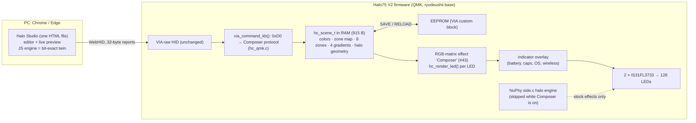

# How it works

A technical reference for the firmware engine, the USB protocol, the scene format and the editor. This is adapted from the original handoff (`chat-handoff/HALO_COMPOSER.md`, sections 3–7) and updated for the changes made since.

## Hardware facts and budgets

| Item | Value | Source |
|---|---|---|
| MCU (the keyboard's processor) | STM32F072: Cortex-M0 at 48 MHz, **no floating point, no hardware divide**, 128 KB flash, 16 KB RAM | ryodeushii tree |
| LED drivers | 2 × IS31FL3733 (I²C 0x50/0x53 at 1 MHz), 64 RGB LEDs each, 8-bit PWM | `keyboards/nuphy/halo75v2/ansi/config.h` |
| LEDs | 0–82 per-key; **83–127 "halo" (45)**: 83–87 status bar, 88–127 underglow ring and badge | `side.c` |
| Halo physical positions | **Measured** on a real Halo75 V2 with the calibration wizard (2026-09-25) and built into the defaults. LEDs 9, 10 and 45 (indices 91, 92, 127) have no LED fitted: Studio hides them and ring order ignores them | `tools/gen_geometry.py` (`CALIBRATED`, `ABSENT`) |
| Frame pacing | QMK RGB matrix: flush every 25 ms (~40 fps), rendering split across main-loop passes. Measured on the keyboard: 40 fps; 30 fps with ripples under 31 simulated key presses per second | `keyboard.json`, `halo_kb.py status` |
| Raw HID | 32-byte reports, **USB only**. The wireless module carries only keyboard, mouse and consumer reports | `rf_protocol.h` |
| Flash use | `via` build 74,328 B · `composer` build 83,120 B (GCC 15.2) | `scripts/build-firmware.ps1` |
| RAM | Fixed stacks: 1 KB main + 2 KB process. Free heap (unused headroom): `via` 2,616 B, `composer` 1,496 B. The scene takes 915 B and the engine state about 190 B | `scripts/mem_report.sh` |
| EEPROM (QMK's *legacy* emulated EEPROM: 4 KB kept in 8 KB of flash, plus a 4 KB copy in RAM) | VIA custom block = NuPhy's 23-byte config + the **915-byte scene**. VIA's macro space shrinks from 2,400 B (ryodeushii's build, computed) to 1,485 B (computed, and confirmed on the keyboard 2026-09-25); NuPhy's stock 2.1.5 reported 2,411 B with a different layout. Details in [RESEARCH_PRESETS_AND_SLOTS.md](RESEARCH_PRESETS_AND_SLOTS.md#2-route-b-several-scenes-on-the-keyboard) | `firmware/keymap/config.h` |

## Architecture

### Per-frame pipeline for each LED (`hc_render_led`, integer math only)

1. **Zone lookup.** `zone_of[led] & 7` picks one of 8 zones. Bit 7 means "ignore keypress overlays".
2. **Base color from the zone's source:** painted per-LED RGB, the zone color, a 1–6 stop gradient sampled along an axis (optionally scrolling), or a rainbow.
3. **The effect modulates that color.** Most effects only change brightness between the zone's `v_min` and `v_max`, so painted palettes survive every effect. Hue effects rotate each LED's *own* hue. Sparkle, Raindrops, Ripple and Heatmap blend toward an accent color.
4. **Keypress overlay** (per zone): flash, glow, ripple, or halo echo.
5. **Master brightness.** Keys use QMK's global value (Fn+↑/↓). The halo uses NuPhy's halo level (Fn+M+↑/↓, 6 steps), or optionally follows the keys. Optional gamma 2.2 (Studio: *Match screen colors*), which the factory look uses.
6. **Indicators** (battery, caps, OS, wireless) are drawn on top from the RGB-matrix indicator callback, so they never flicker against the effect. They're suppressed while the calibration wizard lights single LEDs.

**Design rules:**

- *Effects as modulators* are what make "standard effects while keeping my per-LED colors" possible.
- *Zones* give per-key effects with different speeds without a RAM-heavy layer stack.
- Every animation is a **pure function of (scene, time, key hits)**. Random effects hash per-LED time slots instead of storing state. That's what makes the browser preview bit-exact and keeps RAM tiny. The only stored state is 8 recent key hits and a 128-byte heat map.

### Integration points in ryodeushii's code (everything else untouched)

| Where | Change |
|---|---|
| `keyboards/nuphy/halo75v2/ansi/keymaps/composer/` (from `firmware/keymap/`) | New keymap: a copy of `default`'s layers plus `HC_TOGGLE` on Fn+Enter (jump to Composer and back; its keycode is the one after ryodeushii's last custom keycode, checked by `make_via_json.py`), a 128-LED `g_led_config` in QMK's 224×64 coordinate space, and the three RGB-matrix user effects (`game_mode`, `position_mode`, `composer`). Halo LEDs carry flag `NONE`, so stock effects keep leaving them to NuPhy's halo engine. |
| `side.c` (+26 lines, under `#ifdef HALO_COMPOSER_ENABLE`) | `side_led_show()` returns early while Composer is active, *after* NuPhy's power-on sweep has had its turn. Adds `side_composer_overlay()` (battery + indicators) and `side_power_show_active()`. |
| `common/config/config.h`, `common/core/keyboard.c`, `side.c` | The Caps Lock indicator colour becomes `CAPS_INDICATOR_RGB` (default: ryodeushii's teal). The Composer keymap sets magenta and `DEFAULT_CAPS_INDICATOR_TYPE` = both (status bar and Caps key). |
| `common/config/config.c` (+7 lines) | Weak `nuphy_leds_need_power()` (default `false`, so no change for other keymaps). Composer returns true while the halo is lit, so turning key brightness to 0 no longer cuts power to both LED drivers. |

### EEPROM layout guard (added 2026-09-24)

VIA stores, in order: magic bytes, layout options, the custom-config block, dynamic keymaps, macros. Composer grows the custom-config block by 915 bytes, so **VIA's keymaps move**. VIA decides whether its storage is valid by comparing the *build date* only. Switching between a non-Composer build and Composer built the same day, without the Esc-hold wipe, would therefore read stale bytes as keycodes.

`hc_load(at_boot)` closes that gap: if the saved scene is invalid at boot, it calls `eeconfig_init_via()` (keymaps reset to `keymap.c` and macros cleared) and writes the default scene. `RELOAD` over USB never does this. Tests: `tests/protocol_test.py` ("first boot", "reboot with a valid scene", "reboot after other firmware", "RELOAD never resets").

## Scene format (`hc_scene_t`, 915 bytes, packed, little-endian)

| Offset | Size | Field |
|---|---|---|
| 0 | 1 | `magic` = 0xC7 |
| 1 | 1 | `version` = 1 |
| 2 | 1 | `flags`: bit0 gamma 2.2, bit1 halo follows key brightness |
| 3 | 1 | reserved |
| 4 | 384 | `color[128][3]`: painted RGB per LED |
| 388 | 128 | `zone_of[128]`: bits 0–2 zone, bit 7 = ignore keypress overlays |
| 516 | 160 | `zones[8]` × 20 B (below) |
| 676 | 104 | `grad[4]` × 26 B: `count, flags(bit0 wrap), stop[6]{pos,r,g,b}` (stops sorted by pos) |
| 780 | 90 | `halo_xy[45][2]`: calibrated positions in QMK's 224×64 space |
| 870 | 45 | `halo_ring[45]`: position around the ring, 0–255 (drives the Ring axis) |

Zone (20 bytes):

| Byte | Field | Meaning |
|---|---|---|
| 0 | effect | 0–16 (table below) |
| 1 | speed | 0–255. One cycle ≈ `262144 / (speed + 16)` ms: 16.4 s at 0, 1.8 s at 128, 0.97 s at 255 |
| 2, 3 | v_min, v_max | brightness floor and ceiling, 0–255 |
| 4 | axis | 0 X, 1 Y, 2 radial, 3 angle, 4 spiral, 5 diagonal, 6 ring, 7 none |
| 5 | spread | phase spread across the axis (16 = one full cycle) |
| 6, 7 | p1, p2 | effect parameters |
| 8 | flags | bit0 reverse, bit1 also scroll the color source, bit2 mirror the axis |
| 9 | source | 0 painted, 1 zone color, 2 gradient, 3 rainbow |
| 10, 11 | src_axis, src_scale | axis and scale (16 = once across) for gradient/rainbow |
| 12 | gradient | slot 0–3 |
| 13 | reactive | low nibble: 0 none, 1 flash, 2 glow, 3 ripple, 4 halo echo · high nibble: fade 0–15 |
| 14–16 | color | zone color (source 1), or accent color (black = the LED's own color) |
| 17–19 | rx_color | overlay color (black = white) |

**Default scene** (factory and "Warm Desk"): keys (255, 200, 140) static; WASD (255, 170, 70) at 78%; halo amber (255, 100, 16) breathing 50–100% with a ~4.7 s cycle.

Changing this layout means bumping `HC_SCENE_VERSION`, updating `SCENE_BYTES` in `studio/hc_engine.js` and the offsets in `tools/halo_protocol.py`. The `_Static_assert` in `hc_qmk.c` catches size changes.

## Effects

| # | Effect | p1 | p2 |
|---|---|---|---|
| 0 | Static | – | – |
| 1 | Breathe (sine between Min and Max; with spread, a travelling wave) | – | – |
| 2 | Heartbeat | – | – |
| 3 | Wave (bright band) | band width | – |
| 4 | White wave | band width | whiteness |
| 5 | Hue drift | swing | – |
| 6 | Color cycle | – | – |
| 7 | Flow (scrolls the gradient/rainbow) | – | – |
| 8 | Sparkle | density | – |
| 9 | Candle | – | – |
| 10 | Raindrops | density | hue shift |
| 11 | Comet | tail length | count 1–8 |
| 12 | Strobe | duty | – |
| 13 | Reactive fade (speed = fade length 0.15–3.2 s) | – | – |
| 14 | Ripple (rings are round on the real board: rows weighted 1.5×) | ring width | reach in units (12 = one key); 0–1 = whole board |
| 15 | Heatmap (cools over ~10 s) | – | – |
| 16 | Off | – | – |

Together these cover QMK's standard effect families as modulators: breathing and band → Breathe, White wave, Wave; cycles, pinwheel and spiral → Color cycle and Flow with an axis; hue effects → Hue drift; raindrops → Raindrops and Sparkle; reactive → Reactive fade and overlays; splash → Ripple; typing heatmap → Heatmap. The stock QMK effects are all still there; Composer is one more mode.

## USB protocol (command byte `0xD0`)

Request `[0xD0, sub, args…]` → response `[0xD0, sub, status, payload…]`. Status: 0 OK, 1 bad argument, 2 unknown sub-command. Every report is 32 bytes. All SETs change **RAM only** until `SAVE`. `0xD0` is unused by VIA, Vial, Keychron and SignalRGB. Anything that isn't `0xD0` falls through to VIA unchanged, so VIA keeps working. A keyboard *without* Composer answers `0xD0` with VIA's "unhandled" (`0xFF`), which Studio and `halo_kb.py` use to say "flash the Composer firmware first".

| Sub | Name | Args → response |
|---|---|---|
| 0x01 | GET_INFO | → ver, led_count, key_leds, halo_leds, zones, gradients, stops, fx_count, active, scene_size (lo, hi), scene_flags, magic, mode, prev_mode |
| 0x02 | SET_ACTIVE | on (switches the RGB mode to Composer, or back to the previous mode; the mode is persisted like any effect change) |
| 0x03 / 0x04 | SET / GET_COLORS | start, n ≤ 9, rgb × n |
| 0x05 / 0x06 | SET / GET_ZONE_MAP | start, n ≤ 27 (get ≤ 28), bytes |
| 0x07 / 0x08 | SET / GET_ZONE | zone, 20 bytes (validated: effect, source, axes, gradient slot) |
| 0x09 / 0x0A | SET / GET_GRADIENT | slot, 26 bytes (count ≤ 6) |
| 0x0B / 0x0C | SET / GET_HALO_GEOM | start, n ≤ 9, (x, y, ring) × n |
| 0x0D / 0x0E | SET / GET_SCENE_FLAGS | flags |
| 0x10 | SAVE | RAM scene → EEPROM |
| 0x11 | RELOAD | EEPROM → RAM (defaults if invalid) |
| 0x12 | DEFAULTS | factory scene into RAM |
| 0x13 | IDENTIFY | led, r, g, b, ms (lo, hi): only that LED lit, for calibration. led = 0xFF cancels |
| 0x14 | SIM_KEY | led: inject a key hit (preview reactions on the hardware) |
| 0x15 | GET_STATS | → frames (u32 LE), key master, halo master, halo level, power-on sweep active |

A full scene push is about 45 packets. Studio sends only what changed, 60 ms after the last edit, one request at a time.

## Halo Studio internals

- **One HTML file**, assembled by `studio/build_studio.py` from `studio.tpl.html`, `geometry.json`, `hc_engine.js` (the JS twin of `hc_engine.c`) and `studio_a…e.js` (one shared scope). No build tools and no dependencies besides Google Fonts.
- **Sync:** edits mark LEDs, zones, gradients, geometry and flags as dirty. A serialized `flush()` sends dirty ranges, always reading the *current* scene, and re-marks everything on failure. Save waits for any in-flight sync first. Reads (connect, read, revert, factory) settle the sync before replacing the scene.
- **Halo geometry is treated as a property of the keyboard**, not of a look. Loading starter scenes, library entries or imports keeps it.
- **Storage:** autosave plus "My scenes" in `localStorage`, which is per browser and per web address. Export/import uses `.halo.json` (`{"format": "halo-studio-scene", "version": 1, "scene": <base64 of the 915 bytes>}`); `halo_kb.py scene-backup`/`scene-restore` use the same format.

## Parity: why the preview matches the keyboard

`hc_engine.c` and `studio/hc_engine.js` are written line by line to produce identical integers. That covers FastLED-style `sin8`, integer HSV, an octant `atan2`, integer square root, and C-style truncating division in JS. `tests/host_vectors.c` renders 80 fuzzed scenes (all effects, sources, axes, overlays, flags, 0–6 stop gradients, off-grid halo positions, timer wrap) and `tests/parity_test.mjs` replays them in JS, requiring **byte-identical** frames. **Any change to the engine math must be made in both files.**
